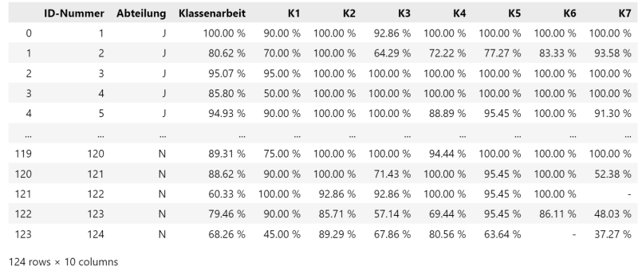
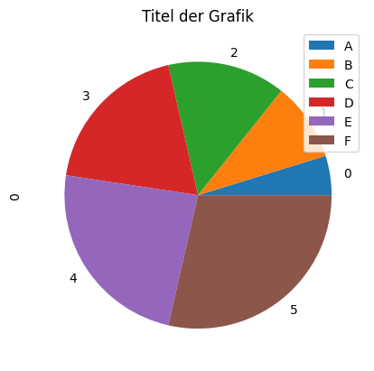
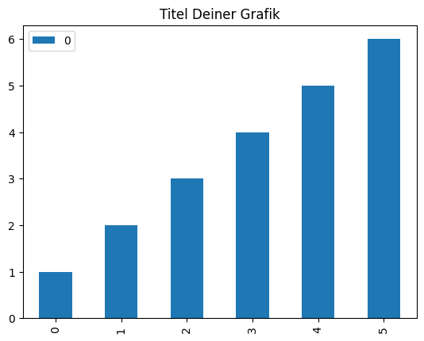
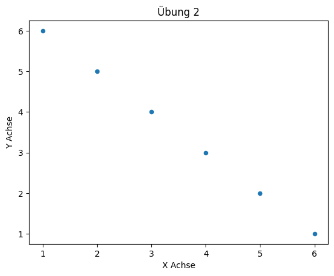

# Dateien als Datenquellen

## Handlungssituation

>Eine der ersten Kunde der neu eingeführten Abteilung "Daten- und Prozessanalyse" der ChangeIT GmbH ist eine große berufsbildenden Schule.
>
>Diese Schule möchte gerne die Leistungsdaten eines Jahrgangs ausgewertet haben. Diese Daten liegen sowohl als *csv*, *xml* und *json* vor.

## Daten der Schülergruppe

<!--dateiinfo-->

### CSV Darstellung

Eine Datei [Moodle.csv](../Data/Moodle.csv) enthält die Daten in Form von CSV.

```csv
ID-Nummer;Abteilung;Klassenarbeit;K1;K2;K3;K4;K5;K6;K7
1;J;100.00 %;90.00 %;100.00 %;92.86 %;100.00 %;100.00 %;100.00 %;100.00 %
2;J;80.62 %;70.00 %;100.00 %;64.29 %;72.22 %;77.27 %;83.33 %;93.58 %
3;J;95.07 %;95.00 %;100.00 %;100.00 %;100.00 %;100.00 %;100.00 %;100.00 %
```

### JSON Darstellung

Eine Weitere Datei [Moodle.json](../Data/Moodle.json) enthält die Daten in JSON Form.

```json
[
 {
   "ID-Nummer": 1,
   "Abteilung": "J",
   "Klassenarbeit": "100.00 %",
   "K1": "90.00 %",
   "K2": "100.00 %",
   "K3": "92.86 %",
   "K4": "100.00 %",
   "K5": "100.00 %",
   "K6": "100.00 %",
   "K7": "100.00 %"
 }
]
```

### XML Darstellung

Eine weitere Datei [Moodle.xml](../Data/Moodle.xml) erhält die Daten in Form einer XML Datei.

```xml
<root>
  <row>
    <ID-Nummer>1</ID-Nummer>
    <Abteilung>J</Abteilung>
    <Klassenarbeit>100.00 %</Klassenarbeit>
    <K1>90.00 %</K1>
    <K2>100.00 %</K2>
    <K3>92.86 %</K3>
    <K4>100.00 %</K4>
    <K5>100.00 %</K5>
    <K6>100.00 %</K6>
    <K7>100.00 %</K7>
  </row>
</root>
```

### Attribute des Datensatzes

Die einzelnen Attribute des Datensatzes haben dabei folgende Bedeutung.

- **ID-Nummer**: Eindeutige ID eines Schülers
- **Abteilung**: Jeweilige Klasse des Schülers (J-N)
- **Klassenarbeit**: Ergebnis der Klassenarbeit
- **K1 bis K7**: Ergebnisse in einzelnen Kapitel-Tests.
<!--dateiinfo-->

<!--dateiaufgabe1-->
## Arbeitsprozess

Im weiteren Verlauf der Kurses werden wir zunächst immer wieder folgenden Arbeitsprozess anwenden.


- Wir werden zunächst die Rohdaten aus einer Datenquelle einlesen. In unserem Fall ist das aktuell eine Datei.
- Anschließend werden wir die Daten anpassen, bereinigen oder vorauswerten.
- Abschließend werden wir das Ergebnis ansprechend für den Kunden visualisieren.

## Einlesen der Dateien

### Hinweise

>Für die Analyse und Visualisierung der Daten verwenden wir das Python Paket **pandas** verwenden. Wenn Sie diese Pakete noch nicht installiert haben, so holen Sie dieses bitte nach.

Ein Paket in Python installiert man über den Python Paket Manger PIP wie folgt:

```txt
pip install {Name des Paketes}
```

### Aufgabe 1: Daten einlesen

Entscheiden Sie sich für ein Dateiformat welches Sie bearbeiten wollen? Bilden Sie dazu Gruppen für die drei genanten Dateitypen und schreiben Sie ein Python Programm welches die jeweilige Datei einließt. Dabei sollten die Daten gleich in einem DataFrame (Datenformat für die Auswertung mit **pandas**) eingelesen werden. Geben Sie nach dem Einlesen des Datensatzes das Dataframe im Jupyter Notebook aus. Die Ausgabe sollte der folgenden Abbildung entsprechen.



>Diskutieren Sie in ihrer Gruppe, ob die Daten bereits so wie Sie vorliegen verwendet werden können, oder ob noch Bereinigungen der Daten notwendig sind?

<!--dateiaufgabe1-->

## Bereinigen der Dateien

<!--dateiaufgabe2-->
Leider sind die Daten für die weitere Bearbeitung nicht geeignet und müssen entsprechend angepasst werden. Folgende Probleme wurden in den Daten festgestellt.

- Die Notenwerte liegen in den Daten als Zeichenketten vor, sinnvoller wäre es hier, wenn die Daten als *float* vorliegen würden.
- Wenn ein Schüler einen Kapitel-Test nicht mitgeschrieben hat, so ist der Datensatz mit '-' gekennzeichnet. Sinnvoller wäre es, wenn hier der Wert 0.0 eingetragen wäre.

## Aufgabe 2: Daten umwandeln / bereinigen

Wandeln Sie die Werte des DataFrames entsprechend der oben durchgeführten Überlegungen um und geben Sie anschließend das DataFrame Objekt im Jupyter Notebook aus und kontrollieren Sie die Ausgabe.

> **Hinweis**: Über *dftypes*  erhalten Sie Auskunft über die Datentypen eines Dataframes

```py

print (df.dtypes)

```

<!--dateiaufgabe2-->

<!--dateiaufgabe3-->

## Erste Statistische Grunddaten ermitteln

Wir wollen nun die Daten einer ersten statistischen Untersuchung unterziehen. Dazu sollen wichtige statistische Grunddaten ermittelt werden. 

Das arithmetische Mittel eines Datenmenge berechnet sich wie folgt:  

$\bar{x}=\frac{1}{N}*\sum_{i=1}^{N}x_{i}$

Die Varianz $var(x)$ einer Datenmenge X berechnet sich wie folgt:

$var(x)=\frac{1}{N-1}*\sum_{i=1}^{N}( x_{i} - \bar{x})^{2}$

Die Standardabweichung $\sigma$ ist dann die Quadratwurzel der Varianz.

$\sigma=\sqrt{var(x))}$

Dies Werte lassen sich auch mittels der **pandas**-Bibliothek ermitteln:

- **mean(column)** ermittelt den arithmetischen Mittelwert einer Spalte
- **median(column)** ermittelt das Mittel (mean) einer Spalte
- **std(column)** ermittelt die Standardabweichung einer Spalte

### Aufgabe 3: statistische Grunddaten ermitteln

Ermitteln Sie mit Hilfe von **pandas** folgende Daten.

- Durchschnittswert (in %) der Klassenarbeit
- Standradabweichung der Klassenarbeit
- Durchschnittswert (in %) der Klassenarbeit der Gruppe "J"
- Notenspiegel der Klassenarbeit (also wie viele Schüler haben ein "seht gut", wie viele Schüler ein "gut" usw.)

Schreiben Sie diese Werte für den Auftraggeber in ein Word Dokument!

> **Hinweise**: 
>- Nutzen Sie zum ermitteln der Daten die Dokumentation zum [pandas Dataframe](https://pandas.pydata.org/pandas-docs/stable/reference/frame.html).
>- Zum bestimmen der Noten soll der IHK Notenschlüssel herangezogen werden (siehe unten)

| ungenügend | mangelhaft    | ausreichend    | befriedigend    | gut    | sehr-gut    |
| :---: | :---: | :---: | :---: | :---: | :---: |
|  0 - < 30    | 30 - < 50    | 50 - < 66    | 66 - < 81 |  81 - < 92   | 92 - 100    |

<!--dateiaufgabe3-->
<!--dateiaufgabe4-->

## Daten visualisieren

Der Auftraggeber (die Schule) möchte die Daten zur weiteren Verarbeitung in Dokumenten visualisiert haben. Zur Visualisierung von Daten nutzen wir das python Paket **plot** aus dem **pandas** Paket.

Für die folgenden Aufgaben stellt Ihnen der Leiter der Abteilung Datenanalyse folgenden Beispielcode zur Verfügung.

### Aufgabe 4 Daten visualisieren

Der Auftraggeber würde gerne das Ergebnis der Klassenarbeit in geeigneter Form visualisiert haben. Entscheiden Sie sich für ein geeignete Darstellungsform und erstellen Sie mit Hilfe eines Python Programms die Grafik. 

> **Hinweis**: In dem unten dargestellten Beispiel werden Werte in Form eines Tortendiagramms dargestellt.

```py

import pandas as pd
import matplotlib.pyplot as plt

data = pd.DataFrame([1,2,3,4,5,6])
pieimage = data.plot.pie(subplots=True)
ax = pieimage[0]

ax.set_title("Titel der Grafik")
ax.legend(["A","B","C","D","E","F"])
plt.show()

```


> **Hinweis**: In dem unten dargestellten Beispiel werden Werte in Form eines Balkendiagramms dargestellt.


```py
import pandas as pd

data = pd.DataFrame([1, 2, 3, 4 , 5, 6])
barimage = data.plot.bar()
barimage.set_title("Titel Deiner Grafik")
```



<!--dateiaufgabe4-->
<!--dateiaufgabe5-->

### Aufgabe 5 Daten visualisieren

Es stellt dich die Frage, ob Schüler die im arithmetischen Mittel in den Kapitel-Tests eine gute Note schreiben auch in der Klassenarbeit eine gute Note schreiben. Versuchen Sie auf diese Fragestellung eine Antwort zu finden und visualisieren Sie das Ergebnis möglichst sinnvoll für den Auftragsgeber.

> **Hinweis**: In dem unten dargestellten Beispiel werden mit Hilfe von **pandas** Punkte mit (x/y) Werten in einem Koordinatensystem dargestellt.

```py

import pandas as pd

data = pd.DataFrame({"x":[1,2,3,4,5,6],"y":[6,5,4,3,2,1]})

pltimage = data.plot.scatter(x="x",y="y")
pltimage.set_xlabel("X Achse")
pltimage.set_ylabel("Y Achse")
pltimage.set_title("Übung 2")

```



<!--dateiaufgabe5-->

## Reflexion

Diskutieren Sie im Klassenverband die Aussagekraft der statischen Grunddaten und der erzeugten Diagramme.

In wie weit können die Daten und die Grafiken genutzt werden um ein Vorhersagemodell für einen neuen Schüler in der Klasse genutzt werden?
