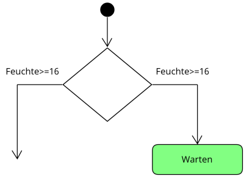
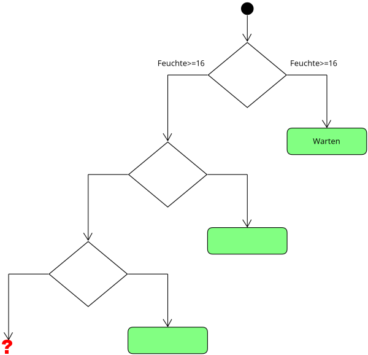
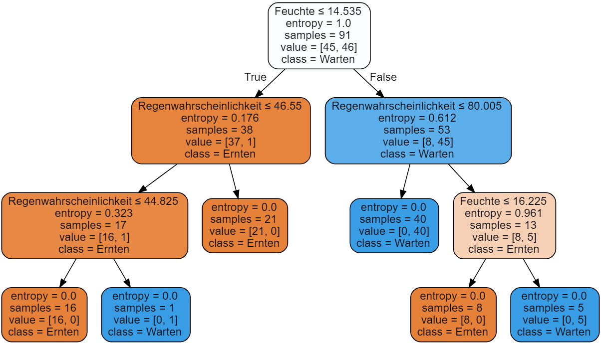

# Entscheidungsbäume 

## Handlungssituation


> Ein großer Landmaschinenhersteller wünscht sich eine größere Kundenbindung und beauftragt die ChangeIT GmbH mit der Entwicklung einer App, die Landwirten Empfehlungen gibt, wann der Weizen zu ernten ist. Die App misst dazu über einen via Bluetooth gekoppelten Feuchte-Sensor die Bodenfeuchte im Feld und kann über eine API Abfrage die Regenwahrscheinlichkeit bestimmen.
>
>Erste Erfahrungswerte liegen bereits vor und werden vom Landmaschinenhersteller der ChangeIT in Form einer CSV Datei zur Verfügung gestellt.
>
>Als Mitglied der Abteilung Daten- und Prozessanalyse erhalten Sie die Aufgabe ein geeignetes Vorhersagemodell zu entwickeln.[^1]

[^1]: Vgl. Brandt, Y., Eickhoff-Schachtebeck, A. und Strecker, K. (2022): „Schulbuch starkeSeiten Informatik Jahrgang 9/10 Differenzierende Ausgabe Niedersachsen“, Klett-Verlag 2022

<!--dsdaten-->

## Die zur Verfügung gestellten Daten

Die Daten die uns der Auftraggeber zur Verfügung stellt liegen in Form einer *csv* Datei vor.

```csv
"Feuchte","Regenwahrscheinlichkeit","Ergebnis"
"17.94","56.89","Warten"
"15.01","80.88","Ernten"
"15.56","75.99","Warten"
"18.25","36.97","Warten"
"16.52","90.11","Warten"
"15.26","27.82","Warten"
```

Die Spalten haben dabei folgende Bedeutung:

- Feuchte: Der Wert der Bodenfeuchte
- Regenwahrscheinlichkeit: Die Regenwahrscheinlichkeit in %
- Ergebnis: Die bisherigen Erfahrungswerte, wann es sich lohnt den Weizen zu **Ernten** oder besser noch zu **Warten**.

<!--dsdaten-->
<!--dsaufgabe1-->

## Aufgabe 1: Visualisierung der Daten

Zunächst sollen die Daten in einem Diagramm visualisiert werden, um sich eine Vorstellung von den Daten zu machen.

Schreiben Sie ein erste Python-Programm, welches möglichst anschaulich den zur Verfügung gestellten Datensatz ([ErnteBauern.csv](../Data/ErnteBauern.csv)) visualisiert.

**Hinweise:**

Einlesen kann man eine CSV Datei in Python auf unterschiedlichste Weise. Zur späteren Datenanalyse ist jedoch die Bibliothek **pandas** das geeignete Mittel. Hier existiert bereits eine Methode **read_csv** die dieses erledigt.

```py
import pandas as pd

# CSV-Datei laden
data = pd.read_csv('Datei.csv')
```

Zum Darstellen von Datenmenge nutzen wir die Bibliothek **matplotlib.pyplot**. Diese muss zunächst importiert werden.

```py
import matplotlib.pyplot as plt
```

Angesprochen werden kann die Bibliothek hier über den Namen **plt**. Enthalten ist z.B. eine Methode zum Darstellen von Punktemengen als X und Y werte (**scatter**). Über die Methode **show()** wird dann die Grafik angezeigt.

```py
datax = [4,6,7,9]
datay = [2,4,7,3]

plt.scatter(datax,datay)
plt.show()

```

<!--dsaufgabe1-->
\newpage

## Analyse des Datensatzes

<!--dsanalyse1-->

Stellt man die zur Verfügung gestellten Datensatz grafisch dar, so erhält man z.B. folgende Darstellung.

<!--dsinfo1-->

 

<!--dsanalyse1-->

> Entwerfen Sie im Klassenverband erste Idee wie man ein Modell entwickeln könnte, welches Aussagen entwickelt wann es sich lohnt den Weizen zu ernten!

Betrachtet man die Daten ein wenig genauer, so fällt auf, dass ab einer Bodenfeuchte von >= 16 auf jeden Fall gewartet werden soll.


Doch wie kann ein Algorithmus auf diesen Wert kommen? Die Lösung hierfür bietet und der Wert der Entropie einer Datenmenge.

>Die Entropie einer Datenmenge ist ein Maß dafür, wie viel "Unordnung" oder "Unsicherheit" in den Daten vorhanden ist. Eine höhere Entropie bedeutet, dass die Daten weniger geordnet und daher schwieriger vorherzusagen sind. Die Entropie wird normalerweise in Bits gemessen.
>
>Eine Entropie von 0 tritt nur auf, wenn alle Elemente in der Datenmenge identisch sind. In diesem Fall gibt es keine Unsicherheit, da das Auftreten jedes Elements vorhersehbar ist. Ein Beispiel wäre eine Liste von Einsen: Jedes Element ist eine 1, und daher gibt es keine Unsicherheit oder Entropie in den Daten.

Wir Menschen sind also auf den Wert Feuchte >= 16 gekommen, indem wir eine Grenze gesucht haben, um eine Teilmenge zu erzeugen, die einen Entropie-Wert von 0 hat.

Die Formel zur Berechnung der Wahrscheinlichkeit eines Ereignisses ist:

$$P(x_i) = \frac{n_i}{N}$$

wobei $n_i$ die Anzahl der Beispiele ist, in denen das Element $x_i$ auftritt und $N$ die Gesamtzahl der Beispiele im Array ist.

Die Shannon-Entropie-Formel zur Berechnung der Entropie lautet wie folgt:

$$H(X) = -\sum_{i=1}^n P(x_i) \log_2(P(x_i))$$

wobei $P(x_i)$ die Wahrscheinlichkeit des Ereignisses $x_i$ ist und $\log_2$ der Logarithmus zur Basis 2 ist.

<!--dsinfo1-->

<!--dsaufgabe2-->

## Aufgabe 2

Gegeben ist folgender Datensatz:

|Kategorie | 
| - |
| A  |
| A  |
| B  |
| A  |
| A  |
| B  |

---

Bestimmen Sie die Entropie des Datensatzes!

<div style="page-break-after: always;"></div>
<!--dsaufgabe2-->
<!--dsloesung2-->

### Lösung

$$P_A = \frac{4}{6}=0.6667$$
$$P_B = \frac{2}{6}=0.3333$$

$$H = - (P_A \log_2(P_A)+P_B \log_2(P_B))$$
$$H = - (0.6667+log_2(0.6667)+0.3333*log_2(0.3333))=0.918262$$

<!--dsloesung2-->
\newpage

## Aufgabe 3

<!--dsaufgabe3-->

Wir können unseren Datensätze nun in zwei Teildatensätze einteilen *m1* und *m2*.

```py
import pandas as pd
import matplotlib.pyplot as plt

# CSV-Datei laden
data = pd.read_csv('ErnteBauern.csv')

m1 = data[data['Feuchte'] < 13]
m2 = data[data['Feuchte'] >= 13]

```

Entwickeln Sie eine Pythonfunktion **calcEntropie(mx):Entropie** welche die Entropie eines übergebenen Arrays mit den Kategorien **Ernten** und **Warten** ermittelt.

<!--dsaufgabe3-->
<!--dsinfo3-->

Wenn wir mir unsere entwickelten Funktion **calcEntropie(mx):Entropie** die Datenmenge nun schrittweise teilen, erhalten wir die folgende Darstellung.


Wie wir sehen erhalten wir bei einen Wert von $Feuchte = 16$ eine Entropie in der Menge e2 von 0. Nun müssen wir noch überprüfen ob es möglich ist eine Menge im Effekt der **Regenwahrscheinlichkeit** zu finden, der gegen 0 geht.


Wie wir sehen, ist der geringste Entropiewert der Wert von 0, wenn wir bei einer $Feuchte >= 16$ die Mengen trennen. Wir haben unsere erste Entscheidung für den Entscheidungsbaum getroffen.



<!--dsinfo3-->
\newpage

## Aufgabe 4

<!--dsaufgabe4-->

Entsprechend den zuvor durchgeführten Überlegungen können wir die verbleibende Menge weiter einteilen:


Führen Sie die weiteren Überlegungen mit der verbleibenden Menge ($Feuchte < 16$) durch und finden Sie die nächsten zwei Knoten unseres Entscheidungsbaumes, indem Sie die Funktion **calcEntropie(m):Entropie** verwenden. Ergänzen Sie mit den Ergebnissen den unten abgebildeten Entscheidungsbaum!



> Diskutieren Sie wie Sie weiter vorgehen sollten !

\newpage

<!--dsaufgabe4-->
<!--dsinfo4-->

Es bietet sich nicht an den letzten Datenpunkt von *Warten* bei *Feuchte=13* / *Regenwahrscheinlichkeit=45* mit in den Entscheidungsbaum aufzunehmen. Bei dem Datenpunkt scheint es sich im einen Ausreißer zu handeln. Würde der Datenpunkt mit in den Entscheidungsbaum aufgenommen, so würde dieses den Entscheidungsbaum unnötig verkomplizieren. Man spricht in diesem Fall auch von der *Überanpassung* eines Modells.

> Die Überanpassung (auch bekannt als Overfitting) bezeichnet ein Phänomen, bei dem ein Modell so eng auf die Trainingsdaten passt, dass es nur in der Lage ist, diese spezifischen Daten gut vorherzusagen und nicht in der Lage ist, neue Daten oder eine Testmenge gut zu verallgemeinern.
>
>Dies kann insbesondere bei komplexeren Entscheidungsbaum-Modellen auftreten, bei denen das Modell so viele Schichten hat, dass es fast jede mögliche Kombination von Variablen innerhalb der Trainingsdaten abdeckt. Dies führt dazu, dass das Modell ein "Gedächtnis" für die Trainingsdaten entwickelt und sich an jede einzelne Beobachtung erinnert, anstatt allgemeine Muster zu lernen, die für neue Datensätze gelten können.
>
>Ein overfitted Entscheidungsbaum kann sich negativ auf die Leistung des Modells auswirken, indem es zu schlechten Vorhersagen für neue Daten führt. Um die Überanpassung von Entscheidungsbäumen zu reduzieren, können verschiedene Methoden angewandt werden, wie z.B. Regelungsverfahren wie Pruning, Setzen von Maximaltiefe für den Baum, sowie Verwendung von Klassifikationsmodellen mit weniger Features.

<!--dsinfo4-->

## Aufgabe 5

<!--dsaufgabe5-->

Mittels des Pythonpaketes *sklearn* lassen sich Entscheidungsbäume erstellen. Der folgende Codeauszug nutzt dieses Paket zum erstellen eines Entscheidungsbaumes:

```py
from sklearn import tree
y = data['Ergebnis']
x = data.drop(['Ergebnis'], axis=1)
clf = tree.DecisionTreeClassifier(criterion = 'entropy')
clf = clf.fit(x, y)
```

Untersuchen Sie mit Hilfe der Methode **predict** den entwickelten Entscheidungsbaum! Erzeugen Sie dafür 4 typische Werte für den Datensatz!

<!--dsaufgabe5-->
\newpage

## Aufgabe 6

<!--dsaufgabe6-->

Python ermöglicht es Ihnen auch den Entscheidungsbaum zu visualisieren. Dazu dient das Paket **graphviz**, welches natürlich zuvor installiert werden muss. Der folgende Code visualisiert den entstandenen Entscheidungsbaum im JupyterNotebook.

```py
from sklearn.tree import export_graphviz
from IPython.display import display
import graphviz

# exportiere Baum in DOT-Format
dot_data = export_graphviz(clf, out_file=None, 
                     feature_names=x.columns.values.tolist(),
                     class_names=['Ernten', 'Warten'], 
                     filled=True, rounded=True,
                     special_characters=True)
                     
# konvertiere DOT-Format zu einem Graph-Objekt
graph = graphviz.Source(dot_data)
display(graph)
```
<!--dsaufgabe6-->
<!--dsloesung6-->



Welche Aussage lassen sich aus der Grafik ableiten?

<!--dsloesung6-->
\newpage

## Aufgabe 7

<!--dsaufgabe7-->

Zur Validierung unseres Modells stellt uns der Kunde einen weiteren Datensatz zur Verfügung ([ErnteBauern2](../Data/ErnteBauern2.csv)). Überprüfen Sie mit Hilfe dieses Datensatzes die Qualität des Entscheidungsbaumes:

> **Hinweis**: Nutzen Sie hierzu das Modul *accuracy_score* aus dem Paket *sklearn.metrics*!

```py
import pandas as pd
from sklearn.tree import DecisionTreeClassifier
from sklearn.metrics import accuracy_score

# Laden Sie den Testdatensatz
test_data = pd.read_csv('Data/ErnteBauern2.csv')

# Trennen Sie die Zielvariable vom Rest der Daten
X_test = test_data.drop('Ergebnis', axis=1)
y_test = test_data['Ergebnis']


# Führen Sie Vorhersagen auf dem Testdatensatz durch (wobei clf unser trainierter Entscheidungsbaum aus Aufgabe 5 ist)
y_pred = clf.predict(X_test)

# Berechnen Sie die Vorhersagegenauigkeit auf dem Testdatensatz
accuracy = accuracy_score(y_test, y_pred)
print("Vorhersagegenauigkeit auf dem Testdatensatz: {:.2f}%".format(accuracy * 100))
```

<!--dsaufgabe7-->
\newpage
<!--dsaufgabe8-->

## Aufgabe 8

Wählen Sie einen geeigneten Datensatz aus und entwerfen Sie eine Entscheidungsbaum Modell und präsentieren Sie im Anschluss daran der Klasse ihren Datensatz, ihr Vorgehen und das entstande Modell. Folgende Datensätze können Sie z.B. verwenden!

1. **Titanic-Datensatz**: Der Titanic-Datensatz enthält Informationen über Passagiere an Bord des Schiffes Titanic, einschließlich Merkmalen wie Alter, Geschlecht, Klasse und Überlebensstatus. Dieser Datensatz ist gut geeignet für binäre Klassifizierungsaufgaben und kann auch zur Vorhersage des Überlebens von Passagieren auf anderen Schiffsreisen verwendet werden.
   - URL: <https://www.kaggle.com/c/titanic/data>

2. **Bank Marketing-Datensatz**: Dieser Datensatz enthält Informationen zu Kunden einer portugiesischen Bank und ob sie Ja oder Nein für ein Termingeld-Abonnement abgeschlossen haben. Es enthält eine Vielzahl von Kundenmerkmalen wie Alter, Beruf, Familienstand usw., die verwendet werden können, um vorherzusagen, ob ein Kunde ein Abonnement abschließen wird oder nicht.
   - URL: <https://archive.ics.uci.edu/ml/datasets/Bank+Marketing>

3. **Breast Cancer Wisconsin (diagnostic) Dataset**: Dieser Datensatz enthält Details zu den Zellkernmerkmalen von malignen und benignen Brustgewebeproben sowie einer Diagnose, ob eine Probe maligne oder benign ist. Der Datensatz ist gut geeignet für binäre Klassifizierungsaufgaben zum Erkennen von Brustkrebs.
   - URL: <https://archive.ics.uci.edu/ml/datasets/Breast+Cancer+Wisconsin+(Diagnostic)>

### Die Präsentation sollte folgendes Beinhalten:

- Vorstellen (Exploration) des Datensatzes mit geeigneter Visualisierung der Daten.
- Darstellung des Entscheidungsbaumes
- Validierung des Entscheidungsbaumes (Aussagen zur Genauigkeit des Entscheidungsbaumes)

<!--dsaufgabe8-->
\newpage

## Fragen zum Verständnis

1. Was ist der Hauptzweck von Entscheidungsbäumen?
    - [ ] Datenspeicherung
    - [ ] Berechnung von Durchschnittswerten
    - [ ] Klassifizierung und Vorhersage
    - [ ] Datenvisualisierung

2. Welches Maß wird verwendet, um die "Unordnung" oder "Unsicherheit" in einer Datenmenge zu beschreiben?
    - [ ] Kovarianz
    - [ ] Entropie
    - [ ] Varianz
    - [ ] Korrelation

3. Wie wird die Entropie einer Datenmenge berechnet?
    - [ ] $P(x_i) = \frac{n_i}{N}$
    - [ ] $H(X) = \sum_{i=1}^n P(x_i) \log_2(P(x_i))$
    - [ ] $H(X) = -\sum_{i=1}^n P(x_i) \log_2(P(x_i))$
    - [ ] $H(X) = \frac{1}{n}\sum_{i=1}^n (x_i - \bar{x})^2$

4. Welches Python-Paket wird verwendet, um Entscheidungsbäume zu erstellen?
    - [ ] numpy
    - [ ] matplotlib
    - [ ] pandas
    - [ ] sklearn

5. Wie kann man die Vorhersagegenauigkeit eines Entscheidungsbaums auf einem Testdatensatz berechnen?
    - [ ] Indem man die Entropie der Vorhersagen berechnet
    - [ ] Mit der Methode `accuracy_score` aus dem Paket `sklearn.metrics`
    - [ ] Durch Vergleich der mittleren quadratischen Fehler
    - [ ] Durch Berechnung der Korrelation zwischen den tatsächlichen und den vorhergesagten Werten

6. Welches der folgenden Aussagen beschreibt die Überanpassung (Overfitting) von Entscheidungsbäumen am besten?

    - [ ] Ein überangepasster Entscheidungsbaum hat eine zu geringe Anzahl an Blättern.
    - [ ] Die Genauigkeit eines überangepassten Entscheidungsbaums sinkt, wenn neue Daten hinzugefügt werden.
    - [ ] Ein überangepasster Entscheidungsbaum passt sich zu stark an die Trainingsdaten an und kann dadurch schlechtere Vorhersagen auf neuen Daten liefern.
    - [ ] Ein überangepasster Entscheidungsbaum hat eine hohe Generalisierungsfähigkeit und ist daher besser auf neuen Daten anwendbar.

<!--

LSG:

1. Nr. 3
2. Nr. 2
3. Nr. 3
4. Nr. 4
5. Nr. 2
6. Nr. 3

 -->