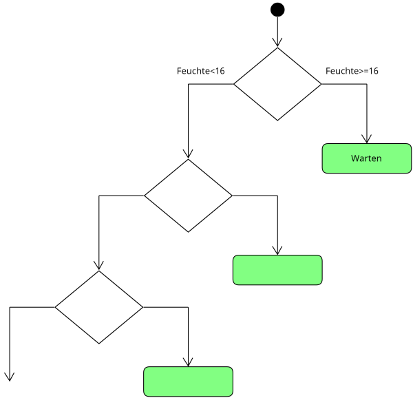

# Entscheidungsbäume 

## Handlungssituation


> Ein großer Landmaschinenhersteller wünscht sich eine größere Kundenbindung und beauftragt die ChangeIT GmbH mit der Entwicklung einer App, die Landwirten Empfehlungen gibt, wann der Weizen zu ernten ist. Die App misst dazu über einen via Bluetooth gekoppelten Feuchte-Sensor die Bodenfeuchte im Feld und kann über eine API Abfrage die Regenwahrscheinlichkeit bestimmen.
>
>Erste Erfahrungswerte liegen bereits vor und werden vom Landmaschinenhersteller der ChangeIT in Form einer CSV Datei zur Verfügung gestellt.
>
>Als Mitglied der Abteilung Daten- und Prozessanalyse erhalten Sie die Aufgabe ein geeignetes Vorhersagemodell zu entwickeln.[^1]

[^1]: Vgl. Brandt, Y., Eickhoff-Schachtebeck, A. und Strecker, K. (2022): „Schulbuch starkeSeiten Informatik Jahrgang 9/10 Differenzierende Ausgabe Niedersachsen“, Klett-Verlag 2022

## Die zur Verfügung gestellten Daten

Die Daten die uns der Auftraggeber zur Verfügung stellt liegen in Form einer *csv* Datei vor.

```csv
"Feuchte","Regenwahrscheinlichkeit","Ergebnis"
"17.94","56.89","Warten"
"15.01","80.88","Ernten"
"15.56","75.99","Warten"
"18.25","36.97","Warten"
"16.52","90.11","Warten"
"15.26","27.82","Warten"
```

Die Spalten haben dabei folgende Bedeutung:

- Feuchte: Der Wert der Bodenfeuchte
- Regenwahrscheinlichkeit: Die Regenwahrscheinlichkeit in %
- Ergebnis: Die bisherigen Erfahrungswerte, wann es sich lohnt den Weizen zu **Ernten** oder besser noch zu **Warten**.

## Aufgabe 1: Visualisierung der Daten

Zunächst sollen die Daten in einem Diagramm visualisiert werden, um sich eine Vorstellung von den Daten zu machen.

Schreiben Sie ein erste Python-Programm, welches möglichst anschaulich den zur Verfügung gestellten Datensatz (**ErnteBauern.csv**) visualisiert.

<div style="page-break-after: always;"></div>

## Analyse des Datensatzes

Stellt man die zur Verfügung gestellten Datensatz grafisch dar, so erhält man z.B. folgende Darstellung.


> Entwerfen Sie im Klassenverband erste Idee wie man ein Modell entwickeln könnte, welches Aussagen entwickelt wann es sich lohnt den Weizen zu ernten!

Betrachtet man die Daten ein wenig genauer, so fällt auf, dass ab einer Bodenfeuchte von >= 16 auf jeden Fall gewartet werden soll.


Doch wie kann ein Algorithmus auf diesen Wert kommen? Die Lösung hierfür bietet und der Wert der Entropie einer Datenmenge.

>Die Entropie einer Datenmenge ist ein Maß dafür, wie viel "Unordnung" oder "Unsicherheit" in den Daten vorhanden ist. Eine höhere Entropie bedeutet, dass die Daten weniger geordnet und daher schwieriger vorherzusagen sind. Die Entropie wird normalerweise in Bits gemessen.
>
>Eine Entropie von 0 tritt nur auf, wenn alle Elemente in der Datenmenge identisch sind. In diesem Fall gibt es keine Unsicherheit, da das Auftreten jedes Elements vorhersehbar ist. Ein Beispiel wäre eine Liste von Einsen: Jedes Element ist eine 1, und daher gibt es keine Unsicherheit oder Entropie in den Daten.

Wir Menschen sind also auf den Wert Feuchte >= 16 gekommen, indem wir eine Grenze gesucht haben, um eine Teilmenge zu erzeugen, die einen Entropie-Wert von 0 hat.

Die Formel zur Berechnung der Wahrscheinlichkeit eines Ereignisses ist:

$$P(x_i) = \frac{n_i}{N}$$

wobei $n_i$ die Anzahl der Beispiele ist, in denen das Element $x_i$ auftritt und $N$ die Gesamtzahl der Beispiele im Array ist.

Die Shannon-Entropie-Formel zur Berechnung der Entropie lautet wie folgt:

$$H(X) = -\sum_{i=1}^n P(x_i) \log_2(P(x_i))$$

wobei $P(x_i)$ die Wahrscheinlichkeit des Ereignisses $x_i$ ist und $\log_2$ der Logarithmus zur Basis 2 ist.

## Aufgabe 2

Gegeben ist folgender Datensatz:

|Effekt | 
| - |
| A  |
| A  |
| B  |
| A  |
| A  |
| B  |

Bestimmen Sie die Entropie des Datensatzes!

<div style="page-break-after: always;"></div>

### Lösung

$$P_A = \frac{4}{6}=0.6667$$
$$P_B = \frac{2}{6}=0.3333$$

$$H = - (P_A \log_2(P_A)+P_B \log_2(P_B))$$
$$H = - (0.6667+log_2(0.6667)+0.3333*log_2(0.3333))=0.918262$$

---

## Aufgabe 3

Wir können unseren Datensätze nun in zwei Teildatensätze einteilen *m1* und *m2*.

```py
import pandas as pd
import matplotlib.pyplot as plt

# CSV-Datei laden
data = pd.read_csv('ErnteBauern.csv')

m1 = data[data['Feuchte'] < 13]
m2 = data[data['Feuchte'] >= 13]

```

Entwickeln Sie eine Pythonfunktion **calcEntropie(mx):Entropie** welche die Entropie eines übergebenen Arrays mit den Kategorien **Ernten** und **Warten** ermittelt.

---

Wenn wir mir unsere entwickelten Funktion **calcEntropie(mx):Entropie** die Datenmenge nun schrittweise teilen, erhalten wir die folgende Darstellung.


Wie wir sehen erhalten wir bei einen Wert von $Feuchte = 16$ eine Entropie in der Menge e2 von 0. Nun müssen wir noch überprüfen ob es möglich ist eine Menge im Effekt der **Regenwahrscheinlichkeit** zu finden, der gegen 0 geht.


Wie wir sehen, ist der geringste Entropiewert der Wert von 0, wenn wir bei einer $Feuchte >= 16$ die Mengen trennen. Wir haben unsere erste Entscheidung für den Entscheidungsbaum getroffen.


## Aufgabe 4

Entsprechend den zuvor durchgeführten Überlegungen können wir die verbleibende Menge weiter wie folgt einteilen:


Ergänzen Sie den unten abgebildeten Entscheidung!



> Diskutieren Sie wie Sie weiter vorgehen sollten !

## Aufgabe 5

Mittels des Pythonpaketes *sklearn* lassen sich Entscheidungsbäume erstellen. Der folgende Codeauszug nutzt dieses Paket zum erstellen eines Entscheidungsbaumes:

```py
from sklearn import tree
y = data['Ergebnis']
x = data.drop(['Ergebnis'], axis=1)
clf = tree.DecisionTreeClassifier(criterion = 'entropy')
clf = clf.fit(x, y)
```

Untersuchen Sie mit Hilfe der Methode **predict** den entwickelten Entscheidungsbaum! Erzeugen Sie dafür 4 typische Werte für den Datensatz!

## Aufgabe 6

Python ermöglicht es Ihnen auch den Entscheidungsbaum zu visualisieren. Dazu dient das Paket **graphviz**, welches natürlich zuvor installiert werden muss. Der folgende Code visualisiert den entstandenen Entscheidungsbaum im JupyterNotebook.

```py
from sklearn.tree import export_graphviz
from IPython.display import display
import graphviz

# exportiere Baum in DOT-Format
dot_data = export_graphviz(clf, out_file=None, 
                     feature_names=x.columns.values.tolist(),
                     class_names=['Ernten', 'Warten'], 
                     filled=True, rounded=True,
                     special_characters=True)
                     
# konvertiere DOT-Format zu einem Graph-Objekt
graph = graphviz.Source(dot_data)
display(graph)
```


Welche Aussage lassen sich aus der Grafik ableiten?

