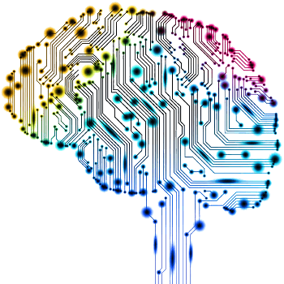

# KI im Alltag

## Handlungssituation

> Die Change IT GmbH prüft ob es sinnvoll wäre eine eigne Abteilung zur Daten- und Prozessanalyse mit dem Schwerpunkt maschinelles Lernen und Deep Learning zu gründen.
>
> Sie erhalten den Auftrag die Begriffe KI, Maschine Learning, Deep Learning einzuordnen, Anwendungsbeispiele für diese Technologien zu finden und ggf. moralische Grenzen aufzuzeigen.

## täglicher Einsatz von KI Systemen

<!--kialltagbrain-->

Künstliche Intelligenz begegnet uns inzwischen in vielfältigen Formen im Alltag. Sammeln Sie in einer gemeinsamen Brainstorming Phase Situationen / Anlässe, bei denen Sie mit künstlicher Intelligenz zu tun haben und versuchen Sie diese Situation mit nur **einem** Wort zu beschreiben.

<!--kialltagbrain-->

## Einsatzmöglichkeiten und moralische Grenzen von künstlicher Intelligenz

<!--kialltagct-->

Lesen Sie den Artikel **"Läuft wie KI-geschmiert"** von Andrea Trinkwalder aus der *ct 17/2022; S20* durch und beantworten Sie die folgenden Fragen.

<!--kialltagct-->

**Was ist der Unterschied zwischen künstlicher Intelligenz und Machine Learning?**

>a) Künstliche Intelligenz ist ein Teilbereich von Machine Learning.
>
>b) Machine Learning ist ein Teilbereich von künstlicher Intelligenz.
>
>c) Es gibt keinen Unterschied zwischen den beiden Begriffen.

**Wie können Unternehmen sicherstellen, dass ihre Mitarbeiter die Fähigkeiten haben, um mit künstlicher Intelligenz zu arbeiten?**

>a) Durch die Einstellung von neuen Mitarbeitern mit KI-Kenntnissen.
>
>b) Durch die Schulung und Weiterbildung bestehender Mitarbeiter.
>
>c) Durch die Auslagerung von KI-Aufgaben an externe Dienstleister.

**Was sind einige der Herausforderungen bei der Verwendung von künstlicher Intelligenz in der Produktion?**

>a) Die Kosten für die Implementierung von KI-Systemen.
>
>b) Die Notwendigkeit, menschliche Arbeitskräfte zu ersetzen.
>
>c) Die Schwierigkeit, komplexe Produktionsprozesse zu automatisieren.

**Wie kann künstliche Intelligenz in der Medizin eingesetzt werden?**

>a) Zur Diagnose von Krankheiten auf Basis von Patientendaten.
>
>b) Zur Entwicklung neuer Medikamente und Therapien.
>
>c) Zur Überwachung von Patienten während medizinischer Eingriffe.

**Was sind einige der ethischen Bedenken im Zusammenhang mit der Verwendung von künstlicher Intelligenz?**

>a) Die Möglichkeit, dass KI-Systeme menschliche Arbeitskräfte ersetzen könnten.
>
>b) Die Möglichkeit, dass KI-Systeme Entscheidungen treffen, die nicht im Einklang mit menschlichen Werten und Normen stehen.
>
>c) Die Möglichkeit, dass KI-Systeme zu Abhängigkeit und Passivität führen könnten.

<!--
Richtige Antworten!
1. b) Machine Learning ist ein Teilbereich von künstlicher Intelligenz.
2. b) Durch die Schulung und Weiterbildung bestehender Mitarbeiter.
3. a) Die Kosten für die Implementierung von KI-Systemen.
4. a) Zur Diagnose von Krankheiten auf Basis von Patientendaten.
5. b) Die Möglichkeit, dass KI-Systeme Entscheidungen treffen, die nicht im Einklang mit menschlichen Werten und Normen stehen.
-->

## Kategorien des Machine Leanings (ML)

<!--kialltagkategorien-->

Es gibt vielfältige Arten / Kategorien von Probleme die mit Hilfe von KI gelöst werden können, die häufigsten Kategorien sind:

**Klassifikation**: Hierbei geht es darum, Objekte oder Daten in vordefinierte Kategorien zu klassifizieren. 

**Regression**: Hierbei geht es um die Vorhersage von numerischen Werten auf der Grundlage von Daten. 

**Clustering**: Hierbei geht es darum, ähnliche Objekte oder Daten in Gruppen oder Cluster zu gruppieren.

**Aufgabe:**  Gruppieren Sie die zuvor erarbeiteten Einsatzgebiete von Künstlicher Intelligenz (und ggf. noch weitere) in diese Kategorien. Präsentieren Sie ihre Zusammenstellung im Anschluss der Klasse.

<!--kialltagkategorien-->

## Reflexion

<!--kialltagreflexion-->

Sie erhalten folgende Email von Dr. Harald Wöhler, dem Geschäftsführer der ChangeIT GmbH!

>Liebe Mitarbeiterinnen und Mitarbeiter der Abteilung Daten- und Prozessanalyse,
>
>ich wende mich heute an Sie mit einem neuen Projektvorschlag. Ich bin auf die Idee gekommen, eine Künstliche Intelligenz zu entwickeln, die Bewerbungsschreiben im Vorfeld bewerten und aussortieren kann. Diese KI soll uns dabei helfen, die Bewerbungsprozesse zu optimieren und die effektive Arbeit der Personalabteilung zu unterstützen.
>
>Ich bin davon überzeugt, dass wir mit unserem Know-how und unserer Erfahrung in der Daten- und Prozessanalyse die ideale Abteilung sind, um ein solches Projekt erfolgreich umzusetzen. Die KI soll in der Lage sein, Bewerbungsschreiben auf verschiedene Kriterien hin zu analysieren, wie zum Beispiel die Übereinstimmung mit den Anforderungen der ausgeschriebenen Stelle oder die Präsentation der eigenen Erfahrungen und Qualifikationen.
>
>Ich möchte Sie alle dazu ermutigen, an diesem Projekt mitzuarbeiten und Ihre Ideen einzubringen. Gemeinsam können wir eine KI entwickeln, die nicht nur unseren eigenen Arbeitsprozess optimiert, sondern auch anderen Unternehmen als Lösung angeboten werden kann.
>
>Ich würde mich sehr freuen, wenn Sie sich an diesem Projekt beteiligen und uns Ihre Ideen und Anregungen mitteilen würden. Wenn Sie Fragen haben oder weitere Informationen benötigen, stehe ich Ihnen gerne zur Verfügung.
>
>Mit freundlichen Grüßen,
>
>Dr. Harald Wöhler

**Aufgabe**: Verfassen Sie zu dieser Email eine Antwort.

<!--kialltagreflexion-->