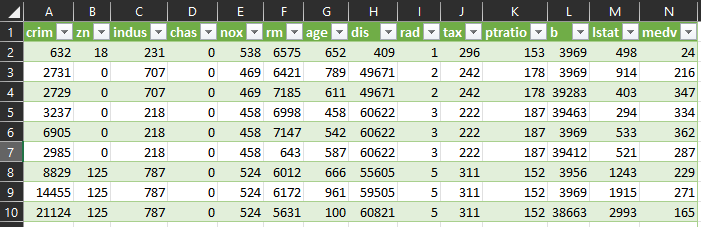
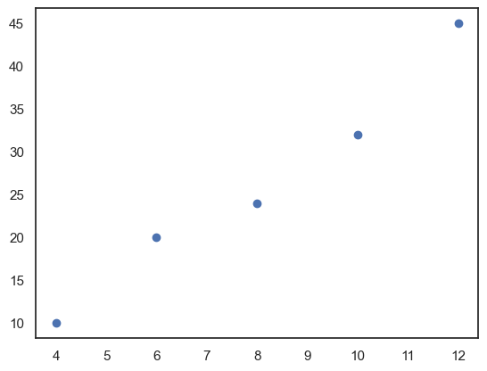

# Lineare Regression

## Handlungssituation

<!--lrg_Handlungssituation-->


> Ein großes internationales Immobilienbüro beauftragt die Abteilung Daten- und Prozessanalyse der ChangeIT GmbH mit der Entwicklung eines Modells zur Vorhersage von Immobilienpreise.
>
> Sie wirken maßgeblich an der Entwicklung des Vorhersagemodells mit und Beurteilen die Qualität des Modells.
<!--lrg_Handlungssituation-->

<!--lrg_daten-->
## Die Daten

Der Kunde stellt ihnen die Daten als *CSV* Datei zur Verfügung. Sie können diese Datei [hier](https://jtuttas.github.io/datenanalyse/Data/bo.csv) laden. Der Datensatz hat dabei folgenden Aufbau.



Die einzelnen Spalten bedeuten dabei:

- CRIM: Kriminalitätsrate pro Kopf
- ZN: Anteil der Wohngrundstücke über 25.000 Quadratfuß
- INDUS: Anteil der Nicht-Einzelhandels-Geschäftsflächen pro Stadt
- CHAS: Charles River-Dummy-Variable (1, falls das Grundstück an einem Fluss liegt, sonst 0)
- NOX: Stickoxidkonzentration (in Teilen pro 10 Millionen)
- RM: Durchschnittliche Anzahl von Zimmern pro Wohnung
- AGE: Anteil der im Jahr 1940 oder früher errichteten Wohnungen
- DIS: Gewichteter Abstand zu fünf Bostoner Arbeitszentren
- RAD: Index der Zugänglichkeit zu radialen Autobahnen
- TAX: Vollständige Immobiliensteuer pro 10.000 Dollar
- PTRATIO: Schüler-Lehrer-Verhältnis nach Stadtteilen
- B: Anteil an Afroamerikanern im Verhältnis zur Bevölkerung pro Stadt
- LSTAT: Prozentsatz der Bevölkerung mit niedrigem sozioökonomischem Status
- MEDV: Medianwert von Eigentumswohnungen in 1000er Dollar

<!--lrg_daten-->

<!--lrg_ueb1-->
Im weiteren Verlauf wollen wir uns zunächst anschauen welchen Einfluss das jeweilige Feature auf den Wert einer Eigentumswohnung (**MEDV**) hat. Zur Bestimmung nutzen wir die Perason-Korrelation des Wertes mit dem Zielfeature (**MEDV**). 

Der Pearson-Korrelationskoeffizient (r) misst die lineare Beziehung zwischen zwei Datensätzen. Die allgemeine Formel lautet:

$r = \frac{\sum (x_i - \bar{x})(y_i - \bar{y})}{\sqrt{\sum (x_i - \bar{x})^2 \sum (y_i - \bar{y})^2}}$

wobei:

- $x_i$ und $y_i$ die Werte der einzelnen Datenpunkte in den beiden Datensätzen sind,
- $\bar{x}$ und $\bar{y}$ die Mittelwerte der entsprechenden Datensätze sind.

Wir können diese Formel unter Verwendung der Definitionen von Standardabweichung und Kovarianz vereinfachen.

Die Kovarianz zwischen zwei Variablen X und Y ist definiert als:

$\text{Cov}(X,Y) = \frac{1}{n}\sum (x_i - \bar{x})(y_i - \bar{y})$

Die Standardabweichung einer Variable X ist definiert als:

$\sigma_X = \sqrt{\frac{1}{n}\sum (x_i - \bar{x})^2}$

und analog für Y.

Setzen wir diese Definitionen in die Formel des Pearson-Korrelationskoeffizienten ein, erhalten wir:

$r = \frac{\text{Cov}(X,Y)}{\sigma_X \sigma_Y}$

Dies ist die vereinfachte Formel des Pearson-Korrelationskoeffizienten, die zeigt, dass der Korrelationskoeffizient gleich dem Quotienten aus der Kovarianz der beiden Variablen und dem Produkt ihrer Standardabweichungen ist. Diese Formel ist besonders nützlich, da sie direkt die Kovarianz und die Standardabweichungen verwendet, was die Berechnung in praktischen Anwendungen erleichtert.

> *Hinweise*: Siehe hierzu hauch das Studyfix Video unter <https://studyflix.de/statistik/pearson-korrelation-1051>

### Übung 1

Es gelten folgende Beispieldaten:

|   X   |   Y   |
|-------|-------|
| 0.55  | 1.11  |
| 0.72  | 1.58  |
| 0.60  | 1.28  |
| 0.54  | 1.10  |
| 0.42  | 0.89  |
| 0.65  | 1.33  |
| 0.44  | 1.02  |
| 0.89  | 1.76  |
| 0.96  | 1.96  |
| 0.38  | 0.68  |

</br>

```py
X = [0.548814, 0.715189, 0.602763, 0.544883, 0.423655, 
     0.645894, 0.437587, 0.891773, 0.963663, 0.383442]
Y = [1.112031, 1.575806, 1.281631, 1.101934, 0.891696, 
     1.325156, 1.024582, 1.763030, 1.958632, 0.681473]
```

Schätzen Sie zunächst den Wert der Korrelation zwischen $X$ und $Y$ ab und bestimmen Sie im Anschluss daran den Pearson-Korrelationskoeffizient $r$.

<!--lrg_ueb1-->

<!--lrg_aufgabe1-->
Ein Kollege der Abteilung Datenanalyse hat sich bereits die Daten angeschaut und basierend auf dem Daten die Korrelation der Daten als Heatmap dargestellt. Er stellt Ihnen das Ergebnis seiner Analyse zur Verfügung:


## Aufgabe 1

Wählen Sie anhand der Heatmap zunächst ein weiteres **Feature** aus und stellen Sie dessen Einfluss auf den Wert einer Eigentumswohnung (**MEDV**) in Form einer Grafik (Scatter Plot) dar.

Beispielhaft ist hier die Beziehung zwischen den Preis der Immobilie (*medv*) und der Anzahl der Zimmer (*rm*) dargestellt.


<!--lrg_aufgabe1-->
<div style="page-break-after: always;"></div>
<!--lrg_info-->
## lineare Regression

Die lineare Regression versucht nun durch diese Datenmenge eine gerade zu legen, um auf diese Weise Vorhersagen von zukünftigen Ereignissen zu bestimmen. Wenn dieses gelingt, dann könnte z.B. ein Immobilienpreis anhand der Größe der Wohnung bestimmt werden.

> Weiter Informationen:
>
>-  [Studifix: Lineare Regression](https://studyflix.de/statistik/lineare-regression-2147)

Eine lineare Gleichung hat dabei folgende allgemeine Form.

$$f(x) = a \cdot x + b$$

Wobei **a** die Steigung und **b** der y-Achsenabschnitt der Geraden ist. Gesucht ist also eine Lösung mit den Werten **a** und **b**, die durch die gewählte Datenmenge eine Gerade repräsentiert, wobei der Fehlern (also die Abweichung des Gerade zu den einzelnen Datenpunkten) zu minimieren ist.

<!--lrg_uebung1-->
Die Lösung des Problem kann dabei iterativ als auch arithmetisch erfolgen. Eine arithmetische Lösung sieht dabei wie folgt aus.


$a = \frac{n\sum_{i=1}^n x_i y_i - \sum_{i=1}^n x_i \sum_{i=1}^n y_i}{n\sum_{i=1}^n x_i^2 - (\sum_{i=1}^n x_i)^2}$

$b = \frac{\sum_{i=1}^n y_i - a\sum_{i=1}^n x_i}{n}$

Dabei sind $x_i$ für das o.g. Beispiel die Werte für die Anzahl der Zimmer pro Wohneinheit (**rm**) und $y_i$ der daraus resultierende Preis der Wohnung.
<!--lrg_info-->

### Übungsaufgabe 2

Gehen Sie von folgenden Daten aus:

```python

x=[4,6,8,10,12]
y=[10,20,24,32,45]

```

Wenn Sie diese Daten visualisieren erhalten Sie folgenden Darstellung.



Berechnen Sie mit Hilfe der o.g. Formel die Geradengleichung $f(x) = a \cdot x + b$.

> **Hinweis**: Nutzen Sie zur Berechnung und ggf. auch zur Visualisierung die zur Verfügung gestellte Excel Tabelle [lrg_ueb1.xls](https://raw.githubusercontent.com/jtuttas/datenanalyse/master/docs/lrg_ueb1.xlsx)

<!--lrg_uebung1-->

### Übungsaufgabe 3

<!--lrg_uebung2-->
Überprüfen Sie ihre berechneten Werte, indem Sie die Gerade $f(x) = a \cdot x + b$ in die Datenmenge einzeichen. Z.B. mit Hilfe des folgenden Python Codes.

```py

a=2 # Ihr berechneter Wert für a
b=4 # Ihr berechneter Wert für b
x=[4,6,8,10,12]
y=[10,20,24,32,45]
gx = [4, 12]
gy = [a*4+b, a*12+b]
plt.plot(gx, gy,color="red")
plt.scatter(x, y)
plt.show()

```


Das Berechnen der Steigung **a** und des Achsenabschnitts **b** ist natürlich auch mit Hilfe einer Methode aus der Bibliothek **sklearn.linear_model** konkret die Klasse **LinearRegression**. Importieren Sie also zunächst die entsprechende Klasse:

```py

from sklearn.linear_model import LinearRegression
import numpy as np

# Gegebene Daten
x = np.array([4, 6, 8, 10, 12]).reshape(-1, 1)
y = np.array([10, 20, 24, 32, 45])

# Erstellung und Anpassung des linearen Regressionsmodells
model = LinearRegression()
model.fit(x, y)

# Koeffizienten der Regressionsgeraden
slope = model.coef_[0]
intercept = model.intercept_


```

Über die Methode **fit()** dieser Klasse können die Parameter **a** und **b** bestimmt werden. Diese befinden sich nach korrektem Aufruf der Methode im Attribut **coef_[0]** (für die Steigung **a**) und **intercept_** (für den Achsenabschnitt **b**). 

Überprüfen Sie mit Hilfe der Methode **fit()** ihre zuvor berechneten Werte und tragen Sie die Steigungsgerade in den Scatter Plot ein.


Über die Methode **predict()** des Modells können Sie nun anhand des Modells Aussagen über das Verhalten des Systems machen. Testen Sie diese indem Sie sich z.B. eine Aussage über den Wert von $x=7$ ausgeben lassen!

<!--lrg_uebung2-->

## Aufgabe 2
<!--lrg_aufg2-->

Bestimmen Sie die aus Aufgabe 1 ermittelten Korrelationen (**Features**) die Gerade $f(x) = a \cdot x + b$ und tragen Sie diese wie in der Übung in die Datenmenge ein.


Erstellen Sie ferner mittels der Methode **predict()** des Modells eine Aussage, indem Sie den Wert des Features übergeben und den Immobilienpreis angezeigt bekommen!

> Diskutieren Sie im Klassenverband, ob das nun erstellte Vorhersagemodell zum Prognostizieren des Hauspreises ausreichend ist, oder wie dieses verbessert werden kann?

<!--lrg_aufg2-->

<!--lrg_info2-->

## Anpassen des Modells für mehrere Features (Multiple Lineare Regression)

Zur Optimierung des Modells sollen auch die anderen *Features* des Datensatzes genutzt werden. Dieses Verfahren nennt sich Multiple Lineare Regression. Gesucht wird dabei folgende Gleichung.

$$f(x) = a_1 \cdot x_1 + a_2 \cdot x_2+a_3 \cdot x_3 + b$$

Dabei sind $a_1$ bis $a_n$ Faktoren für die einzelnen *Features* $x_1$ bis $x_n$. Diese einzelnen Faktoren gilt es nun iterativ zu bestimmen.

> **Weitere Informationen:**
>
> - [Studifix: Multiple Lineare Regression](https://studyflix.de/statistik/multiple-regression-2149)

Zur Überprüfung des daraus entstandene Vorhersagemodells muss nun der Datensatz zunächst in **Trainingsdaten** und **Testdaten** geteilt werden. Eine Teilung von 80/20 ist hierfür ein gängiges Mittel.


Zum Aufteilen ein Datensatzes in Trainings- / Testdaten dient auch wieder eine Methode aus dem Paket **sklearn.model_selection**, konkret die Methode **train_test_split()** die dieser Aufteilung vornimmt.

```py

from sklearn.model_selection import train_test_split
feature_names=["rm","b","dis"]
X_train, X_test, y_train, y_test = train_test_split(df[feature_names], df['medv'], test_size=0.2, random_state=0)

```

### Trainieren des Modells

Anschließend kann das Modell mit den Trainingsdaten trainiert werden.

```py

model = LinearRegression()
model.fit(X_train, y_train)

```

Die Einzelnen Faktoren $a_1$ bis $a_n$ befinden sich dabei wie zuvor in dem Attribut *model.coeff_* in Form eines Arrays und *model.intercept* der Wert für den Achsenabschnitt *b*.

Um nun aufgrund unseres Modells eine Vorhersage zu treffen, dient die Funktion **predict** im Objekt **model**. Dieses erwartet einen Datensatz als Übergabeparameter.

### R2 - Metrik

Über die Qualität des Modells gibt u.a. Der Wert $R^2$ (Determinationskoeffizient) Auskunft.

Je höher der $R^2$-Wert, desto besser die Vorhersage.

```py

from sklearn.metrics import r2_score

y_pred = model.predict(X_test)
r2 = r2_score(y_test, y_pred)
print('R^2: ', r2)

```
<!--lrg_info2-->

## Aufgabe 3
<!--lrg_aufg3-->

Führen Sie wie beschrieben die Regressions Analyse mit 3-4 **wichtigen Features** mit dem Datensatz durch. Wählen Sie dann einen Datensatz aus der Menge der Testdaten und lassen sich mit der Funktion **predict()** das Ergebnis für einen Immobilienpreis ausgeben. Überprüfen Sie ferner die Qualität ihres Vorhersagemodells, indem Sie den Wertt $R^2$ bestimmen.

> Diskutieren Sie Maßnahmen, wie die Qualität des Vorhersagemodells verbessert werden kann!
<!--lrg_aufg3-->

## Aufgabe 4
<!--lrg_aufg4-->

Entscheiden Sie sich in einer Kleingruppe für einen geeigneten Datensatz zur Durchführung einer Regressionsanalyse und führen Sie die Analyse durch. Erstellen Sie auf der Grundlage ihrer Analyse eine kurze Präsentation und Präsentieren diese anschließend kurz der Klasse ihr Ergebnis.

Die Präsentation sollte beinhalten:

- Art / Beschreibung des Datensatzes
- Zu untersuchende Fragestellung
- Vorgehensweise
- Interpretation der Ergebnisse

Folgende Datensätze können z.B. genutzt werden:

- **El Nino Dataset**: Oceanographic and surface meteorological readings taken from a series of buoys positioned throughout the equatorial Pacific. [Download](https://jtuttas.github.io/datenanalyse/Data/el.csv) / Beschreibung: <https://www.kaggle.com/datasets/uciml/el-nino-dataset>
- **eBay auction data**: Auction data from various eBay.com objects over various length auctions. [Download](https://jtuttas.github.io/datenanalyse/Data/auc.csv) / Beschreibung: <https://www.kaggle.com/code/yingyingchen/ebay-auction-data-analysis/data>
- **Bike Sharing Dataset**: Hourly and daily count of rental bikes in a large city. [Download](https://jtuttas.github.io/datenanalyse/Data/lbike.csv) / Beschreibung: <https://www.kaggle.com/datasets/hmavrodiev/london-bike-sharing-dataset>
- Oder wählen Sie einen eigenen Datensatz z.B. aus [https://www.kaggle.com/](https://www.kaggle.com/)!

<!--lrg_aufg4-->

## Reflexion der Unterrichtseinheit

<!--lrg_relex-->
Sie erhalten von ihrem Geschäftsführer *Dr. Wöhler* die unten abgebildete Email. Verfassen Sie auf diese Email eine Antwort.

>"Sehr geehrte Mitarbeiter der Abteilung Daten- und Prozessanalyse,
>
>ich gratuliere Ihnen von ganzem Herzen zu Ihrer erfolgreichen Fertigstellung des Modells zur Vorhersage von Immobilienpreisen. Alle Anstrengungen, die Sie auf sich genommen haben, um dieses Modell zum Laufen zu bringen, werden nun mit dem Ergebnis belohnt.
>
>Ausserdem möchte ich betonen, dass wir in Zukunft alle Anforderungen für ein Modell datenbasierter Vorhersagen mit den Mitteln der linearen Regression lösen sollten. Der Grund ist, dass lineare Regression uns die größtmögliche Genauigkeit beim Entwerfen oder Verbessern von Modellen gewährleistet.
>
>Noch einmal herzlichen Glückwunsch an alle, die an diesem Projekt beteiligt waren. Bleiben Sie alle weiterhin motiviert, kreativ und innovativ.
>
>Vielen Dank,
>
>Dr. Wöhler,  
>Geschäftsführer ChangeIT GmbH"

<!--lrg_relex-->