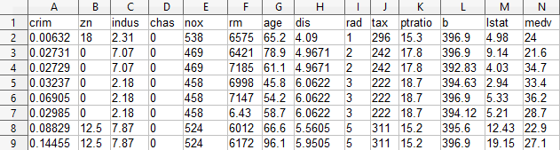

# Lineare Regression

## Handlungssituation

> Ein großes internationales Immobilienbüro beauftragt die Abteilung Daten- und Prozessanalyse der ChangeIT GmbH mit der Entwicklung eines Modells zur Vorhersage von Immobilienpreise.
>
> Sie wirken maßgeblich an der Entwicklung des Vorhersagemodells mit und Beurteilen die Qualität des Modells.

## Die Daten

Der Kunde stellt ihnen die Daten als *CSV* Datei zur Verfügung. Sie können diese Datei [hier](../Data/bo.csv) laden. Der Datensatz hat dabei folgenden Aufbau.



Die einzelnen Spalten bedeuten dabei:

- CRIM: Kriminalitätsrate pro Kopf
- ZN: Anteil der Wohngrundstücke über 25.000 Quadratfuß
- INDUS: Anteil der Nicht-Einzelhandels-Geschäftsflächen pro Stadt
- CHAS: Charles River-Dummy-Variable (1, falls das Grundstück an einem Fluss liegt, sonst 0)
- NOX: Stickoxidkonzentration (in Teilen pro 10 Millionen)
- RM: Durchschnittliche Anzahl von Zimmern pro Wohnung
- AGE: Anteil der im Jahr 1940 oder früher errichteten Wohnungen
- DIS: Gewichteter Abstand zu fünf Bostoner Arbeitszentren
- RAD: Index der Zugänglichkeit zu radialen Autobahnen
- TAX: Vollständige Immobiliensteuer pro 10.000 Dollar
- PTRATIO: Schüler-Lehrer-Verhältnis nach Stadtteilen
- B: Anteil an Afroamerikanern im Verhältnis zur Bevölkerung pro Stadt
- LSTAT: Prozentsatz der Bevölkerung mit niedrigem sozioökonomischem Status
- MEDV: Medianwert von Eigentumswohnungen in 1000er Dollar

Ein Kollege der Abteilung Datenanalyse hat sich bereits die Daten angeschaut und basierend auf dem Daten die Korrelation der Daten als Heatmap dargestellt. Er stellt Ihnen das Ergebnis seiner Analyse zur Verfügung:


## Aufgabe 1

Wählen Sie zunächst zwei für die Aufgabe interessanten Korrelationen (**Features**) aus und stellen Sie die Verteilung in Form einer Grafik (Scatter Plot) dar.

Beispielhaft ist hier die Beziehung zwischen den Preis der Immobilie (*medv*) und der Anzahl der Zimmer (*rm*) dargestellt.


## lineare Regression

Die lineare Regression versucht nun durch diese Datenmenge eine gerade zu legen, um auf diese Weise Vorhersagen von zukünftigen Ereignissen zu bestimmen. Wenn dieses gelingt, dann könnte z.B. ein Immobilienpreis anhand der Größe der Wohnung bestimmt werden.

Eine lineare Gleichung hat dabei folgende allgemeine Form.

$$f(x) = a \cdot x + b$$

Wobei **a** die Steigung und **b** der y-Achsenabschnitt der Geraden ist. Gesucht ist also eine Lösung mit den Werten **a** und **b**, die durch die gewählte Datenmenge eine Gerade repräsentiert, wobei der Fehlern (also die Abweichung des Gerade zu den einzelnen Datenpunkten) zu minimieren ist.

Die Lösung des Problem kann dabei iterativ als auch arithmetisch erfolgen. Eine arithmetische Lösung sieht dabei wie folgt aus.

$a = \frac{n\sum_{i=1}^n x_i y_i - \sum_{i=1}^n x_i \sum_{i=1}^n y_i}{n\sum_{i=1}^n x_i^2 - (\sum_{i=1}^n x_i)^2}$

$b = \frac{\sum_{i=1}^n y_i - a\sum_{i=1}^n x_i}{n}$

Dabei sind $x_i$ für das o.g. Beispiel die Werte für die Anzahl der Zimmer pro Wohneinheit (**rm**) und $y_i$ der daraus resultierende Preis der Wohnung.

### Übungsaufgabe 1

Gehen Sie von folgenden Daten aus:

```py

x=[4,6,8,10,12]
y=[10,20,24,32,45]
```

Wenn Sie diese Daten visualisieren erhalten Sie folgenden Darstellung.


Berechnen Sie mit Hilfe der o.g. Formel die Geradengleichung $f(x) = a \cdot x + b$.

### Übungsaufgabe 2

Überprüfen Sie ihre berechneten Werte, indem Sie die Gerade $f(x) = a \cdot x + b$ in die Datenmenge einzeichen. Z.B. mit Hilfe des folgenden Python Codes.

```py
a=2 # Ihr berechneter Wert für a
b=4 # Ihr berechneter Wert für b
x=[4,6,8,10,12]
y=[10,20,24,32,45]
gx = [4, 12]
gy = [a*4+b, a*12+b]
plt.plot(gx, gy,color="red")
plt.scatter(x, y)
plt.show()
```


Das Berechnen der Steigung **a** und des Achsenabschnitts **b** ist natürlich auch mit Hilfe einer Methode aus der Bibliothek **sklearn.linear_model** konkret die Klasse **LinearRegression**. Importieren Sie also zunächst die entsprechende Klasse:

```py
from sklearn.linear_model import LinearRegression
```

Über die Methode **fit()** dieser Klasse können die Parameter **a** und **b** bestimmt werden. Diese befinden sich nach korrektem Aufruf der Methode im Attribut **coef_[0]** (für die Steigung **a**) und **intercept_** (für den Achsenabschnitt **b**). 

Überprüfen Sie mit Hilfe der Methode **fit()** ihre zuvor berechneten Werte und tragen Sie die Steigungsgerade in den Scatter Plot ein.


## Aufgabe 2

Bestimmen Sie die aus Aufgabe 1 ermittelten Korrelationen (**Features**) die Gerade $f(x) = a \cdot x + b$ und tragen Sie diese wie in der Übung in die Datenmenge ein.


> Diskutieren Sie im Klassenverband, ob das nun erstellte Vorhersagemodell zum Prognostizieren des Hauspreises ausreichend ist, oder wie dieses verbessert werden kann?

## Anpassen des Modells für mehrere Features

Zur Optimierung des Modells sollen auch die anderen *Features* des Datensatzes genutzt werden. Zur Überprüfung des daraus entstandene Vorhersagemodells muss nun der Datensatz zunächst in **Trainingsdaten** und **Testdaten** geteilt werden. Eine Teilung von 80/20 ist hierfür ein gängiges Mittel.


Zum Aufteilen ein Datensatzes in Trainings- / Testdaten dient auch wieder eine Methode aus dem Paket **sklearn.model_selection**, konkret die Methode **train_test_split()** die dieser Aufteilung vornimmt.

```py
from sklearn.model_selection import train_test_split
feature_names=["rm","b","dis"]
X_train, X_test, y_train, y_test = train_test_split(df[feature_names], df['medv'], test_size=0.2, random_state=0)
```

Anschließend kann das Modell mit den Trainingsdaten trainiert werden.

```py
model = LinearRegression()
model.fit(X_train, y_train)
```

Über die Qualität des Modells gibt u.a. Der Wert $R^2$ aus. Je höher der $R^2$-Wert, desto besser die Vorhersage.

```py
from sklearn.metrics import r2_score

y_pred = model.predict(X_test)
r2 = r2_score(y_test, y_pred)
print('R^2: ', r2)
```

## Aufgabe 3

Führen Sie wie beschrieben die Regressions Analyse mit **allen** bekannten *Features* mit dem Datensatz durch und lassen Sie sich den Wert $R^2$ ausgeben.

> Diskutieren Sie Maßnahmen, wie die Qualität des Vorhersagemodells verbessert werden kann!

## Aufgabe 4

Entscheiden Sie sich in einer Kleingruppe für einen geeigneten Datensatz zur Durchführung einer Regressionsanalyse und führen Sie die Analyse durch. Präsentieren Sie anschließende kurz der Klasse ihr Ergebnis.

Folgende Datensätze können z.B. genutzt werden:

- **El Nino Dataset**: Oceanographic and surface meteorological readings taken from a series of buoys positioned throughout the equatorial Pacific. [Download](../Data/el.csv) / [Download und Beschreibung](https://www.kaggle.com/datasets/uciml/el-nino-dataset)
- **eBay auction data**: Auction data from various eBay.com objects over various length auctions. [Download](../Data/auc.csv) / [Download und Beschreibung](https://www.kaggle.com/code/yingyingchen/ebay-auction-data-analysis/data)
- **Bike Sharing Dataset**: Hourly and daily count of rental bikes in a large city. [Download](../Data/lbike.csv) / [Download und Beschreibung](https://www.kaggle.com/datasets/hmavrodiev/london-bike-sharing-dataset)
- Oder wählen Sie einen eigenen Datensatz z.B. aus [https://www.kaggle.com/](https://www.kaggle.com/)!
