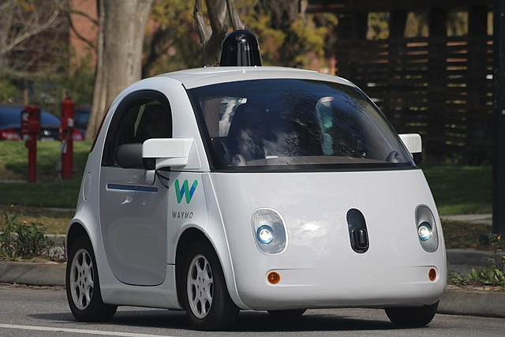
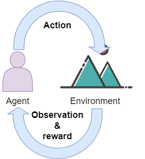
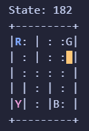
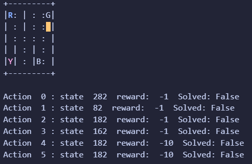
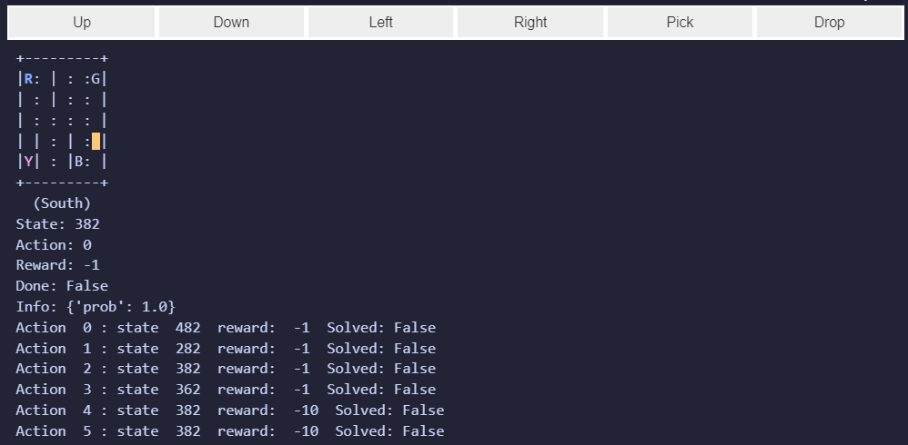
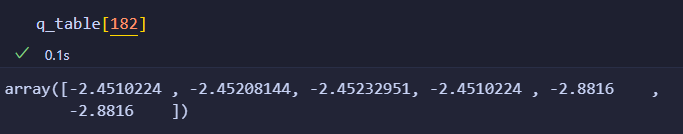

# Reinforced Learning

## Handlungssituation



<!--ril_Handlungssituation-->
> Ein großer deutscher internationaler Automobilkonzern, plant die Einführung einer autonomen Taxiflotte. Dabei sollen Fahrgäste ein fest definierten Stationen die Möglichkeit haben eine Fahrt zu buchen und eine weitere Station als Zielort anzugeben.
>
> Der Chefentwickler der Abteilung Daten- und Prozessanalyse der ChangeIT GmbH schlägt vor dieses Problem mit Hilfe des verstärkenden Lernens zu lösen. Die Kollegen der Anwendungsentwicklung haben dazu bereits eine Simulationsumgebung geschaffen. Ihre Aufgabe wird es sein, einen Lernalgorithmus zu entwickeln, der in dieser Simulationsumgebung Fahrgäste aufnimmt und optimal zu ihrem Zeil befördert.

<!--ril_Handlungssituation-->

## Erklärung Reinforced Learning

Reinforcement Learning ist eine Methode im Bereich des maschinellen Lernens, bei der ein Agent seine Strategien lernt, indem er seine Umgebung erkundet und durch Interaktion mit dieser belohnt oder bestraft wird. Das Ziel des Agenten ist es, durch wiederholte Interaktionen die Aktionen zu finden, die ihn am meisten belohnen.

Ein Beispiel für Reinforcement Learning könnte ein autonomes Fahrzeug sein, das lernen soll, wie es auf einer Straße sicher navigieren kann. Die Umgebung des Agenten besteht aus den Straßenzuständen, dem Verkehr und anderen Objekten auf der Straße. Der Agent arbeitet hierbei mit einem State-Action-Reward-State-Modell (SARS-Modell).

Der Agent beginnt damit, zufällige Aktionen auszuführen, während er die Umgebung erkundet. Der Zustand des Agenten ändert sich abhängig von seinen Aktionen und der Umgebung. Wenn das Auto beispielsweise bremst, weil ein Hindernis auf der Straße auftaucht, wird der Zustand des Autos verändert. Für jede Aktion, die der Agent ausführt, erhält er einen Belohnungswert oder ein Bestrafungssignal, je nachdem, ob die Aktion erfolgreich war oder nicht.

Der Agent verwendet die gesammelten Zustandsinformationen, um die besten Aktionen in ähnlichen Situationen zu identifizieren. Durch erneute Iteration verbessert der Agent schließlich seine Fähigkeiten und trifft bessere Entscheidungen in Zukunft.

Das SARS-Modell ist eine grundlegende Komponente von Reinforcement Learning. Der Zustand (State) zeigt an, in welchem Zustand das System sich gerade befindet. Die Aktion (Action) ist die Handlung, die der Agent ausführt. Die Belohnung (Reward) wird dem Agenten je nach dem Ergebnis seiner Aktion gegeben. Der Zustand in der Folgezeit zeigt an, wie sich die Umgebung aufgrund der ausgewählten Aktion verändert hat.

Durch die Verwendung des SARS-Modells und die ständige Interaktion mit der Umgebung kann ein Reinforcement Learning-Agent schließlich lernen, die besten Entscheidungen zu treffen, um seine Ziele auf effektive Weise zu erreichen.



## Die Simulationsumgebung

### Installation der notwendigen Pakete 

Zunächst müssen wir die Simulationsumgebung installieren. Am besten nutzt man dazu eine Virtuelle Umgebung mit Python 3.8. Diese kann man z.B. mittels Conda wie folgt einrichten.

```
conda create --name mygym python=3.8
conda activate mygym
```

Anschließend können die notwendigen Pakete installiert werden.

```
pip install stable-baselines3
pip install ipywidgets
pip install gym[toy_text]
```

> GGf. muss anschließen der Kernel noch einmal neu gestartet werden!

### Starten der Simulationsumgebung

Führen Sie dann im Anschluss daran den folgenden Python Code in einer Zelle eines Juypter Notebooks aus.

```py
import gym

env = gym.make("Taxi-v3").env
state=env.reset()
print("State:", state)
env.render()
```

Es sollte dabei folgende Ausgabe erscheinen:



Der gelb markierte Cursor entspricht dem Taxi. Es gibt vier Stationen (R)ed, (G)reen ,(B)lue und (Y)ellow. Ein Passagier möchte dabei von der blau markierten Station abgeholt werden und zur magenta markierten Station gebracht werden.

Um diesen Auftrag zu bewältigen stehen dem Agenten folgende Aktionen zur Verfügung.

| Aktion          | Wert |
| --------------- | ---- |
| South           | 0    |
| North           | 1    |
| East            | 2    |
| West            | 3    |
| Pick Passagener | 4    |
| Drop Passanger  | 5 |

Vgl. [Open AI Gym taxi Env](https://www.gymlibrary.dev/environments/toy_text/taxi/)

Wie jedes Environment stellt auch das Taxi Environment für das Training mittels reinforced Learning wichtige Parameter zur Verfügung:

**State** : Der Zustand in dem sich die Umgebung befindet. Nach dem oberen Bild befindet sich die Umgebung im Zustand 182. Unsere Umgebung besteht aus 5x5 Feldern. Zusätzlich gibt es 4 Positionen der Stationen. Der Passagier kann dabei an einem der Positionen sein, oder bereits im Taxi (4+1), daher haben wird insgesamt 500 unterschiedliche Zustände in der Umgebung ($5*5*4*(4+1)$)! Jeder dieser Werte beschreibt genau die Situation in unserer Umgebung. Über*env.s* kann die Umgebung in einen gezielten Zustand gebracht werden.

**Reward**: Belohnung für den Agenten

**Done**: Boolean, ob die Aufgabe erfüllt wurde.

### Setzen des Zustandes

Erweitern Sie ihr Programm in der Weise, dass der oben dargestellte Zustand 182 eingenommen wird!


### Ausführen von Aktionen

Führen Sie mit Hilfe Hilfe der Methode *step(int)* eine Aktion durch. Die Methode gibt dabei einen Vektor zurück der aus folgenden Elemente besteht.

```py
next_state, reward, done, info = env.step(int)
```

- *next_state*: Der Zustand in der sich die Umgebung befindet, wenn die Aktion ausgeführt wurde.
- *reward*: Belohnung die es für die Aktion gab
- *done*: Boolescher Wert ob die Aufgabe erfolgreich absolviert wurde

Lassen Sie sich die Ergebnisse ihre Aktion auf der Console ausgeben.

### Die Möglichkeiten (Possibilities) der Aktionen

Neben diesen Werten gibt uns die Umgebung noch die Möglichkeit die Möglichkeiten der Aktionen zu untersuchen. Setzten Sie dazu die Umgebung wieder in den Zustand 182 und lassen Sie sich das *P* Array ausgeben. Dieses Array hat das Format [Action] [State,reward,done].



Wie wir sehen führt eine *Action 1 - North* in den Zustands 82. Es gibt einen "*reward* von -1. Das Ausführen der *Action 4 - Pick Passanger* verweilt im Zustand 182 und wird 'bestraft' mit einem *reward* von -10, denn im Zustand 182 befindet sich kein Passagier an der Stelle um ihn aufzunehmen.

### Weiteres erkunden der Umgebung

Nachdem Sie nun die wichtigsten Parameter der Umgebung kennen gelernt haben erkunden Sie ein wenig die Umgebung und beobachten Sie die Parameter *reward*. Führen Sie folgende Zelle in einem Jupyter Notebook aus, nachdem die Umgebung initialisiert wurde. Über die dargestellten Schaltflächen können Sie die Aktionen durchführen. Transportieren Sie einen Passagier von Startpunkt zum Zielpunkt !

```py
import ipywidgets as widgets
from IPython.display import clear_output

# Funktion, die ausgeführt wird, wenn ein Button geklickt wird:
def on_button_clicked(button):
    print(f"{button.description} wurde geklickt!")
    clear_output()
    display(buttons_hbox)
    i=0
    if button==button1:
        i=1
    if button==button2:
        i=0
    if button==button3:
        i=3
    if button==button4:
        i=2
    if button==button5:
        i=4
    if button==button6:
        i=5
    next_state, reward, done, info = env.step(int(i))
    env.render()
    print("State:", next_state)
    print("Action:", i)
    print("Reward:", reward)
    print("Done:", done)
    print("Info:", info)
    
    for key, value in env.P[next_state].items():
        print("Action ", key, ": state ", value[0][1], " reward: ",value[0][2], " Solved:",value[0][3])
    

# Erstelle die beiden Buttons:
button1 = widgets.Button(description="Up")
button2 = widgets.Button(description="Down")
button3 = widgets.Button(description="Left")
button4 = widgets.Button(description="Right")
button5 = widgets.Button(description="Pick")
button6 = widgets.Button(description="Drop")

# Weise die Callback-Funktion jedem Button zu:
button1.on_click(lambda b: on_button_clicked(b))
button2.on_click(lambda b: on_button_clicked(b))
button3.on_click(lambda b: on_button_clicked(b))
button4.on_click(lambda b: on_button_clicked(b))
button5.on_click(lambda b: on_button_clicked(b))
button6.on_click(lambda b: on_button_clicked(b))

# Gruppiere die Buttons mit HBox:
buttons_hbox = widgets.HBox([button1, button2,button3,button4,button5,button6])

# Zeige die Gruppierung an:
display(buttons_hbox)
env.render()
```



## Brute Force Ansatz

Schreiben Sie nun ein Programm, welches die Aufgabe (den Transport eines Passagiers vom Startpunkt zum Zielpunkt) mittels eines Brute Force Ansatzes löst und lassen Sie sich ausgeben wie viele Züge dazu notwendig waren!

### Lösung Brute Force Ansatz

```py

done = False

while not done:
    action = env.action_space.sample()
    state, reward, done, info = env.step(action)
  
    
print("Timesteps taken: {}".format(epochs))

```

## Q-Learning Algorithmus

Der Brute-Force Ansatz liefert unterschiedliche und unakzeptable Werte für das Erledigen eines Auftrages. Der Grund darin ist, dass wir uns nicht den Erfolg einer Aktion in der Umgebung merken.

Um dieses 'Gedächnis' zu erstellen benötigen wir ein Array, welches den Erfolg einer Aktion in Abhängigkeit vom Zustand speichert. Das Array hätte folgendes Aussehen und wir zunächst einmal mit 0-Werten initialisiert.

| state | South | North | East | West | Pick | Drop |
| ----- | :---- | ----- | ---- | ---- | ---- | ---- |
| 0     | 0     | 0     | 0    | 0    | 0    | 0    |
| 1 | 0      | 0      |  0    |  0    | 0     | 0     |
| ... | 0      | 0      |  0    |  0    | 0     | 0     |
| 499 | 0      | 0      |  0    |  0    | 0     | 0     |

Beim Lernen wird es nun wichtig sein, die Summe des *reqrds* zu maximieren innerhalb einer *Epoche*. Eine *Epoche* ist dabei die Anzahl der Schritte bis zum Abliefern des Passagiers.

Unser Q-Learning Algorithmus hat dabei folgende Funtion:

**Q(state,action)= (1 - α) * Q(state,action) + α * [reward + γ * max Q(next State,all actions)]**

- Q(state,aaction): der erwartete Nutzen (engl. "expected utility") bei Auswahl der Aktion 'action' im Zustand 'state'
- α: der Lernrateparameter (engl. "learning rate parameter"), der bestimmt, inwieweit neue Informationen den bisherigen Q-Wert beeinflussen sollen
- reward: die Belohnung (engl. "reward") nach der Wahl der Aktion 'action' im Zustand 'state'
- γ: der Abschlagfaktor (engl. "discount factor"), der bestimmt, wie wichtig zukünftige Belohnungen im Vergleich zu aktuellen Belohnungen sind
- max Q(next State,all actions): der maximale erwartete Nutzen, den man erhält, wenn man eine Aktion 'a' im nächsten Zustand 'next state' wählt.

Wir wir sehen, ist dabei, dass das bisher Gelernte den größten Einfluss hat $(1 - α) * Q(state,action)$ und der Zugewinn mit dem Renratenparameter eingeht.

Die Implementierung des Algorithmus in Python kann wie folgt aussehen:

```py
import numpy as np
import random
from IPython.display import clear_output

q_table = np.zeros([env.observation_space.n, env.action_space.n])
# Hyperparameters
alpha = 0.1
gamma = 0.6


for i in range(1, 100001):
    state = env.reset()

    epochs, reward, = 0, 0, 
    done = False
    
    while not done:
        action = np.argmax(q_table[state]) # Exploit learned values

        next_state, reward, done, info = env.step(action) 
        
        old_value = q_table[state, action]
        next_max = np.max(q_table[next_state])
        
        new_value = (1 - alpha) * old_value + alpha * (reward + gamma * next_max)
        q_table[state, action] = new_value

        state = next_state
        epochs += 1
        
    if i % 100 == 0:
        clear_output(wait=True)
        print(f"Episode: {i}")

print("Training finished.\n")

```

*Aufgabe*: Trainieren Sie das Modell und lassen Sie sich nach dem Training die Q-Tabelle für den Zustand 182 ausgeben und entscheiden Sie daran, welche Aktion in diesem Zustand den meisten Erfolg bringt.

*Lösung*: Die Q-Table im Zustands 182 zieht wie folgt aus:



Der maximale Wert ist die -2.4510224, d.h. die erfolgreichsten Aktionen in diesem Zustands ist entweder eine Bewegung nach Süden oder nach Osten!


*Aufgabe*: Entwickeln Sie nach erfolgreichem Training ein Programm, welches Ihnen Aussagen über die Qualität des Modells erlaubt. Verändern Sie ferner wichtige Parameter im Algorithmus und beobachten Sie, wie dieses sich auf die Qualität des Modells auswirken.

*Lösung*: Hier ein Programm, welches 10 Episoden durchführt und die Anzahl der notwendigen Schritte und ggf. Fehlversuche zählt und visualisiert.

```py
penalties, reward = 0, 0

frames = [] # for animation

for i in range(1,10):
    env.reset()
    epochs=0
    done = False

    while not done:
        action = np.argmax(q_table[state])
        state, reward, done, info = env.step(action)

        if reward == -10:
            penalties += 1
        
        # Put each rendered frame into dict for animation
        frames.append({
            'frame': env.render(mode='ansi'),
            'state': state,
            'action': action,
            'reward': reward,
            'done': done
            }
        )
        epochs += 1
        
        
    print("Timesteps taken: {}".format(epochs))
    print("Penalties incurred: {}".format(penalties))
```

Und hier eine einfache Form der Visualisierung:

```py
def print_frames(frames):
    j=0
    for i, frame in enumerate(frames):
        clear_output(wait=True)
        env.s = frame['state']
        j=j+1
        print(f"Timestep: {j}")
        print(f"State: {frame['state']}")
        print(f"Action: {frame['action']}")
        print(f"Reward: {frame['reward']}")
        if frame['done']==True:
            j=0
        env.render()
        sleep(.5)
        
print_frames(frames)
```

*Aufgabe*: Wechseln Sie das Environment auf ein anderes Environment. Z.B.

- Das **FrozenLake** Environment. <https://www.gymlibrary.dev/environments/toy_text/frozen_lake/>.
- Das **Cliff Walking** Environmment <https://www.gymlibrary.dev/environments/toy_text/cliff_walking/>

Gehen Sie im weiteren Verlauf wie folgt vor:

- Untersuchen Sie dabei zunächst das Environment, welche Aktionen gibt es, bestimmen Sie den Action Space und den Observation Space.
- Versuchen Sie einen Brute Force Ansatz
- Trainieren Sie mit Hilfe des Q-learning Algorithmus ein Modell und beurteilen Sie dessen Qualität
- Dokumentieren und präsentieren Sie anschließend ihr Vorgehen

## Fragen zum Verständnis

1. Welches der folgenden Aussagen ist eine korrekte Beschreibung von Reinforcement Learning?
   - [ ] A. Ein überwachtes Lernen, bei dem die Modelle mit Hilfe von explizit beschrifteten Trainingsdaten trainiert werden.
   - [ ] B. Ein unüberwachtes Lernen, bei dem die Modelle Muster in Daten entdecken, ohne dass menschliche Anleitung erforderlich ist.
   - [ ] C. Ein Art von Lernen, bei dem ein Agent seine Handlungen basierend auf Belohnungen und Strafen optimiert.
   - [ ] D. Ein semi-überwachtes Lernen, das eine Mischung aus beschrifteten und unbeschrifteten Daten verwendet.

2. Was ist ein wesentliches Merkmal des Q-Learning-Algorithmus im Reinforcement Learning?
   - [ ] A. Q-Learning verwendet ein Modell der Umgebung, um die beste nächste Aktion vorherzusagen.
   - [ ] B. Q-Learning aktualisiert seine Q-Werte basierend auf der Differenz zwischen der erwarteten und der tatsächlichen Belohnung nach jeder Aktion (auch bekannt als TD-Fehler).
   - [ ] C. Q-Learning erfordert eine vollständige Kenntnis aller möglichen Zustände und Aktionen vor Beginn des Lernprozesses.
   - [ ] D. Q-Learning kann nur bei diskreten Zustands- und Handlungsräumen angewendet werden.


3. Was ist "Deep Reinforcement Learning"?
   - [ ] A. Ein Ansatz für Reinforcement Learning, der genetische Algorithmen verwendet.
   - [ ] B. Ein Ansatz für Reinforcement Learning, der neuronale Netzwerke verwendet, um Q- oder Value-Funktionen zu approximieren.
   - [ ] C. Ein Ansatz für Reinforcement Learning, der tiefe neuronale Netzwerke verwendet, um die Umgebung des Agenten zu modellieren.
   - [ ] D. Ein Ansatz für Reinforcement Learning, der sich ausschließlich auf theoretische Forschung konzentriert und nicht in der Praxis angewendet wird.

4. Welche Aussage über Q-Learning ist korrekt?
   - [ ] A. Q-Learning ist eine Art von überwachtem Lernen.
   - [ ] B. Q-Learning ist ein modellfreier Reinforcement Learning Algorithmus.
   - [ ] C. Q-Learning erfordert ein vollständiges Modell der Umgebung, um effektiv zu sein.
   - [ ] D. Q-Learning kann nur in kontinuierlichen Zustandsräumen verwendet werden.

5. Was bedeutet Exploration vs Exploitation in Reinforcement Learning?
   - [ ] A. Exploration bezieht sich auf das Erlernen von neuen Strategien, während Exploitation das Anwenden dieser Strategien bezeichnet.
   - [ ] B. Exploration bezieht sich auf das Sammeln von Daten, während Exploitation die Analyse dieser Daten bezeichnet.
   - [ ] C. Exploration bezieht sich auf das Testen unbekannter Aktionen, während Exploitation das Nutzen von bekanntem Wissen zur Maximierung der Belohnung bezeichnet.
   - [ ] D. Exploration bezieht sich auf das Experimentieren mit verschiedenen Modellen, während Exploitation das Trainieren eines bestimmten Modells bezeichnet.

<!-- richtig 

1C
2B
3B
4B
5C

-->