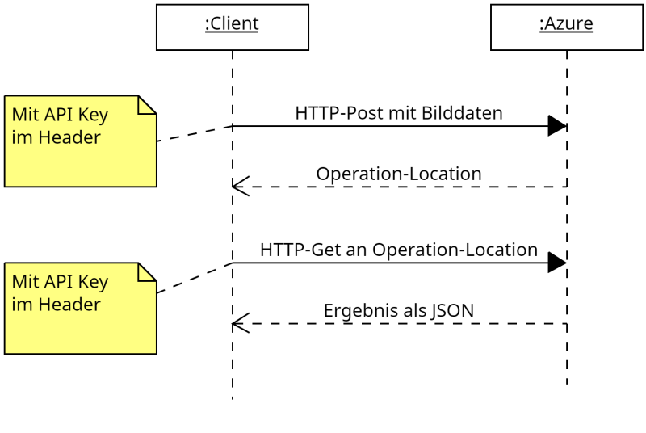
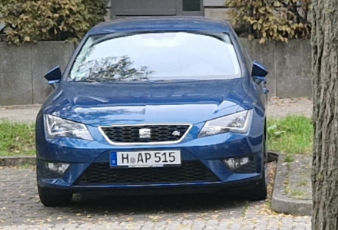
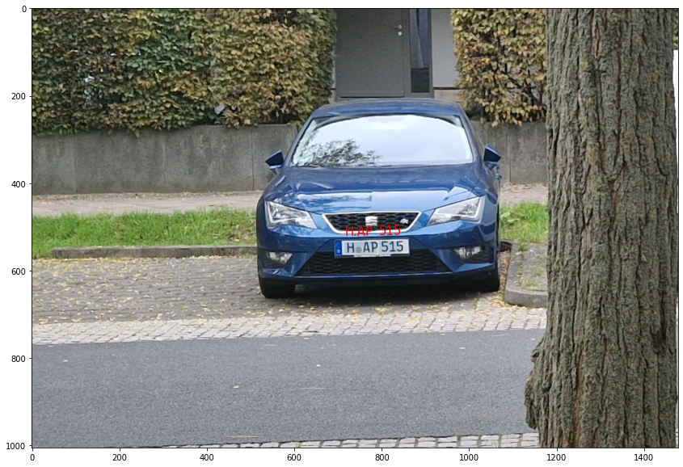

# Cloud KI Dienste

>Der Besitzer eines Eigenheims möchte gerne wissen welche Autos für wie lange auf seinen Parkplatz parken. Die Kamera vor dem Haus mach dazu alle 5 Minuten ein Bild von dem Parkplatz. Sie erhalten der Auftrag eine Anwendungssystem zu entwickeln welches das KFZ Kennzeichen erfasst und dieses mit einem Zeitstempel in eine Datenbank schreibt.

Da das antrainieren einer eigenen Texterkennungs KI zu aufwendig erscheint, entscheidet sich die Geschäftsführung dazu einen Cloud Dienstleister zu nutzen. Da bereits ein Azure Konto existiert, soll der Azure Bilderkennungsdienst genutzt werden.

<!--Info-->
## Der Bilderkennungsdienst von Azure

Azure bietet eine vielzahl von trainierten Neuronalen Netzwerken für diverse Aufgaben an (z.B. Bildanalyse, Sprachsynthese u.v.a.m). In diesem Beispiel wollen wir das Texterkennungssystem von Azure nutzen. Dabei kommunizieren die KI Dienste von Azure über eine REST Schnittstelle mit dem Client (das Programm).

### Einrichten der Texterkennung in Azure

Melden Sie sich zunächst in [Azure an](https://azure.microsoft.com/de-de/get-started/azure-portal/). Erstellen Sie in dem Portal eine neue **Ressourcengruppe** und fügen Sie dieser den Dienst **Maschinelle Sehen** hinzu.


Über den Reiter *Schlüssel und Endpunkt* im Bereich Maschinelles Sehen können Sie die Zugriffsschlüssel für ihren Dienst abfragen.


### Funktion des Bilderkennungsdienstes

Der Bilderkennungsdienst wird über zwei HTTP Requests angesprochen. Der erste HTTP Request in Form eines HTTP-Post Befehl stellt dem Dienst das zu analysierende Bild zur Verfügung. Entweder in Form eines JSON:

```json
{
    "url":"http Adresse des Bildes"
}
```

Oder die Bilddatei wird dem Dienst im Body des http Post Befehls übertragen.

Im Header des HTTP Post Befehls steht der API Schlüssel mit dem key *Ocp-Apim-Subscription-Key*:

```http
POST https://{{Name der Ressourcegruppe}}.cognitiveservices.azure.com/vision/v3.2/read/analyze HTTP/1.1
content-type: application/json
Ocp-Apim-Subscription-Key: {{api-key}}

{
    "url":"https://raw.githubusercontent.com/MicrosoftDocs/azure-docs/master/articles/cognitive-services/Computer-vision/Images/readsample.jpg"
}
```

Liefert der Dienst den Status Code **202 Accepted** zurück, so enthält der Header des Response einen key **Operation-Location**, der zum Abholen des Ergebnisses dient.

```txt
HTTP/1.1 202 Accepted
Content-Length: 0
Operation-Location: https://{{Name der Ressourceguppe}}.cognitiveservices.azure.com/vision/v3.2/read/analyzeResults/8bba342e-f1eb-4e24-8702-db823f615a38
x-envoy-upstream-service-time: 584
CSP-Billing-Usage: CognitiveServices.ComputerVision.Transaction=1
apim-request-id: 8bba342e-f1eb-4e24-8702-db823f615a38
Strict-Transport-Security: max-age=31536000; includeSubDomains; preload
x-content-type-options: nosniff
Date: Sat, 15 Oct 2022 16:11:18 GMT
Connection: close
```

Über einen zweiten HTTP-Get Request auf die Adresse **Operation-Location** kann das Ergebnis in Form eines JSON abgeholt werden. Dabei muss erneut der *Ocp-Apim-Subscription-Key* angegeben werden.

```http
GET https://{{Name der Ressourcegruppe}}.cognitiveservices.azure.com/vision/v3.2/read/analyzeResults/54d749b7-697e-4a8b-a2f2-8caefa1ba053 HTTP/1.1
Ocp-Apim-Subscription-Key: {{api-key}}
```

Die Funktion des Texterkennung Dienstes stellt das folgende Sequenzdiagramm dar.



<!--Info-->

## Aufgaben

<!--Aufgabe1-->

### Aufgabe 1

- Lesen Sie sich noch einmal aufmerksam die Informationen zum Bilderkennungsdienst von Azure durch.
- Melden Sie sich dann bei Azure an und erzeugen Sie wie beschrieben eine Ressourcegruppe und fügen Sie dort einen Bilderkennungsdienst "Maschinelles Sehen" hinzu. 
- Notieren Sie sich dich Zugangsdaten zum Dienst und führen Sie eine HTTP Post Request zum Dienst durch. Z.B. via dem Programm CURL

```http
curl --request POST --url https://{{Ressourcehngruppe}}.cognitiveservices.azure.com/vision/v3.2/read/analyze --header 'content-type: application/json' --header 'ocp-apim-subscription-key: {{api key}}' --data '{"url":"https://raw.githubusercontent.com/MicrosoftDocs/azure-docs/master/articles/cognitive-services/Computer-vision/Images/readsample.jpg"}'
```

- Schreiben Sie ein Programm (die Programmiersprache ist hier beliebig) welchen des Request durchführt und lassen Sie sich den Head des Responses auf der Konsole ausgeben.

- Modifizieren Sie ihr Programm, dass statt dem JSON die Bytes des Bildes mit dem parkenden Auto übertragen werden.



>Sollten Sie Python als Programmiersprache verwenden, so hilft diese Code Schnipsel ihnen den request zu erzeugen und die Bilddaten im Body des Requests zu übertragen!

```py
import requests

files = [('file', (image_name, open(image_name, 'rb'), 'image/jpeg'))]
headers = {
    'Ocp-Apim-Subscription-Key': api_key
}
r2 = requests.post("https://"+api_endpunkt+".cognitiveservices.azure.com/vision/v3.2/read/analyze", files=files, headers=headers)
ol=r2.headers["Operation-Location"]
print(ol)
```
<!--Aufgabe1-->
<!--Aufgabe2-->

### Aufgabe 2

Notieren Sie sich die URL, die Sie im Header **Operation-Location** aus Aufgabe 1 erhalten haben und gehen Sie dann wie folgt vor.

- Erzeugen Sie einen GET Request auf die Adresse **Operation-Location**. Wobei im Header der API key als **Ocp-Apim-Subscription-Key** anzugeben ist und lassen Sie sich die Antwort des Requests auf der Console ausgeben.

```http
curl --request GET --url https://{{Name der Ressourcengruppe}}.cognitiveservices.azure.com/vision/v3.2/read/analyzeResults/54d749b7-697e-4a8b-a2f2-8caefa1ba053 --header 'ocp-apim-subscription-key: {API key}' 
```

- Erweitern Sie ihr Programm aus Aufgabe 1 um diesen Get-Request und lassen Sie sich den Body des Response auf der Konsole ausgeben.

<!--Aufgabe2-->
<!--Aufgabe3-->

### Aufgabe 3

Analysieren Sie das im Response erhaltene JSON und zeichnen Sie auf das Bild den Bereich des erkannten Textes und den Text ein.

>Wenn Sie als Programmiersprache Python verwenden, so können Sie hierzu die Bibliothek **mathplotlib** verwenden.  

```json
             {
                "boundingBox": [
                  130,
                  655,
                  418,
                  664,
                  413,
                  825,
                  124,
                  823
                ],
                "text": "The",
                "confidence": 0.998
              },
```



<!--Aufgabe3-->

<!--Aufgabe4-->
### Aufgabe 4 (Zusatz)

Speichern die abschließend den gelesenen Text mit aktuellem Zeitstempel in eine Datenbank
<!--Aufgabe4-->

<!--Aufgabe5-->
## Datenschutz

Nach dem Realisieren der Aufgabe erhalten Sie eine weitergeleitete Email vom Auftraggeber mit folgendem Inhalt:

>"Sehr geehrte Damen und Herren,<br>
>wie ich feststellen konnte nimmt ihre Überwachungskamera Fotos von meinem Auto auf und erfasst dabei auch das KFZ Kennzeichen. 
>
>Mit Blick auf die DSGVO möchte ich Sie bitten dieses Aufzeichnungen von personengebundenen Daten zu Unterlassen. Sollten Sie ihren Dienst nicht innerhalb der nächsten Woche abstellen, so werde ich mit rechtliche Schritte vorbehalten.
>
>Mit freundlichen Grüßen
>
>Dr. Harald Wöhler"

Beantworten Sie diese Email, nachdem Sie sich zuvor über die rechtlichen Grundlagen informiert haben!
<!--Aufgabe5-->