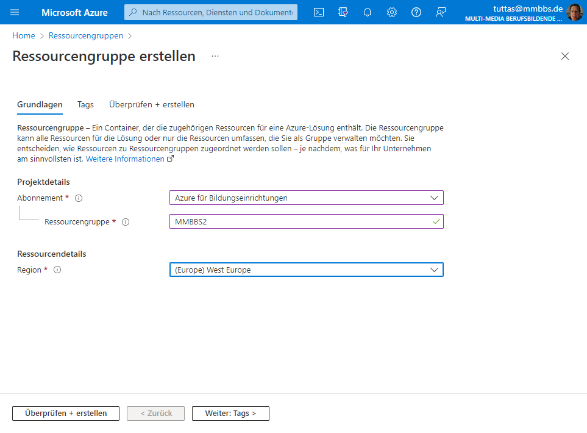
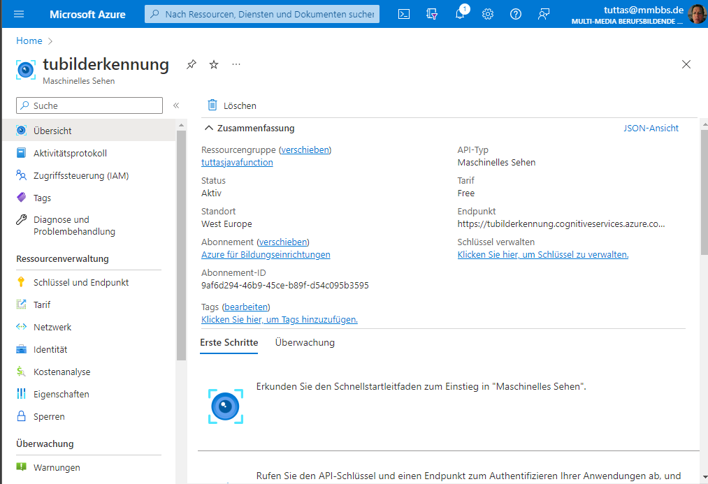
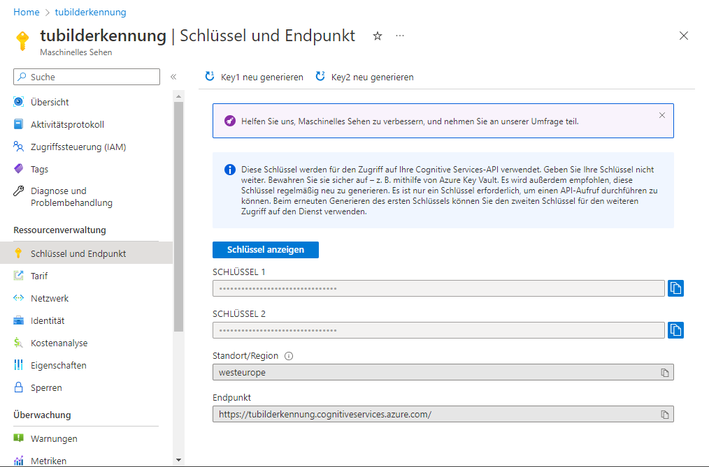

# Cloud KI Dienste

>Der Besitzer eines Eigenheims möchte gerne wissen welche Autos für wie lange auf seinen Parkplatz parken. Die Kamera vor dem Haus mach dazu alle 5 Minuten ein Bild von dem Parkplatz. Sie erhalten der Auftrag eine Anwendungssystem zu entwickeln welches das KFZ Kennzeichen erfasst und dieses mit einem Zeitstempel in eine Datenbank schreibt.

Da das antrainieren einer eigenen Texterkennungs KI zu aufwendig erscheint, entscheidet sich die Geschäftsführung dazu einen Cloud Dienstleister zu nutzen. Da bereits ein Azure Konto existiert, soll der Azure Bilderkennungsdienst genutzt werden.

<!--Info-->
## Der Bilderkennungsdienst von Azure

Azure bietet eine vielzahl von trainierten Neuronalen Netzwerken für diverse Aufgaben an (z.B. Bildanalyse, Sprachsynthese u.v.a.m). In diesem Beispiel wollen wir das Texterkennungssystem von Azure nutzen. Dabei kommunizieren die KI Dienste von Azure über eine REST Schnittstelle mit dem Client (das Programm).

### Einrichten der Texterkennung in Azure

Melden Sie sich zunächst in [Azure an](https://azure.microsoft.com/de-de/get-started/azure-portal/). Erstellen Sie in dem Portal eine neue **Ressourcengruppe** und fügen Sie dieser den Dienst **Maschinelle Sehen** hinzu.





Über den Reiter *Schlüssel und Endpunkt* im Bereich Maschinelles Sehen können Sie die Zugriffsschlüssel für ihren Dienst abfragen.



### Funktion des Bilderkennungsdienstes

Der Bilderkennungsdienst wird über zwei HTTP Requests angesprochen. Der erste HTTP Request in Form eines HTTP-Post Befehl stellt dem Dienst das zu analysierende Bild zur Verfügung. Entweder in Form eines JSON:

```json
{
    "url":"http Adresse des Bildes"
}
```

Oder die Bilddatei wird dem Dienst im Body des http Post Befehls übertragen.

Im Header des HTTP Post Befehls steht der API Schlüssel mit dem key *Ocp-Apim-Subscription-Key*:

```http
POST https://tubilderkennung.cognitiveservices.azure.com/vision/v3.2/read/analyze HTTP/1.1
content-type: application/json
Ocp-Apim-Subscription-Key: {{api-key}}

{
    "url":"https://raw.githubusercontent.com/MicrosoftDocs/azure-docs/master/articles/cognitive-services/Computer-vision/Images/readsample.jpg"
}
```

Liefert der Dienst den Status Code **202 Accepted** zurück, so enthält der Header des Response einen key **Operation-Location**, der zum Abholen des Ergebnisses dient.

Über einen zweiten HTTP-Get Request auf die Adresse **Operation-Location** kann das Ergebnis in Form eines JSON abgeholt werden. Dabei muss erneut der *Ocp-Apim-Subscription-Key* angegeben werden.

```http
GET https://tubilderkennung.cognitiveservices.azure.com/vision/v3.2/read/analyzeResults/54d749b7-697e-4a8b-a2f2-8caefa1ba053 HTTP/1.1
Ocp-Apim-Subscription-Key: {{api-key}}
```

Die Funktion des Texterkennung Dienstes stellt das folgende Sequenzdiagramm dar.


<!--Info-->