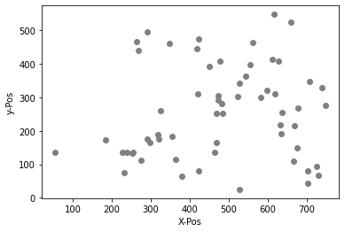
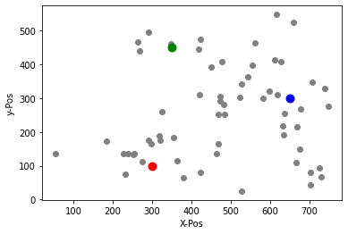
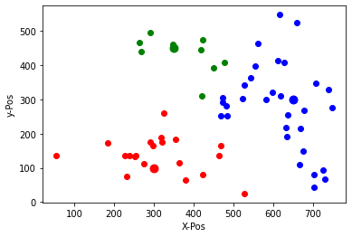
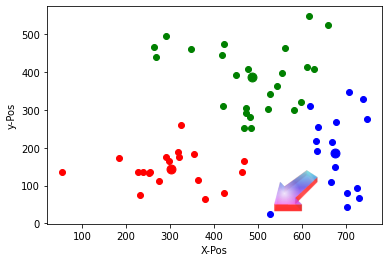

# K-Mean Clustering

## Handlungssituation


> Ein Regionaler Stromanbieter will in seinem Versorgungsgebiet Ladesäulen für Elektroautos anbieten. Dabei sollen möglichst alle Kunden einen kurzen Weg zur angebotenen Ladesäule habe.[^1]
>
> Die Abteilung Daten- und Prozessanalyse der ChangeIT GmbH wird damit beauftragt diese Standorte zu ermitteln..
>
>Der Kunde stellt dazu einen Plan zur Verfügung, der die Wohnorte der Kunden, die ein Elektroauto besitzen enthält.

[^1]: Vgl. Brandt, Y., Eickhoff-Schachtebeck, A. und Strecker, K. (2022): „Schulbuch starkeSeiten Informatik Jahrgang 9/10 Differenzierende Ausgabe Niedersachsen“, Klett-Verlag 2022

<!--kmean_aufgabe1-->

## Aufgabe 1 - Datenexploration und -Visualisierung

Laden Sie die zur Verfügung gestellten CSV Daten ([Ladestationen.csv](/Data/Ladestationen.csv)). Diese Datei enthält die Positionen der Elektro Auto Besitzer in der Region. Stelle Sie diese Positionen grafisch dar (vorzugsweise als graue Punkte in einem Koordinatensystem).

<!--kmean_aufgabe1-->
<!--kmean_aufgabe2-->

## Aufgabe 2



In dem dargestellten Gebiet sollen nun 3 Ladestationen gebaut werden. Wählen Sie drei möglich Standorte für die Ladestationen (**a,b,c**), so dass jeder Besitzer einer E-Autos einen möglichst kurzen Weg zu einer Ladestation hat. Speicher Sie diese Werte in einem zweidimensionalen Array ab.

```py
l_station=[[ax,ay],[bx,by],[cx,cy]]
```

Zeichnen Sie zunächst die ausgewählten Punkte in das Diagramm ein!



<!--kmean_aufgabe2-->
<!--kmean_aufgabe3-->

## Aufgabe 3

Doch welche E-Auto Besitzer fahren jetzt zu welcher Ladesäule? Im nächsten Schritt wollen wir dieses ermitteln. Dazu ist die Entfernung einer Ladestation zu einem E-Auto zu bestimmen. Da wir diese Information öfter brauchen soll eine Funktion entwickelt werden mit dem Namen **distance(ax,ay,px,py)**, die die Entfernung zweier Punkte bestimmt.

Die Entfernung kann dabei über den Satz des Pythagoras ermittel werden. Es gilt:

$$c = \sqrt{a^2 + b^2}$$

bzw.

$$c = \sqrt{(ax-px)^2 + (ay-py)^2}$$

Im n-dimensionalen Raum wird diese Abstand auch als Euklidische Distanz bezeichnet. Für einen n-dimensionalen Raum sieht die Berechnung des Euklidische Distanz wir folgt aus:

$$ \sqrt{\sum_{i=1}^{n}(q_i-p_i)^2} $$

Hierbei beschreibt $n$ die Anzahl der Dimensionen der Punkte $p$ und $q$ und $p_i$ und $q_i$ stellen die Werte der i-ten Dimension der jeweiligen Punkte dar.

<!--kmean_aufgabe3-->

<!--kmean_loesung3-->

### Lösung Aufgabe 3

```py
import math

def distance(x1, y1, x2, y2):
    dist = math.sqrt((x2 - x1)**2 + (y2 - y1)**2)
    return dist
```

<!--kmean_loesung3-->

<!--kmean_aufgabe4-->

## Aufgabe 4

Teilen Sie die Datenmenge nun in 3 Mengen ein, jede Menge sind dabei die Autos, die zu der jeweiligen Ladestation fahren würden (also wo der Abstand zur jeweiligen Ladestation am kürzesten ist). Stellen Sie diese 3 Mengen dar und färben Sie geeigneter Weise die Punkte entsprechend ein.

<!--kmean_aufgabe4-->

<!--kmean_loesung4-->

### Lösung Aufgabe 4



<!--kmean_loesung4-->

<!--kmean_aufgabe5-->

## Aufgabe 5

Die zunächst willkürliche Wahl der Position der Ladestationen hat zu einem ersten Überblick geführt. Dabei ist die Position der Ladesäulen sicherlich nicht optimal. Jetzt wo wir die 3 Mengen gebildet haben, kann eine optimierte Position der Ladesäulen ermittelt werden, indem man einfach das Mittel dieser Datenmenge bestimmt.

x-Mittelpunkt: $(x_1 + x_2 + ... + x_n)/n$

y-Mittelpunkt: $(y_1 + y_2 + ... + y_n)/n$

Ermitteln Sie für jede der 3 Datenmenge eine neue optimale Position und zeichnen Sie diese in das Diagramm ein.

<!--kmean_aufgabe5-->

<!--kmean_loesung5-->

### Lösung Aufgabe 5


<!--kmean_loesung5-->

<!--kmean_aufgabe6-->

## Aufgabe 6 - iteration des Algorithmus

Wenn Sie jetzt erneut anhand der neuen Position der Ladesäulen die kürzesten Weg ermitteln die ein E-Auto zur jeweiligen Ladesäule hat, kann es passieren, dass das Auto nun zu einer anderen Säule fahren würde.



Unser Algorithmus muss also iterativ so lange weiter laufen, bis sich die Mengen nicht mehr verändern. Dann haben wir die optimale Position der Ladesäulen gefunden.

Wiederholen Sie den den Vorgang mindestens für wei weiter Durchgänge und beobachten Sie, wie sich die Position der Ladesäulen verändert!

<!--kmean_aufgabe6-->
<!--kmean_aufgabe7-->

## Aufgabe 7 - Python Module verwenden

Das Python Modul **KMeans** aus dem Paket **sklearn.cluster** übernimmt genau diese Aufgabe. Der hier aufgeführte Beispielcode konfiguriert dieses Modul:

```py
import numpy as np
from sklearn.cluster import KMeans

# Definiere die Anzahl der Cluster
k = 3

# Erstelle ein KMeans-Objekt mit der Anzahl der Cluster
kmeans = KMeans(n_clusters=k)

# Wende den K-Means-Algorithmus auf die Daten an
kmeans.fit(data)

# Ermittle die Positionen der Zentroiden (d.h. der Punkte in der Mitte jedes Clusters)
centroids = kmeans.cluster_centers_

# Gib die Positionen der Zentroiden aus
print("Die Zentroiden sind:")
centroids
```


Verwenden Sie dieses Modul und wenden Sie es auf die Datenmenge der E-Auto Besitzer an. Tragen Sie die optimalen Positionen in die Karte ein und visualisieren Sie die Gruppen (Cluster).

<!--kmean_aufgabe7-->
<!--kmean_aufgabe8-->

## Aufgabe 8 - Einsatzgebiete für das k-mean Clustering

Recherchieren Sie im Internet nach weiteren Einsatzmöglichkeiten / Use-Cases für die Verwendung des **k-mean Clusterings**. Fassen Sie die Einsatzmöglichkeit in einem Wort zusammen und erstellen Sie eine Wortwolke.

<!--kmean_aufgabe8-->

## Fragen zum Verständnis

1. Was ist das Hauptziel des K-Means-Clustering-Algorithmus?

- [ ] Die Anzahl der Datenpunkte in einem Datensatz zu reduzieren
- [ ] Die optimale Anzahl von Clustern in einem Datensatz zu bestimmen
- [ ] Datenpunkte in Clustern zu gruppieren, basierend auf ihrer Ähnlichkeit
- [ ] Eine lineare Regression durchzuführen

2. Welche Entfernungsformel wird im K-Means-Algorithmus verwendet?

- [ ] Manhattan-Distanz
- [ ] Kosinus-Ähnlichkeit
- [ ] Pearson-Korrelation
- [ ] Euklidische Distanz

3. Wann kann der K-Means-Algorithmus als konvergiert betrachtet werden?

- [ ] Wenn sich die Clusterzentren nicht mehr signifikant verändern
- [ ] Wenn alle Datenpunkte gleichmäßig über die Cluster verteilt sind
- [ ] Wenn die Anzahl der Cluster gleich der Anzahl der Datenpunkte ist
- [ ] Wenn die Summe der Abstände zwischen den Datenpunkten und ihren jeweiligen Clustern minimiert ist

4. Welches Python-Paket enthält den KMeans-Algorithmus, der in dieser Unterrichtseinheit verwendet wurde?

- [ ] pandas
- [ ] seaborn
- [ ] matplotlib
- [ ] sklearn.cluster


5. Welche der folgenden Anwendungen ist ein typisches Anwendungsgebiet für K-Means-Clustering?

- [ ] Bildkomprimierung
- [ ] Textklassifikation
- [ ] Zeitreihenanalyse
- [ ] Anomalieerkennung


<!--
Richtig:

c
d
a
d
a
-->
