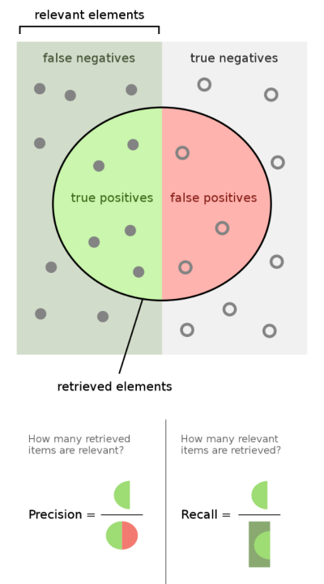

# KNN - K Nearest Neighbor

## Handlungssituation


>Ein Online Fahrradhändler möchte seinen Kunden stets Fahrräder in der optimale Rahmenhöhe anbieten. Dazu soll eine App inkl. Vorhersagemodell entwickelt werden, so dass der Kunde lediglich ein Foto aufnehmen muss und ihm die optimale Rahmenhöhe empfohlen wird.
>
>Eine Abteilung der ChangeIT GmbH ist bereits damit beauftragt aus einem Bild die Schrittlänge und die Körpergröße (jeweils in cm) zu ermitteln. Sie sollen ein Vorhersagemodell entwickeln, welches dem Kunden die richtige Rahmengröße vorschlägt.
>
>Der Online Fahrradhändler hat bereits Daten in Form von Erfahrungswerten vorliegen und stellt ihnen diese in Form einer CSV Datei zur Verfügung.

<!--knn_aufg1-->

## Exploration der Daten

Stelle Sie zunächst die Daten, die Sie vom Online Händler erhalten haben grafisch dar ([CSV Datei](https://jtuttas.github.io/datenanalyse/Data/Rahmenhoehe.csv)). Zur besseren Unterscheidung der Kategorien (Klassen) sollte jede Rahmenhöhe (S,M,L,XL) in einer anderen Farbe dargestellt werden.

<!--knn_aufg1-->
<!--knn_lsg1-->


<!--knn_lsg1-->
<!--knn_aufg1b-->

## Erste Überlegungen zum Vorhersagemodell

Angenommen ein Kunde wird ausgemessen und es ergibt sich eine Körpergröße von *163cm* und eine Schrittlänge von *84cm* (der graue Punkt in der unteren Abbildung), welchen Rahmengröße könnte man dem Kunden empfehlen?


Nun man könnte zunächst auf die Idee kommen sich den Datenpunkt zu suchen, der vom gesuchten den geringsten Abstand hat. Also benötigen wir eine Funktion, die und die Entfernung der Datenpunkte bestimmt. 

$$c = \sqrt{a^2 + b^2}$$

bzw.

$$c = \sqrt{(ax-px)^2 + (ay-py)^2}$$

Im n-dimensionalen Raum wird diese Abstand auch als Euklidische Distanz bezeichnet. Für einen n-dimensionalen Raum sieht die Berechnung des Euklidische Distanz wir folgt aus:

$$ \sqrt{\sum_{i=1}^{n}(q_i-p_i)^2} $$

Hierbei beschreibt $n$ die Anzahl der Dimensionen der Punkte $p$ und $q$ und $p_i$ und $q_i$ stellen die Werte der i-ten Dimension der jeweiligen Punkte dar.

Entwickeln sie eine Funktion **distance(ax,ay,px,py)**, die die Entfernung zweier Punkte bestimmt.

Iterieren Sie durch alle gegeben Datenpunkte und bestimmen Sie den Punkt, der vom gesuchten Punkt (Körpergröße=163cm / Schrittlänge=84 cm) den geringsten Abstand hat.

> Diskutieren Sie im Klassenverband, ob wir bereits ein geeignetes Vorhersagemodell gefunden haben? Und wie wir die Qualität unseres gefundenen Modells überprüfen können?

<!--knn_aufg1b-->

<!--knn_aufg2-->

## Testen des Vorhersagemodells

Wollen wir unsere Modell qualitativ überprüfen sollten wir zunächst unseren Datenbestand teilen in Trainingsdaten und Testdaten. 


Anhand der Testdaten können wir nun überprüfen wie gut unser Modell ist. Erstellen Sie ein Programm, welches anhand der Testdaten Vorhersagen zur Rahmenhöhe macht. Und dokumentieren Sie, wie of das Modell eine richtige Vorhersage macht und wie oft das Modell falsch liegt.

<!--knn_aufg2-->
<!--knn_lsg2-->

### Lösung

```py
import pandas as pd

ok=0;
err=0

for i in range(0,len(test)):

    d = pd.DataFrame(columns=["distance","Koerpergroesse","Schrittlaenge","Rahmenhöhe"])
    testData = test.iloc[i]
    for index, row in learn.iterrows():
        d.loc[len(d)] = [distance(testData["Koerpergroesse"],testData["Schrittlaenge"],
        row["Koerpergroesse"],
        row["Schrittlaenge"]),
        row["Koerpergroesse"],
        row["Schrittlaenge"],
        row["Rahmengroesse"]]
        
    d.sort_values(by=["distance"], inplace=True)

    print("Vorhersage "+d.iloc[0]["Rahmenhöhe"]+ " Ist "+testData["Rahmengroesse"])
    if (d.iloc[0]["Rahmenhöhe"]==testData["Rahmengroesse"]):
        print ("OK")
        ok=ok+1
    else:
        print ("Fehler")
        err=err+1

print ("OK "+str(ok)+"   Fehler "+str(err))
```
<!--knn_lsg2-->
<!--knn_aufg3-->

## Andere k-Werte

Bisher schauen und wir uns den nächsten Nachbarn im Datenraum an ($k=1$). Doch wie würde sich die Qualität unseres Modells ändern, wenn wir z.B. die nächsten 3 Nachbarn ($k=3$) betrachten würden? Experimentieren Sie mit ihrem Modell mit anderen k-Werten und analysieren Sie die Qualität des Vorhersagemodells.

*Hinweis*: Wenn wir einen anderen k-Wert als 1 verwenden, müssen wir, nachdem wir das Ergebnis-Array ["Entfernung","Rahmengröße"] sortiert haben heraus finden welche Klasse in den k-letzten Einträgen am meisten vorhanden ist!


<!--knn_aufg3-->
<!--knn_aufg4-->

## Metriken

Metriken dienen dazu die Qualität von Modellen zu beurteilen. Eine erste einfache Metrik haben wir bereits angewendet, die Genauigkeit (*Accuracy*):

> Accuracy (Genauigkeit): Die Genauigkeit misst den Prozentsatz der korrekten Vorhersagen im Verhältnis zur Gesamtzahl der Vorhersagen. Es ist eine einfache und häufig verwendete Metrik, aber sie kann irreführend sein, wenn die Daten ungleichmäßig verteilt sind.

Accuracy = $\frac{T_{correct}}{T_{correct} + F_{error}}$

Dabei sind $T_{correct}$ die Anzahl der richtigen Vorhersagen und $F_{error}$ die Anzahl der falschen Vorhersagen.

Neben dieser Metrik gibt es noch eine Vielzahl weiterer Metriken, die je nach Problemstellung eine bessere Aussage über die Qualität des Vorhersagemodells liefern. Siehe folgende Abbildung. [^1]

[^1]: vgl. <https://en.wikipedia.org/wiki/Precision_and_recall>



Angenommen wir wollen einen Klassifizierer für Corona Tests entwickeln. So liegen alle Personen die Corona haben im grün dargestellten Bereich. Unser Klassifizierer (Test) kann jedoch nicht alle Corona positiven Personen erfassen und es gibt eine Reihe von Tests, die Corona negativ sind obwohl die Person Corona hat. Diese finden sich im Bereich *false negative* und werden als $F_N$ bezeichnet. Erkennt unser Test eine Corona-Infektion so wird dieses als *true positive* bezeichnet und als $T_P$ erfassen.

In ähnlicher Weise könnte unser Test auch einen gesunden Menschen als an Corona erkrankt erfassen. Dieses würde als *true negativ* bezeichnen und als $T_N$ erfasst. Bzw. wenn im optimalen Fall würde der Test keine Corona Infektion ausweisen und der Proband ist auch nicht an Corona erkrankt, so wäre der Test *false positiv* oder $F_P$.

Daraus ergeben sich die Werte *Precision* und *Recall*

> Precision (Präzision) und Recall (Rückruf): Diese beiden Metriken beziehen sich auf das Verhältnis von korrekten positiven Vorhersagen zu allen tatsächlichen positiven Instanzen. Precision misst, wie oft das Modell richtig vorhergesagt hat, während Recall misst, wie viele der tatsächlichen positiven Fälle das Modell gefunden hat.

Precision = $\frac{TP}{TP + FP}$

Recall = $\frac{TP}{TP + FN}$

Eine weitere Metrik ergibt sich aus diesen beiden Werten und wird als *F1-Score* bezeichnet.

>F1-Score: Der F1-Score ist das harmonische Mittel zwischen Präzision und Rückruf und gibt daher ein ausgewogenes Maß für die Leistung des Modells.

F1 Score = $2*\frac{precision* recall}{precision + recall}$

Für unser Problem der Bestimmung der optimalen Rahmenhöhe müssen wir die Größen *Precision* und *Recall* pro Klasse betrachten. Dabei haben wir 4 Klassen (S,M,L,XL).

Angenommen unser Modell würde folgende Vorhersagen treffen (dabei sind die gelb markierten Felder die richtigen Größen und die blau markierten Felder die vorhergesagten Größen).


Wie wir sehen macht das Modell bei der Vorhersage der Rahmengröße "L" drei Fehler. Bestimmen Sie für die vier Klassen S,M,L und XL jeweils die *Precision* und den *Recall* Wert.

<!--knn_aufg4-->
<!--knn_lsg4-->

### Lösung Metriken


$P_S=\frac{TP}{TP + FP}=\frac{4}{4 + 0}=1$

$P_M=\frac{TP}{TP + FP}=\frac{1}{1 + 1}=0.5$

$P_L=\frac{TP}{TP + FP}=\frac{2}{2 + 0}=1$

$P_{XL}=\frac{TP}{TP + FP}=\frac{6}{6 + 2}=0.75$

---

$R_S=\frac{TP}{TP + FN}=\frac{4}{4 + 0}=1$

$R_M=\frac{TP}{TP + FN}=\frac{1}{1 + 0}=1$

$R_L=\frac{TP}{TP + FN}=\frac{2}{2 + 3}=0.4$

$R_{XL}=\frac{TP}{TP + FN}=\frac{6}{6 + 0}=1$

<!--knn_lsg4-->
<!--knn_uebung1-->

## Übungsaufgabe Metriken

Ein Klassifizierungsalgorithmus ist in der Lage unterschiedliche Getreidearten wie (W)eizen, (G)erste und (R)oggen zu klassifizieren. Der Algorithmus wurde mit einem Testdatensatz validiert und es kam zu folgendem Ergebnis:

| Vorhersage | Ist |
| ---------- | --- |
| W          | W   |
| W          | W   |
| G          | W   |
| G          | G   |
| R          | R   |
| W          | W   |
| R          | W   |
| G          | G   |
| R          | R   |
| R          | W   |
| R          | R   |
| G          | G   |
| G          | R   |
| W          | R   |
| G         | G |

Bestimmen Sie für den Algorithmus die *Accuracy*, *Precision* und den *Recall*-Wert.

<!--knn_uebung1-->
<!--knn_uebung1lsg-->

### Lösung Übung Metriken

|     | $W_v$   | $G_v$   | $R_v$   |
| --- | :-- | --- | --- |
| $W_i$   | 3   | 1   | 2   |
| $G_i$   |     | 4   |     |
| $R_i$   | 1   | 1   | 3   |

Das ist $G_v$ z.B. der vorhergesagte Weizenwert und $G_i$ der Istwert.

Für die *Accuracy* gilt:

$A=\frac{T_{correct}}{T_{correct} + F_{error}}=\frac{10}{10 + 5}=67 \%$

Für die *Precision* gilt:

$P_W=\frac{T_P}{T_P + F_P}=\frac{3}{4}=75 \%$

$P_G=\frac{T_P}{T_P + F_P}=\frac{4}{6}=67 \%$

$P_R=\frac{T_P}{T_P + F_P}=\frac{3}{5}=60 \%$

Für den *Recall* gilt:

$R_W=\frac{T_P}{T_P + F_N}=\frac{3}{3 + 3}= 50 \%$

$R_G=\frac{T_P}{T_P + F_N}=\frac{4}{4 + 0}= 100 \%$

$R_R=\frac{T_P}{T_P + F_N}=\frac{3}{3 + 2}= 60 \%$

<!--knn_uebung1lsg-->
<!--knn_aufg5-->


## Nutzen von Bibliotheken

Aus dem Paket *sklearn.neighbours* kann der *KNeighborsClassifier* genutzt werden um eine KNN Klassifizierung zu erstellen.

```py
import pandas as pd
import numpy as np
from sklearn.model_selection import train_test_split
from sklearn.preprocessing import StandardScaler
from sklearn.neighbors import KNeighborsClassifier

# Laden Sie die CSV-Datei in ein Pandas DataFrame.
df = pd.read_csv('Rahmenhoehe.csv')

# Aufteilen der Features und Labels
X = df[['Koerpergroesse', 'Schrittlaenge']]
y = df['Rahmengroesse']

# Teilen Sie die Daten in Trainings- und Testdaten auf.
X_train, X_test, y_train, y_test = train_test_split(X, y, test_size=0.2, random_state=42)

# Skalieren Sie die Merkmale.
scaler = StandardScaler()
X_train = scaler.fit_transform(X_train)
X_test = scaler.transform(X_test)

# Erstellen und Trainieren des KNN-Modells mit k=3.
knn = KNeighborsClassifier(n_neighbors=3)
knn.fit(X_train, y_train)

# Verwenden Sie das trainierte Modell, um Vorhersagen für die Testdaten zu treffen.
y_pred = knn.predict(X_test)
```

Nutzen Sie die Klasse *KNeighborsClassifier* und überprüfen Sie das Modell für verschiedene Werte von *k*.

<!--knn_aufg5-->
<!--knn_aufg6-->

## Bestimmung der Metriken

Auch die Metriken können mit Hilfe des Paketes *sklearn.metrics* bestimmt werden. Bestimmen Sie mit Hilfe des unten abgebildeten Programmcodes die Qualität ihres Vorhersagemodells.

> *Hinweis*: Die Klasse werden dabei in der Reihenfolge ihres Auftretens in den Testdaten gebildet. 

```py
from sklearn.metrics import accuracy_score, precision_score, recall_score, f1_score

# Berechnen Sie die Vorhersagen für die Testdaten.
y_pred = knn.predict(X_test)

# Reihenfolge der Klassenlabels abrufen
class_order = knn.classes_

# Drucken der Reihenfolge der Klassenlabels
print('Klassenreihenfolge:', class_order)

# Berechnen Sie die Accuracy
accuracy = accuracy_score(y_test, y_pred)
print('Accuracy:', accuracy)

# Berechnen Sie die Precision
precision = precision_score(y_test, y_pred, average=None)
print('Precision:', precision)

# Berechnen Sie den Recall
recall = recall_score(y_test, y_pred, average=None)
print('Recall:', recall)

# Berechnen Sie den F1-Score
f1 = f1_score(y_test, y_pred, average=None)
print('F1-Score:', f1)
```
<!--knn_aufg6-->

## Fragen zum Kapitel

1.) Wie funktioniert KNN im Allgemeinen?

- [ ] Es speichert alle vorhandenen Daten und sucht nach ähnlichen Mustern
- [ ] Es berechnet die Distanz zwischen Punkten und wählt die k nächsten Nachbarn aus
- [ ] Es gibt eine Liste von Regeln zurück, um eine Entscheidung zu treffen
- [ ] Es gibt nur binäre Antworten zurück

2.) Warum wird der Parameter "k" in KNN verwendet?

- [ ] Um die Anzahl der Dateneingaben zu begrenzen
- [ ] Um die Genauigkeit des Modells einzuschränken
- [ ] Um zu bestimmen, wie viele Nachbarn einbezogen werden sollen
- [ ] Um das Modell einfacher zu gestalten

3.) Welche Art von Problemen kann KNN gut lösen?

- [ ] Probleme mit nur zwei Variablen
- [ ] Probleme mit vielen Variablen und komplexen Mustererkennungen
- [ ] Nur einfache lineare Probleme
- [ ] Probleme, bei denen das Ergebnis auf binärer Logik basiert

4.) Welche Metrik wird zur Bewertung eines KNN-Modells verwendet, das für eine binäre Klassifikation eingesetzt wird?

- [ ] F1-Score
- [ ] R2-Score
- [ ] Adjusted R-Squared
- [ ] Silhouette Coefficient

5.) Welche Python-Bibliothek kann verwendet werden, um KNN in Python zu implementieren?

- [ ] TensorFlow
- [ ] PyTorch
- [ ] Scikit-Learn (sklearn)
- [ ] Theano

<!--
1 Antwort: b) Es berechnet die Distanz zwischen Punkten und wählt die k nächsten Nachbarn aus
2 Antwort: c) Um zu bestimmen, wie viele Nachbarn einbezogen werden sollen
3 Antwort: b) Probleme mit vielen Variablen und komplexen Mustererkennungen
4 Antwort: a) F1-Score
5. Antwort: c) Scikit-Learn (sklearn)
-->
