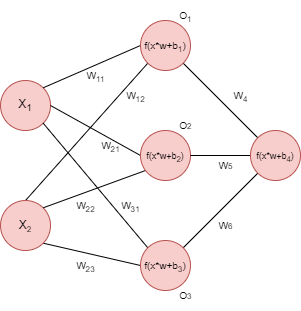
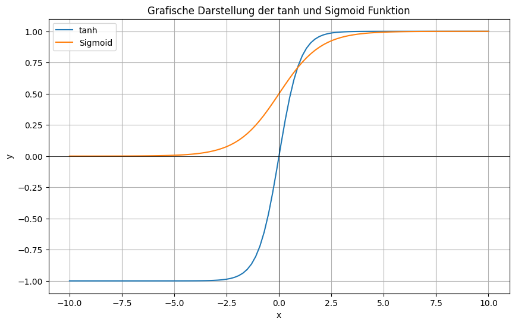
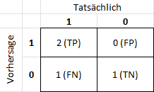

# Neuronale Netze

## Handlungssituation


>Die Firma Home-IoT ist eine bekannter Hersteller von Smart Home Produkten. Es ist geplant für diese Firma eine smarte Lichtsteuerung "AI Light" zu entwickeln, die an die jeweiligen Anforderungen der Kunden angepasst werden kann.
>
>Der Chefentwickler der Abteilung Daten- und Prozessanalyse der ChangeIT GmbH beauftragt Sie damit ein Neuronalen Netz zu entwickeln und dieses für eine exemplarische Anforderung zu trainieren.

## AI-Light
<!--neuro_aufg1-->
Die smarte Lichtsteuerung "AI-Light" besitzt zwei Sensoren.

- Präsenzerkennung: Über Sensoren ist das System in der Lage zu erkennen, ob sich Personen im Raum befinden.
- Tag / Nachterkennung: Das System ist ebenso in der Lage, Tag- / Nachtzeiten zu erkennen.


## Kundenanforderungen

Die Kunden stellen dabei unterschiedliche Anforderungen an das System vlg. [^1].

[^1]: Brandt, Y., Eickhoff-Schachtebeck, A. und Strecker, K. (2022) „Schulbuch starkeSeiten Informatik Jahrgang 9/10
Gymnasium Niedersachsen“, Klett-Verlag 2022, ISBN: 978-3-12-007572-1

- In den **Büros** der **Fabrikhalle** sollen die Lampen nachts immer leuchten aus Gründen des Einbrecherschutzes, und tagsüber nur, wenn die Mitarbeiter an ihren Plätzen sind.
- Im **Bürogebäude** der Softwarefirma sollen die Lampen nur nachts leuchten, wenn Mitarbeiter da sind. Tagsüber ist es durch die vielen Fenster immer hell genug.
- Im alten Gebäude der **Stadtverwaltung** müssen die Lampen tagsüber angeschaltet sein, wenn Mitarbeiter da sind, da die Fenster zu wenig Licht hereinlassen. Sollten Mitarbeiter auch nachts arbeiten, müssen auch dann die Lampen eingeschaltet werden. Sonst können sie aus bleiben.
- Im Haus der **Familie Schmidt** sollen die Lampen tagsüber an sein, wenn jemand zuhause ist, und aus sein, wenn keiner da ist. Nachts sollen die Lampen aus sein, wenn die Bewohner im Haus sind und schlafen, und aus Gründen des Einbrecherschutzes an sein, wenn niemand da ist


### Aufgabe Wahrheitstabelle erzeugen

Wählen Sie sich eine Anforderung des Kunden aus und erstellen Sie eine Wahrheitstabelle, die alle möglichen Eingangssignale darstellt und ob sich die Lampe in der jeweiligen Situation an oder ausgehen soll.

<!--neuro_aufg1-->

### Lösung Wahrheitstabelle erzeugen

<!--neuro_lsg1-->
Für ein **Büro** in der **Fabrikhalle** könnte diese Tabelle wie folgt aussehen.

| Tag / Nacht ($X_1$) | Person ($X_2$)    | Lampe ($Y$)   |
| ----------- | --------- | ------- |
| Tag (1)     | nein (0)  | aus (0) |
| Tag (1)     | ja (1)    | an (1)  |
| Nacht (0)   | nein  (0) | an (1)  |
| Nacht (0)   | ja (1)    | an (1)  |

<!--neuro_lsg1-->

## Das neuronale Netz

<!--neuro_aufg2-->
Ein neuronales Netzwerk ist ein Modell, das von der Funktionsweise des menschlichen Gehirns inspiriert ist. Es besteht aus einer Sammlung miteinander verbundener künstlicher Neuronen, die Informationen verarbeiten und weiterleiten.

Ähnlich wie biologische Neuronen empfangen auch künstliche Neuronen Eingaben, verarbeiten diese und geben sie als Ausgabe weiter. Die Eingaben werden gewichtet und durch Aktivierungsfunktionen in eine Ausgabe transformiert. 

Ein einfaches Neuron (man spricht hier auch von einem *Perzeptron*) kann dabei wie folgt aussehen.


Die Werte $X_1$ bis $X_3$ sind z.B. Sensorwerte oder Werte aus einer vorherigen Stufe. $G_1$ bis $G_3$ sind Gewichtungsfaktoren die im laufe des Trainings des Neuronalen Netzes angepasst werden und zur Initialisierung auf zufällige Werte gesetzt werden. Als Aktivierungsfunktionen können Funktionen genutzt werden, wie die Sigmoid-, ReLu- oder Tanh-Funktion bzw. einfache Schwellwerte. Die Funktion gibt an, ob und wie stark das Neuron "feuert".

**Aufgabe**: Berechnen Sie den Ausgabewert $Y$ für das Neuron, wenn als Aktivierungsfunktion ein Tanh-Funktion genutzt wird und folgende Eingangsvektoren und Gewichtsvektoren vorliegen.

$G = \begin{pmatrix} G_1 \\ G_2 \\ G_3 \end{pmatrix}=\begin{pmatrix} 0.4 \\ 0.2 \\ -0.5 \end{pmatrix}$

$X = \begin{pmatrix} X_1 \\ X_2 \\ X_3 \end{pmatrix}=\begin{pmatrix} 0.7 \\ -0.1 \\ -0.4 \end{pmatrix}$

<!--neuro_aufg2-->
<!--neuro_lsg2-->

**Lösung**: 

$Y_*= X_1*G_1+X_2*G_2+X_3*G_3$

$Y_*=0.4*0.7+0.2*(-0.1)+(-0.5)*(-0.4)=0.46$

$Y=tanh(0.46)=0.43$

Diese Ausgaben können dann wieder als Eingaben für andere Neuronen dienen, wodurch das Netzwerk Schicht für Schicht komplexere Berechnungen durchführen kann.

<!--neuro_lsg2-->
<!--neuro_info3-->
Ein neuronales Netzwerk lernt, indem es seine Gewichte anpasst, basierend auf dem Vergleich zwischen seinen Ausgaben und den erwarteten Ausgaben. Dieser Lernprozess wird durch mathematische Algorithmen unterstützt, die als Backpropagation bezeichnet werden. Durch wiederholtes Training auf großen Datensätzen kann ein neuronales Netzwerk Muster erkennen, Zusammenhänge verstehen und Vorhersagen treffen.

Obwohl neuronale Netzwerke nicht genau die gleiche Funktionsweise wie biologische Neuronen haben, sind sie dennoch stark von ihnen inspiriert. Die Idee besteht darin, komplexe Informationsverarbeitung nach dem Vorbild des Gehirns zu ermöglichen und dadurch komplexe Aufgaben in Bereichen wie Bilderkennung, Spracherkennung, Textanalyse und vielem mehr zu lösen.

Für die Steuerung der Lichtanlage benötigen wir pro Sensors ein Neuron, in diesem Fall wäre das demnach zwei Neuronen in der Eingangsschicht (*input Layer*). Die Ausgangsschicht (*output layer*) steuert mir einem Neuron die Lampe. Für einen ersten Ansatz wählen wir 3 Neuronen in der *hidden Layer*. Dementsprechend hat unser Neuronales Netz folgendes Aussehen.

.

<!--neuro_info3-->
<!--neuro_info4-->
### Initialisierung des Netzes

Die Gewichte $W_{11}$ bis $W_{32}$, sowie $W_4$ bis $W_5$ werden initial auf zufällige Werte zwischen +1 / -1 gesetzt.

$W_1 = \begin{pmatrix} w_{11} & w_{21} & w_{31} \\ w_{12} & w_{22} & w_{32} \end{pmatrix}== \begin{pmatrix} -0.19 & -0.96 & 0.43 \\ -0.23 & 0.97 & 0.46 \end{pmatrix}$

$W_2 = \begin{pmatrix} w_4 \\ w_5 \\ w_6 \end{pmatrix}=\begin{pmatrix} -1.0 \\ -0.21 \\ 0.16 \end{pmatrix}$

Als Aktivierungsfunktion $f(x)$ können unterschiedliche Funktionen wie die Sigmoid-, ReLu- oder Tanh-Funktion genutzt werden. Wie verwenden in diesem Beispiel die $tanh$ Funktion im **hidden Layer** und die Sigmoid Funktion in der Ausgabeschicht. Die Sigmoid Funktion ist dabei wie folgt definiert.

$\sigma(x) = \frac{1}{1 + e^{-x}}$

Hier sind beide Funktion nochmals grafisch dargestellt.



<!--neuro_info4-->
<!--neuro_info5-->
### Forward Propagation

Um nun den Wert der Zwischenschicht $O$ zu ermitteln müssen wir folgende Rechnungen durchführen.

$O_1=  tanh((X_1*W_{11}+X_2*W_{12})+b_1)$

$O_2=  tanh((X_1*W_{21}+X_2*W_{22})+b_2)$

$O_3=  tanh((X_1*W_{31}+X_2*W_{32})+b_3)$

Im ersten Durchgang nehmen wird den X-Vektor wie folgt an:

$X = \begin{pmatrix} X_1 & X_2 \end{pmatrix}=\begin{pmatrix} 1 & 0 \end{pmatrix}$

Die Bias Werte legen wir zunächst auf 1 fest.

$B_1 = \begin{pmatrix} b_1 \\ b_2 \\ b_3 \end{pmatrix}=\begin{pmatrix} 1 \\ 1 \\ 1 \end{pmatrix}$

$B_4 = 1$

Mit den angenommen Werten kann nun weiter gerechnet werden:

$O_1=  tanh((X_1*W_{11}+X_2*W_{12})+b_1)= tanh((1*-0.19+0*-0.23)+1)=0.6696$

$O_2=  tanh((X_1*W_{21}+X_2*W_{22})+b_2) = tanh((1*-0.96+0*0.97)+1)=0.0006$

$O_3=  tanh((X_1*W_{31}+X_2*W_{32})+b_3) = tanh((1*-0.43+0*0.46)+1)=0.5154$

Für die *output Layer* ergeben sich folgende Werte.

$O_4'=  (O_1*W_4+O_2*W_5+O_3*W_6)+b_4$

$O_4' = (0.6696*-1.0+0.0006*-0.21+0.5154*0.16)+1=0.4127$

$O_4 = Y'= \frac{1}{1 + e^{-O_4'}}=0.6017$

Als Ergebnis würde das Neuronale Netz also die Lampe einschalten, was leider falsch wäre, denn wir hatten ja angegeben, dass es Nacht ist (1) und keine Person anwesend ist (0). 

<!--neuro_info5-->
<!--neuro_info6-->
## Fehlerfunktionen (Loss-Function)

Unser Netzwerk hat also einen Fehler gemacht, dieser kann z.B. wie folgt bestimmt werden:

$E(Y')=Y-Y'=0-0.6017=-0.6017=-60.17\%$

Eine andere (besser geeignete) Fehlerfunktion ist der *Binary Cross Entropy Error*. Dieser ist wie folgt bestimmt:

$E(Y')=-(Y*ln(Y')+(1-Y)*ln(1-Y'))$

Für unsere Beispiel würde sich also folgender *Binary Cross Entropy Error* ergeben:

$E(Y')=-(0*ln(0.6017)+(1-0)*ln(1-0.6017))=0.9205$

Neben dieser Fehlerfunktion gibt es noch weitere, wie z.B. *Categorical Cross Entropy*, *Mean Squared Error* und *Cosine Distance*. Für unsere binäres Klassifizierungsproblem (Lampe an/aus) eignet sich jedoch am besten die zuvor berechnete Binary Cross Entropy Error.

<!--neuro_info6-->
<!--neuro_info7-->

## Back Propagation

Damit das Modell nun lernen kann (also sich der Fehler minimiert), müssen die Gewichte und die Bias Werte angepasst werden. Dieses geschieht in der Back-Propagation.

Neben dem *Cross Entropy Error* definieren wir noch einen weiteren Parameter, die Lernrate *LearningRate*. Sie zumeist mit $\alpha$ bezeichnet und liegt auf einem Wert z.B. $\alpha=0.1$. Die *LearningRate* ist dabei nur ein Faktor um wie viel die Gewichte und Bias Werte angepasst werden, also wie schnell das Neuronale Netz lernen soll.

In der Back Propagation geht es nun darum die Loss Funktion nach allen Gewichten und Bias Werten abzuleiten.

Durch das Anwenden der Kettenregel kann der Rechenaufwand jedoch reduziert werden. Wir wollen uns nur auf einen Teil unseres Netzwerkes konzentrieren und "trainieren" jetzt den Parameter $W_4$.

.

$\frac{\delta E(Y')} {\delta W_4}=\frac {\delta E(Y')} {\delta Y'}* \frac {\delta Y'}{\delta \Theta}*\frac {\delta \Theta}{\delta W_4}$

Dabei ist:

- $\frac{\delta E(Y')} {\delta W_4}$ die Partielle Ableitung der Loss Funktion nach dem Gewicht $W_4$.

- $\frac {\delta E(Y')} {\delta Y'}$ Ableitung der Loss Funktion nach Y'

- $\frac {\delta Y'}{\delta \Theta}$ Ableitung von Y' nach $\Theta$, wobei $\Theta$ die Multiplikation der Gewichte mit den Eingangsgrößen plus den Bias Werten ist. In unserem Fall wäre also $\Theta=(O_1*W_4+O_2*W_5+O_3*W_6)+B_4$.

- $\frac {\delta \Theta}{\delta W_4}$ Die Ableitung dieses Wertes nach $W_4$

Die Fehlerfunktion war $E(Y')=-((1-Y)*ln((1-Y'))$ und das abgeleitet nach Y' ergibt $\frac {\delta E(Y')} {\delta Y'}=\frac{(1 - Y)}{(1 - Y')}$, bzw. mit unseren Werten $\frac{(1 - 0)}{(1 - 0.6017)}=2.5107$

Der Wert Y' ergibt sich aus der Sigmoid Funktion $\frac{1}{1 + e^{-\Theta}}$. Die Ableitung der Sigmoid Funktion nach $\Theta$ ergibt $\frac {\delta Y'}{\delta \Theta}=Y'*(1-Y')=0.6017*(1-0.6017)=0.2397$

Als letztes erfolgt die Ableitung von $\Theta$ nach $W_4$, wobei $\Theta=(O_1*W_4+O_2*W_5+O_3*W_6)+B_4$ und die Ableitung ist $\frac {\delta \Theta}{\delta W_4}=O_1=0.6696$.

Durch Anwendung der Kettenregel erhalten wir also:

$\frac{\delta E(Y')} {\delta W_4}=2.5107*0.2397*0.6696=0.4030$, d.h. um unsere Loss Funktion zu optimieren müssen wir diesen Wert von $W_4$ abziehen, dieses geschieht aber unter Berücksichtigung der *Learning Rate*. Es gilt:

$W_{4Neu}=W_4-\alpha*\frac{\delta E(Y')} {\delta W_4}=-1.0-0.1*0.4030=-1.0403$, d.h. unser Wert $W_4$ hat sich erniedrigt von -1.0 auf -1.0403.

In ähnlicher Weise müssen wir nun mit den anderen Gewichten $W_5$ und $W_6$ und den Bias Wert $B_4$ verfahren, also jeweils fie Fehlerfunktion ableiten. Dann hat man die Gewichte und Bias Werte der Ausgabeschicht neu berechnet und kann sich dann an die Gewichte und Bias Werte der Hidden-Layer und Eingabeschicht (Input Layer) machen.

<!--neuro_info7-->
<!--neuro_info8-->

## Implementierung in Python

Zum Implementieren dieses Modells nutzen wir die Bibliothek *Tensorflow*. Der folgende Code importiert die notwendige Bibliothek und legt die Daten für die Lichtsteuerung in einem *NumPy* Array an.

```py
import tensorflow as tf
import numpy as np

# Daten definieren
data = np.array([[1, 0, 0],
                 [1, 1, 1],
                 [0, 0, 1],
                 [0, 1, 1]])
```

Anschließend müssen die Daten in Eingangs- und Ausgangsdaten aufgeteilt werden. Für unsere Aufgabenstellung enthalten die ersten beiden Spalten die Eingangsdaten (Tag_Nacht und Person) und die letzte Spalte die Ausgangsdaten.

```py
# Aufteilen der Daten in Features (X) und Labels (y)
X = data[:, :-1]  # Eingangsdaten: Erste beiden Spalten
y = data[:, -1]   # Ausgangsdaten: Letzte Spalte
```

Anschließend muss das neuronale Netz aufgebaut werden:

.

```py
# Definition des neuronalen Netzwerks
model = tf.keras.Sequential([
    tf.keras.layers.Dense(3, activation='tanh', input_dim=2),  # Hidden-Layer mit 3 Neuronen
    tf.keras.layers.Dense(1, activation='sigmoid')             # Ausgangsneuron
])
```

Unser Netz hat 3 Neuronen als *hidden layer*. Auf dieser Ebene verwenden wir die **tanh** Funktion als Aktivierungsfunktion. Von der Eingangsebene erhalten wird 2 Daten **input_dim**. Die drei Neuronen der **hidden layer** speisen ein Neuron auf der Ausgabeebene (**output layer** ), hier verwenden wir die **Sigmoid** Funktion als Aktivierungsfunktion. 

Nachdem das Neuronale Netz gebaut wurde, muss es 'compiliert' werden.

```py
# Kompilieren des Modells
model.compile(optimizer='adam', loss='binary_crossentropy', metrics=['accuracy'])
```

Angegeben wird hier der Optimizer **adam**, der dazu dient das absolute Minimum im Fehler zu finden.

Nachdem das Neuronale Netz kompiliert wird, kann es angelernt werden.

```py
model.fit(X, y, epochs=600)
```

Eine *Epoche* ist dabei der Zyklus von Forward- und Backward Propagation mit allen Testdaten.

Nach dem Training kann das Modell überprüft werden. 

```py
# Beispiel-Eingabe für die Vorhersage (Nacht und Person anwesend)
input_data = np.array([[0, 1]])

# Vorhersage für die Klasse "Lampe" (Binärklassifikation)
prediction = model.predict(input_data)

print(prediction)
```

Das Neuronale Netz liefert z.B. einen Wert von *0.9583882*, welches in unserem Beispiel bedeuten würde, dass die Lampe einzuschalten ist. Dieses wäre auch korrekt für die Annahme, dass es Nacht ist (0) und eine Person im Raum anwesend wäre (1).

Die berechneten Gewichte und Bias Werte im Modell können über folgendes Python Skript ausgegeben werden.

```py
for layer in model.layers:
    weights = layer.get_weights()
    print('Gewichtungen:', weights)
```

Für das Output Layer sieht die Ausgabe z.B. wie folgt aus:

```txt
Gewichtungen: [array([[ 1.6754032 ],
       [-0.9415936 ],
       [ 0.18030357]], dtype=float32), array([0.34544384], dtype=float32)]
```

.

Das letzte Neuron wird gespeist aus den drei Neuronen der hidden Layer. Die Gewichte sind hier $W_4=1.6754$, $W_5=-0.94159$ und $W_6=0.180303$. Das zweite Array listet den Bias Wert $b_4=0.34544$.

<!--neuro_info8-->
<!--neuro_info9-->
## Metriken

Metriken geben Auskunft über die Qualität eines Vorhersagemodells. Für unser binäres Vorhersagemodell ist es recht einfach eine Metrik zu bestimmen. Man setzt einfach die korrekten Vorhersagen ($T_P$ und $T_N$) allen Vorhersagen ($P + N$) ins Verhältnis und erhält die Binäre Genauigkeit (*Binary Accuracy*).

Nach dem Trainieren des neuronalen Netzes Sagt unser Netz das Ergebnis wie folgt voraus:

```txt
[[0.3770217]
 [0.4830392]
 [0.5109197]
 [0.6186656]]
```

Würde man die Werte runden so erhält man:

| Tag / Nacht ($X_1$) | Person ($X_2$)    | Lampe ($Y$)   | Vorhersage
| ----------- | --------- | ------- | ------
| Tag (1)     | nein (0)  | aus (0) | 0
| Tag (1)     | ja (1)    | an (1)  | 0
| Nacht (0)   | nein  (0) | an (1)  |1
| Nacht (0)   | ja (1)    | an (1)  |1

Unser Modell hat also 2 mal den korrekten Wert für 1 bestimmt ($T_P$) und einmal den korrekten Wert für 0 ($F_P$). Einmal lag das Modell falsch, es wäre bei "Tag" und eine Person anwesend eine 1 heraus kommen müssen, dass Modell hat jedoch eine 0 bestimmt ($F_P$). Für unser Vorhersagemodell ergebe sich folgende Darstellung:



Nun kann für die Vorhersage die *Accuracy* bestimmt werden:

$A_{CC}=\frac {T_P+T_N}{P+N}=\frac {2+1}{3+1}=0.75$

> Die *Accuracy* gibt den Prozentwert an, wie viele Vorhersagen korrekt waren.

Eine weitere Metrik ist die Genauigkeit (*Precision*). Die Precision ist definiert als:

$P_{RE}=\frac {T_P}{T_P+F_P}=\frac {2}{2+0}=1.0$

> Die *Precision* misst, wie viele der vom Modell als positiv klassifizierten Beispiele tatsächlich positiv sind.

Eine weitere Metrik ist der *Recall* (die Sensitivität), er ist definiert als:

$R_{call}=\frac {T_P}{T_P+F_N}=\frac {2}{2+1}=0.6666$

> Der *Recall* misst, wie viele der tatsächlich positiven Beispiele vom Modell korrekt als positiv identifiziert wurden.

Als letzte Metrik spielt noch der *F1 Score* eine Rolle, er ist bestimmt als das harmonische Mittel zwischen *Precision* und *Recall*.

$F1_{Score}=2*\frac {P_{RE}*R_{call}}{P_{RE}+R_{call}}=2*\frac {1*0.6666}{1+0.6666}=0.80$

> Der F1-Score ist eine Metrik, die das harmonische Mittel aus Precision (Präzision) und Recall (Sensitivität) bildet. Er bietet eine einzige Metrik, die versucht, ein Gleichgewicht zwischen diesen beiden Aspekten herzustellen.
>
>Wenn Sie ein Modell haben, dessen F1-Score hoch ist, bedeutet das im Allgemeinen, dass sowohl die Präzision als auch der Recall des Modells gut sind. Ein hoher F1-Score deutet darauf hin, dass das Modell nicht nur eine hohe Trefferquote hat (hoher Recall), sondern auch eine hohe Genauigkeit in den Vorhersagen, die es macht (hohe Präzision).

Über die Funktion *evaluate* ist es möglich die Genauigkeit des Modells zu bestimmen. Wichtig dabei ist, dass bereits die Metriken beim Kompilieren des Modells mit angegeben werden müssen.

```py
from tensorflow.keras.metrics import Precision, Recall

# [....]

# Kompilieren und trainieren des Modells
model.compile(optimizer='adam', loss='binary_crossentropy', metrics=['accuracy', Precision(), Recall()])

```

Anschließend können die Metriken dann anhand der Test-Daten bestimmt werden.

```py
data = np.array([[1, 0, 0],
                 [1, 1, 1],
                 [0, 0, 1],
                 [0, 1, 1]])
X = data[:, :-1]  # Eingangsdaten: Erste beiden Spalten
y = data[:, -1]   # Ausgangsdaten: Letzte Spalte

loss, accuracy, precision, recall = model.evaluate(X, y)

print('Test accuracy:', accuracy)
print('Test precision:', precision)
print('Test recall:', recall)
```
Und man erhält die vorher ermittelten Werte:

```txt
Test accuracy: 0.75
Test precision: 1.0
Test recall: 0.6666666865348816
```
<!--neuro_info9-->
<!--neuro_aufg3-->
Wenn Sie die bisherigen Informationen aufmerksam gelesen haben, sollte Ihnen die folgende Aufgabe nicht schwer fallen.

.

**Aufgabe:**

- Erstellen Sie auf der Grundlage der bisherigen Überlegungen ihre Modell eines neuronalen Netzwerkes für die intelligente Lichtsteuerung "AI-Light" in Python.
- Trainieren Sie das Modell entsprechend den von Ihnen in Aufgabe 1 gewählten Anforderungen.
- Beurteilen Sie die Qualität des Modells und ermitteln Sie geeignete Metriken.
- Diskutieren Sie wie die Qualität des Modells gesteigert werden kann.

Erstellen Sie eine Dokumentation ihres Vorgehens und der Ergebnisse und der Überlegung (ca. 1 bis 2 Seiten)

<!--neuro_aufg3-->
<!--neuro_aufg4-->

## Ein eigenes Netzwerk entwerfen und trainieren

**Aufgabe:** Bilden Sie Arbeitsgruppen zur ca. 3-4 Mitschülern und wählen Sie einen anderen Datensatz (s.u.) für ein binäres Klassifizierungsproblem und entwerfen und trainieren Sie ein neuronales Netz. Dokumentieren Sie ihr Vorgehen und Ihr Ergebnis und präsentieren Sie dieses abschließend der Klasse.

Die Dokumentation sollte beinhalten:

- Vorstellen des Datensatzes
- Entwurf des Netzwerkes inkl. gewählter Layer und Aktivierungsfunktionen
- Beurteilen der Qualität des Vorhersagemodells (Metriken)

Mögliche Datensätze wären (Sie können aber auch gerne einen eigenen Datensatz auswählen):

1. **Titanic-Datensatz**: Der Titanic-Datensatz enthält Informationen über Passagiere an Bord des Schiffes Titanic, einschließlich Merkmalen wie Alter, Geschlecht, Klasse und Überlebensstatus. Dieser Datensatz ist gut geeignet für binäre Klassifizierungsaufgaben und kann auch zur Vorhersage des Überlebens von Passagieren auf anderen Schiffsreisen verwendet werden.
   - URL: <https://www.kaggle.com/c/titanic/data>

2. **Bank Marketing-Datensatz**: Dieser Datensatz enthält Informationen zu Kunden einer portugiesischen Bank und ob sie Ja oder Nein für ein Termingeld-Abonnement abgeschlossen haben. Es enthält eine Vielzahl von Kundenmerkmalen wie Alter, Beruf, Familienstand usw., die verwendet werden können, um vorherzusagen, ob ein Kunde ein Abonnement abschließen wird oder nicht.
   - URL: <https://archive.ics.uci.edu/ml/datasets/Bank+Marketing>

3. **Breast Cancer Wisconsin (diagnostic) Dataset**: Dieser Datensatz enthält Details zu den Zellkernmerkmalen von malignen und benignen Brustgewebeproben sowie einer Diagnose, ob eine Probe maligne oder benign ist. Der Datensatz ist gut geeignet für binäre Klassifizierungsaufgaben zum Erkennen von Brustkrebs.
   - URL: <https://archive.ics.uci.edu/ml/datasets/Breast+Cancer+Wisconsin+(Diagnostic)>

<!--neuro_aufg4-->

## Fragen zum Verständnis

1. Was ist ein Neuron in einem künstlichen neuronalen Netzwerk?
    - [ ] Eine Datenstruktur, die Informationen speichert
    - [ ] Eine Funktion, die das Ergebnis des Netzes berechnet
    - [ ] Eine Einheit, die Eingaben empfängt und eine Ausgabe basierend auf diesen Eingaben generiert
    - [ ] Ein spezielles Modell von neuronalen Netzwerken

2. Welche der folgenden ist KEINE typische Schicht in einem neuronalen Netzwerk?
    - [ ] Eingabeschicht
    - [ ] Ausgabeschicht
    - [ ] Versteckte Schicht
    - [ ] Datenbankschicht

3. Was ist der Zweck einer Aktivierungsfunktion in einem neuronalen Netzwerk?
    - [ ] Um die Genauigkeit des Modells zu erhöhen
    - [ ] Um die Größe des Modells zu reduzieren
    - [ ] Um nicht-lineare Transformationen einzuführen
    - [ ] Um die Geschwindigkeit des Trainings zu erhöhen

4. Welches Problem kann durch zu viel Training eines neuronalen Netzwerks auftreten?
    - [ ] Overfitting
    - [ ] Underfitting
    - [ ] Datenverlust
    - [ ] Netzwerkfehler

5. Welches der folgenden Verfahren wird verwendet, um ein neuronales Netzwerk zu trainieren?
    - [ ] Random Forest Algorithmus
    - [ ] Backpropagation
    - [ ] Linear Regression
    - [ ] Naive Bayes Klassifikation

6. Was ist die Hauptfunktion der "Verlustfunktion" (Loss Function) beim Training eines neuronalen Netzwerks?
    - [ ] Sie definiert die Architektur des Netzwerks
    - [ ] Sie bestimmt die Art der Aktivierungsfunktion in den Neuronen
    - [ ] Sie misst, wie gut das Netzwerk die Ausgabe vorhersagt, und wird für die Optimierung des Netzwerks verwendet
    - [ ] Sie dient dazu, das Netzwerk vor Overfitting zu schützen

