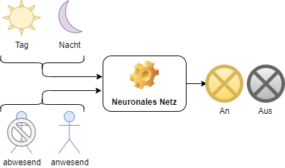

# Neuronale Netze

## Handlungssituation


>Die Firma Home-IoT ist eine bekannter Hersteller von Smart Home Produkten. Es ist geplant für diese Firma eine smarte Lichtsteuerung "AI Light" zu entwickeln, die an die jeweiligen Anforderungen des Kunden angepasst werden kann.
>
>Der Chefentwickler der Abteilung Daten- und Prozessanalyse der ChangeIT GmbH beauftragt Sie damit ein Neuronalen Netz zur entwickeln und für eine exemplarische Anforderung zu trainieren.

## AI-Light

Die smarte Lichtsteuerung "AI-Light" besitzt zwei Sensoren.

- Präsenzerkennung: Über Sensoren ist das System in der Lage zu erkennen, ob sich Personen im Raum befinden.
- Tag / Nachterkennung: Das System ist ebenso in der Lage, Tag- / Nachtzeiten zu erkennen.



## Kundenanforderungen

Die Kunden stellen dabei unterschiedliche Anforderungen an das System vlg. [^1].

[^1]: Brandt, Y., Eickhoff-Schachtebeck, A. und Strecker, K. (2022) „Schulbuch starkeSeiten Informatik Jahrgang 9/10
Gymnasium Niedersachsen“, Klett-Verlag 2022, ISBN: 978-3-12-007572-1

- In den **Büros** der **Fabrikhalle** sollen die Lampen nachts immer leuchten aus Gründen des Einbrecherschutzes, und tagsüber nur, wenn die Mitarbeiter an ihren Plätzen sind.
- Im **Bürogebäude** der Softwarefirma sollen die Lampen nur nachts leuchten, wenn Mitarbeiter da sind. Tagsüber ist es durch die vielen Fenster immer hell genug.
- Im alten Gebäude der **Stadtverwaltung** müssen die Lampen tagsüber angeschaltet sein, wenn Mitarbeiter da sind, da die Fenster zu wenig Licht hereinlassen. Sollten Mitarbeiter auch nachts arbeiten, müssen auch dann die Lampen eingeschaltet werden. Sonst können sie aus bleiben.
- Im Haus der **Familie Schmidt** sollen die Lampen tagsüber an sein, wenn jemand zuhause ist, und aus sein, wenn keiner da ist. Nachts sollen die Lampen aus sein, wenn die Bewohner im Haus sind und schlafen, und aus Gründen des Einbrecherschutzes an sein, wenn niemand da ist

### Aufgabe Wahrheitstabelle erzeugen

Wählen Sie sich eine Anforderung des Kunden aus und erstellen Sie eine Wahrheitstabelle, die alle möglichen Eingangssignale darstellt und ob sich die Lampe in der jeweiligen Situation an oder ausgehen soll.

### Lösung Wahrheitstabelle erzeugen

Für ein **Büro und eine Fabrikhalle** könnte diese Tabelle wie folgt aussehen.

| Tag / Nacht | Person    | Lampe   |
| ----------- | --------- | ------- |
| Tag (1)     | nein (0)  | aus (0) |
| Tag (1)     | ja (1)    | an (1)  |
| Nacht (0)   | nein  (0) | an (1)  |
| Nacht (0)   | ja (1)    | an (1)  |

## Das neuronale Netz

Ein neuronales Netzwerk ist ein Modell, das von der Funktionsweise des menschlichen Gehirns inspiriert ist. Es besteht aus einer Sammlung miteinander verbundener künstlicher Neuronen, die Informationen verarbeiten und weiterleiten.

Ähnlich wie biologische Neuronen empfangen auch künstliche Neuronen Eingaben, verarbeiten diese und geben sie als Ausgabe weiter. Die Eingaben werden gewichtet und durch Aktivierungsfunktionen in eine Ausgabe transformiert. 

Ein einfaches Neuron (man spricht hier auch von einem *Perzeptron*) kann dabei wie folgt aussehen.


Die Werte $X_1$ bis $X_3$ sind z.B. Sensorwerte oder Werte aus einer vorherigen Stufe. $G_1$ bis $G_3$ sind Gewichtungsfaktoren die im laufe des Trainings des Neuronalen Netzes angepasst werden und zur Initialisierung auf zufällige Werte gesetzt werden. Als Aktivierungsfunktionen können Funktionen genutzt werden, wie die Sigmoid-, ReLu- oder Tanh-Funktion bzw. einfache Schwellwerte. Die Funktion gibt an, ob und wie stark das Neuron "feuert".

**Aufgabe**: Berechnen Sie den Ausgabewert $Y$ für das Neuron, wenn als Aktivierungsfunktion ein Tanh-Funktion genutzt wird und folgende Eingangsvektoren und Gewichtsvektoren vorliegen.

$G = \begin{pmatrix} G_1 \\ G_2 \\ G_3 \end{pmatrix}=\begin{pmatrix} 0.4 \\ 0.2 \\ -0.5 \end{pmatrix}$

$X = \begin{pmatrix} X_1 \\ X_2 \\ X_3 \end{pmatrix}=\begin{pmatrix} 0.7 \\ -0.1 \\ -0.4 \end{pmatrix}$

**Lösung**: 

$Y_*= X_1*G_1+X_2*G_2+X_3*G_3=0.4*0.7+0.2*(-0.1)+(-0.5)*(-0.4)=0.46$

$Y=tanh(0.46)=0.43$

Diese Ausgaben können dann wieder als Eingaben für andere Neuronen dienen, wodurch das Netzwerk Schicht für Schicht komplexere Berechnungen durchführen kann.

Die Verbindungen zwischen den künstlichen Neuronen werden Gewichte genannt und beeinflussen, wie stark die Eingaben zur Aktivierung eines Neurons beitragen. Analog dazu spielen Synapsen in biologischen Neuronen eine ähnliche Rolle, indem sie die Signalübertragung zwischen den Neuronen beeinflussen.

Ein neuronales Netzwerk lernt, indem es seine Gewichte anpasst, basierend auf dem Vergleich zwischen seinen Ausgaben und den erwarteten Ausgaben. Dieser Lernprozess wird durch mathematische Algorithmen unterstützt, die als Backpropagation bezeichnet werden. Durch wiederholtes Training auf großen Datensätzen kann ein neuronales Netzwerk Muster erkennen, Zusammenhänge verstehen und Vorhersagen treffen.

Obwohl neuronale Netzwerke nicht genau die gleiche Funktionsweise wie biologische Neuronen haben, sind sie dennoch stark von ihnen inspiriert. Die Idee besteht darin, komplexe Informationsverarbeitung nach dem Vorbild des Gehirns zu ermöglichen und dadurch komplexe Aufgaben in Bereichen wie Bilderkennung, Spracherkennung, Textanalyse und vielem mehr zu lösen.

Für die Steuerung der Lichtanlage benötigen wir pro Sensors ein Neuron, in diesem Fall wäre das demnach zwei Neuronen in der Eingangsschicht (*input Layer*). Die Ausgangsschicht (*output layer*) steuert mir einem Neuron die Lampe. Für einen ersten Ansatz wählen wir 3 Neuronen in der *hidden Layer*. Dementsprechend hat unser Neuronales Netz folgendes Aussehen.

.

### Initialisierung des Netzes

Die Gewichtungsfunktionen $W_{11}$ bis $W_{23}$ werden initial auf zufällige Werte zwischen +1 / -1 gesetzt.

$W_1 = \begin{pmatrix} w_{11} & w_{12} \\ w_{21} & w_{22} \\ w_{31} & w_{32} \end{pmatrix}=\begin{pmatrix} 0.2 & -0.15 \\ -0.1 & 0.5 \\ -0.5 & 0.4 \end{pmatrix}$

$W_2 = \begin{pmatrix} w_4 \\ w_5 \\ w_6 \end{pmatrix}=\begin{pmatrix} 0.2 \\ 0.5 \\ -0.3 \end{pmatrix}$

Als Aktivierungsfunktion $f(x)$ können unterschiedliche Funktionen wie die Sigmoid-, ReLu- oder Tanh-Funktion genutzt werden. Wie verwenden in diesem Beispiel die Sigmoid Funktion.

$\sigma(x) = \frac{1}{1 + e^{-x}}$

### Forward Propagation

Um nun den Wert der Zwischenschicht $O$ zu ermitteln müssen wir folgende Rechnungen durchführen.

$x_1=  (X_1*W_{11}+X_2*W_{12})+b_1$

$x_2=  (X_1*W_{21}+X_2*W_{22})+b_2$

$x_3=  (X_1*W_{31}+X_2*W_{23})+b_3$

$O_1 = \frac{1}{1 + e^{-x_1}}$

$O_2 = \frac{1}{1 + e^{-x_2}}$

$O_3 = \frac{1}{1 + e^{-x_3}}$

Im ersten Durchgang nehmen wird den X-Vektor wie folgt an:

$X = \begin{pmatrix} X_1 \\ X_2 \end{pmatrix}=\begin{pmatrix} 1 \\ 0 \end{pmatrix}$

Die Bias Werte legen wir zunächst auf 1 fest.

$B = \begin{pmatrix} b_1 \\ b_2 \\ b_3 \end{pmatrix}=\begin{pmatrix} 1 \\ 1 \\ 1 \end{pmatrix}$

Mit den angenommen Werten kann nun weiter gerechnet werden:

$x_1=  (X_1*W_{11}+X_2*W_{12})+b_1= (1*0.2+0*-0.15)+1=1.2$

$x_2=  (X_1*W_{21}+X_2*W_{22})+b_2 = (1*-0.1+0*0.5)+1=0.9$

$x_3=  (X_1*W_{31}+X_2*W_{23})+b_3 = (1*-0.5+0*0.4)+1=0.5$

$O_1 = \frac{1}{1 + e^{-x_1}}=0.7685$

$O_2 = \frac{1}{1 + e^{-x_2}}=0.7109$

$O_3 = \frac{1}{1 + e^{-x_3}}=0.6625$

Für die *output Layer* ergeben sich folgende Werte.

$x_4=  (O_1*W_4+O_2*W_5+O_3*W_6)+b_4 = (0.7685*0.2+0.7109*0.5+0.6625*-0.3)+1=1.3104$

$O_4 = \frac{1}{1 + e^{-x_4}}=0.7876$

Als Ergebnis würde das Neuronale Netz also die Lampe einschalten, was leider falsch wäre, denn wir hatten ja angegeben, dass es Nacht ist (1) und keine Person anwesend ist (0). Damit das Modell nun lernen kann, müssen die Gewichte angepasst werden.

## Backward Propagation

## Implementierung in Python

Zum Implementieren dieses Modells nutzen wir die Bibliothek *Tensorflow*. Der folgende Code importiert die notwendige Bibliothek und legt die Daten für die Lichtsteuerung in einem *NumPy* Array an.

```py
import tensorflow as tf
import numpy as np

# Daten definieren
data = np.array([[1, 0, 0],
                 [1, 1, 1],
                 [0, 0, 1],
                 [0, 1, 1]])
```

Anschließend müssen die Daten in Eingangs- und Ausgangsdaten aufgeteilt werden. Für unsere Aufgabenstellung enthalten die ersten beiden Spalten die Eingangsdaten (Tag_Nacht und Person) und die letzte Spalte die Ausgangsdaten.

```py
# Aufteilen der Daten in Features (X) und Labels (y)
X = data[:, :-1]  # Eingangsdaten: Erste beiden Spalten
y = data[:, -1]   # Ausgangsdaten: Letzte Spalte
```

Anschließend muss das neuronale Netz aufgebaut werden:

.

```py
# Definition des neuronalen Netzwerks
model = tf.keras.Sequential([
    tf.keras.layers.Dense(3, activation='relu', input_dim=2),  # Hidden-Layer mit 3 Neuronen
    tf.keras.layers.Dense(1, activation='sigmoid')             # Ausgangsneuron
])
```

Unser Netz hat 3 Neuronen als *hidden layer*. Auf dieser Ebene verwenden wir die **ReLu** Funktion als Aktivierungsfunktion. Von der Eingangsebene erhalten wird 2 Daten **input_dim**. Die drei Neuronen der **hidden layer** speisen ein Neuron auf der Ausgabeebene (**output layer** ), hier verwenden wir die **Sigmoid** Funktion als Aktivierungsfunktion. 

Nachdem das Neuronale Netz gebaut wurde, muss es 'compiliert' werden.

```py
# Kompilieren des Modells
model.compile(optimizer='adam', loss='binary_crossentropy', metrics=['accuracy'])
```

Angegeben wird hier der Optimizer **adam**, der dazu dient das absolute Minimum im Fehler zu finden.

Nachdem das Neuronale Netz kompiliert wird, kann es angelernt werden.

```py
model.fit(X, y, epochs=600)
```

Eine *Epoche* ist dabei der Zyklus von Forward- und Backward Propagation mit allen Testdaten.

Nach dem Training kann das Modell überprüft werden. 

```py
# Beispiel-Eingabe für die Vorhersage (Nacht und Person anwesend)
input_data = [[0, 1]] 

# Vorhersage für die Klasse "Lampe" (Binärklassifikation)
prediction = model.predict(input_data)

print(prediction)
```

Das Neuronale Netz liefert z.B. einen Wert von *0.9583882*, welches in unserem Beispiel bedeuten würde, dass die Lampe einzuschalten ist. Dieses wäre auch korrekt für die Annahme, dass es Nacht ist (0) und eine Person im Raum anwesend wäre (1).

Die berechneten Gewichte und Bias Werte im Modell können über folgendes Python Skript ausgegeben werden.

```py
for layer in model.layers:
    weights = layer.get_weights()
    print('Gewichtungen:', weights)
```

Für das Output Layer sieht die Ausgabe z.B. wie folgt aus:

```txt
Gewichtungen: [array([[ 1.6754032 ],
       [-0.9415936 ],
       [ 0.18030357]], dtype=float32), array([0.34544384], dtype=float32)]
```

.

Das letzte Neuron wird gespeist aus den drei Neuronen der hidden Layer. Die Gewichte sind hier $W_4=1.6754$, $W_5=-0.94159$ und $W_6=0.180303$. Das zweite Array listet den Bias Wert $b_4=0.34544$.

**Aufgabe:** Trainieren Sie das Modell wie angegeben und beurteilen Sie die Qualität des Modells. Diskutieren Sie wie die Qualität des Modells gesteigert werden kann.

