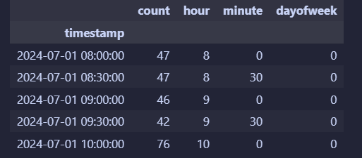
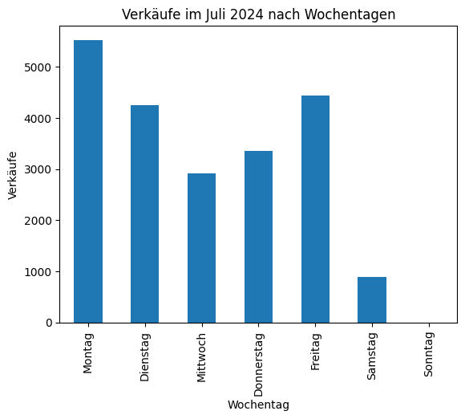
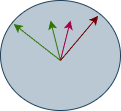
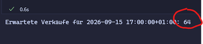
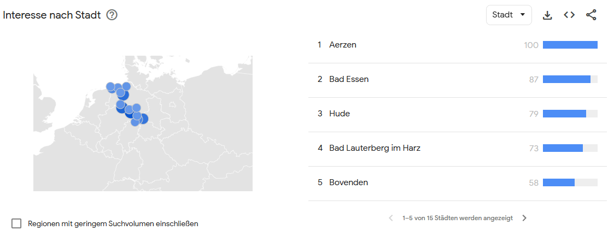

# Vorhersagemodell zur Personalplanung in einer Apotheke

Sie sind Auszubildender zum Fachinformatiker für Daten- und Prozessanalyse und bei der Change IT GmbH tätig. Ihr aktuelles Projekt besteht darin, ein Vorhersagemodell zu entwickeln, das den Personalbedarf in der Eulen Apotheke in Hannover prognostiziert. Ziel ist es, die Personalplanung zu optimieren, um sowohl den Kundenservice zu verbessern als auch die Personalkosten zu senken.

## Handlungssituation

Die Eulen Apotheke in Hannover steht vor der Herausforderung, ihre Personalplanung zu optimieren, um den Kundenservice zu verbessern und gleichzeitig die Personalkosten zu senken. Die Apotheke möchte ein Vorhersagemodell entwickeln, das auf Basis historischer Daten den Personalbedarf für verschiedene Tageszeiten und Wochentage prognostiziert.

Die Eulenapotheke hat festgestellt, dass es Zeiten mit Überbesetzung gibt, während zu Stoßzeiten oft nicht genügend Personal vorhanden ist. Dies führt zu längeren Wartezeiten für Kunden und einer erhöhten Belastung für die Mitarbeiter.


Die Apotheke beschäftigt derzeit 16 Mitarbeiter, darunter Apotheker, Pharmazeutisch-technische Assistenten (PTA) und Pharmazeutisch-kaufmännische Angestellte (PKA). Die Öffnungszeiten sind von Montag bis Freitag von 8:00 bis 18:00 Uhr und samstags von 9:00 bis 13:00 Uhr.

 Die Apotheke verfügt über 8 Arbeitsplätze, die flexibel besetzt werden können. Die Personalplanung erfolgt derzeit manuell durch die  Inhaberin Frau Iris Wien, basierend auf Erfahrungswerten und allgemeinen Annahmen über Kundenfrequenz.

<br/>

## Zielsetzung

Das Ziel dieses Projekts ist es, ein Vorhersagemodell zu entwickeln, das den Personalbedarf in der Eulen Apotheke basierend auf historischen Daten genau prognostiziert. Das Modell soll in der Lage sein, den Personalbedarf für verschiedene Tageszeiten und Wochentage vorherzusagen, um eine optimale Personalplanung zu ermöglichen.

Das Modell soll folgende Anforderungen erfüllen:
- **Genauigkeit**: Das Modell soll eine hohe Vorhersagegenauigkeit aufweisen, um Über- und Unterbesetzungen zu minimieren.
- **Flexibilität**: Das Modell soll in der Lage sein, sich an saisonale Schwankungen und besondere Ereignisse anzupassen.
- **Benutzerfreundlichkeit**: Das Modell soll einfach zu bedienen sein und klare Empfehlungen für die Personalplanung liefern.

## Planen / Informieren

Im weiteren Verlauf dieses Projekts werden Sie die folgenden Schritte durchführen:


### Vorüberlegungen

> Sammeln Sie im Klassenverband Ideen und Überlegungen, die Ihnen bei der Entwicklung des Vorhersagemodells helfen könnten. Berücksichtigen Sie dabei Aspekte wie Datenquellen, relevante Variablen, mögliche Herausforderungen.
>
>Wie könnten sich folgende Faktoren auf den Personalbedarf auswirken?

- **Tageszeit**: Morgens, mittags, nachmittags, abends
- **Wochentag**: Montag bis Samstag
- **Saisonale Schwankungen**: Winter (Grippezeit), Sommer (Urlaubszeit)
- **Wetterbedingungen**: Regen, Sonne, Schnee
- **Besondere Ereignisse**: Feiertage, lokale Veranstaltungen, Schulferien

### Daten einlesen

Die Apotheke verfügt über historische Daten des letzten Jahres, die folgende Informationen enthalten:

- Zeitstempel (Datum und Uhrzeit) im 30 Minuten Intervall
- Anzahl der Verkäufe im Intervall

```csv
timestamp;count
2024-07-01 07:00:00+02:00;0
2024-07-01 07:30:00+02:00;0
2024-07-01 08:00:00+02:00;61
2024-07-01 08:30:00+02:00;63
2024-07-01 09:00:00+02:00;65
2024-07-01 09:30:00+02:00;53
2024-07-01 10:00:00+02:00;85
```

#### Aufgabe 1: Datenvorbereitung

1. Laden Sie die CSV-Datei *apotheke_sales_filled.csv* in ein Pandas DataFrame.
2. Konvertieren Sie die Spalte `timestamp` in ein Datetime-Format und setzen Sie sie als Index des DataFrames.

```python
import pandas as pd

# CSV einlesen und Timestamp parsen
df = pd.read_csv("apotheke_sales_filled.csv", parse_dates=["timestamp"])

# explizit in UTC interpretieren und dann nach Berlin konvertieren
df["timestamp"] = pd.to_datetime(df["timestamp"], utc=True)
df = df.set_index("timestamp").tz_convert("Europe/Berlin")
df
```

3. Extrahieren Sie relevante Zeitmerkmale wie Stunde, Minute und Wochentag aus dem Index und fügen Sie diese als neue Spalten hinzu.

```python
df["hour"] = df.index.hour
df["minute"] = df.index.minute
df["dayofweek"] = df.index.dayofweek
df.head()
```

Ihr Dataframe sollte nun wie folgt aussehen:



#### Aufgabe 2: Datenexploration

> Die Verkäufe im Juli 2024 je Wochentag sind im folgenden Diagramm dargestellt. Analysieren Sie die Daten und überlegen Sie, wie sich der Wochentag auf die Kundenzahlen auswirkt.



- Warum sind am Mittwoch die Verkäufe geringer als an anderen Tagen?
- Warum sind die Verkäufe am Samstag geringer als an anderen Tagen?
- Warum sind am Montag die Verkäufe am höchsten?

> Überprüfen Sie weitere Ihre zuvor aufgestellten Thesen anhand der geladenen Daten. Stellen Sie z.B. die Verkäufe über ein Jahr, gruppiert nach den Monaten dar. Oder die summe der Verkäufe je Tageszeit (8-18 Uhr) im Juli 2024.

### Daten aufbereiten

Leider sind die Daten für ein neuronales Netz noch nicht optimal vorbereitet. Neuronale Netze arbeiten am besten mit numerischen Daten und benötigen oft eine Normalisierung oder Skalierung der Eingabedaten.

Für ein neuronales Netzwerk liegt z.B. 23:50 und 0:10 Uhr sehr weit auseinander, obwohl die Zeit nur 20 Minuten auseinander liegt. Daher sollten Sie die Zeit in eine numerische Form bringen, die diese Nähe besser widerspiegelt.

Denken Sie dabei an eine Uhr, für den Menschen ist 23:50 Uhr und 0:10 Uhr nur 20 Minuten auseinander, für ein neuronales Netz liegen diese Werte aber sehr weit auseinander.



> Wenn wir von den Minuten, Stunden, Wochentag und Monat den *Sin* und *Cos* bilden, dann liegen 23:50 und 0:10 Uhr auch für ein neuronales Netz nah beieinander und die Werte befinden sich in einem Bereich von -1 bis 1.

#### Aufgabe 3: Skalieren der Daten

Skalieren Sie die Daten, um sie für das neuronale Netz vorzubereiten.

```python
import numpy as np
import pandas as pd

# df: index = timestamp (tz-aware empfohlen), Spalte 'count'
df = df.sort_index()

# zyklische Features
hour = df.index.hour + df.index.minute/60.0
dow  = df.index.dayofweek
mon  = df.index.month

df["dayofweek"] = dow
df["mon"] = mon
df["hour"] = hour
df["sin_hour"] = np.sin(2*np.pi*hour/24); df["cos_hour"] = np.cos(2*np.pi*hour/24)
df["sin_dow"]  = np.sin(2*np.pi*dow/7);  df["cos_dow"]  = np.cos(2*np.pi*dow/7)
df["sin_mon"]  = np.sin(2*np.pi*mon/12); df["cos_mon"]  = np.cos(2*np.pi*mon/12)

feat_cols = ["sin_hour","cos_hour","sin_dow","cos_dow","sin_mon","cos_mon"]
X = df[feat_cols].astype("float32").values
y = df["count"].astype("float32").values.reshape(-1,1)
df
```

Auch die Anzahl der Kunden (count) sollte skaliert werden, um die Trainingszeit zu verkürzen und die Leistung des Modells zu verbessern. Eine gängige Methode ist die Min-Max-Skalierung, bei der die Werte auf einen Bereich von 0 bis 1 skaliert werden.


```python
%pip install scikit-learn

from sklearn.preprocessing import MinMaxScaler

scaler = MinMaxScaler()
df["count_scaled"] = scaler.fit_transform(df[["count"]])
df.head()
```

<div style="page-break-after: always;"></div>

## Durchführen / Umsetzen

### Aufgabe 4: Entwicklung des Vorhersagemodells

Teilen Sie die Daten in Trainings- und Validierungsdatensätze auf, um die Leistung des Modells zu bewerten. Eine übliche Aufteilung ist 80% der Daten für das Training und 20% für die Validierung.

```python
from sklearn.model_selection import train_test_split

X = df[["hour", "minute", "dayofweek"]]
y = df["count_scaled"]
X_train, X_test, y_train, y_test = train_test_split(X, y, test_size=0.2, random_state=42)
```

> Im weiteren Verlauf soll ein einfaches neuronales Netz mit Keras entwickelt werden.Informieren Sie sich über die Grundlagen von Neuronalen Netzen und Keras. Klären Sie Begriffe wie **Neuronen**, **Schichten**, **Aktivierungsfunktionen**, **Epoche**, **Lossfunktion** und **Backpropagation**.

### Aufgabe 5: Neuronales Netz mit Keras trainieren

Das unten dargestelle Modell ist ein einfaches Feedforward-Netzwerk mit zwei versteckten Schichten. Die erste Schicht hat 32 Neuronen und die zweite Schicht hat 16 Neuronen. Beide Schichten verwenden die ReLU-Aktivierungsfunktion. Die Ausgabeschicht hat ein Neuron, da es sich um ein Regressionsproblem handelt (Vorhersage einer kontinuierlichen Zahl).


```python
from tensorflow.keras import Sequential
from tensorflow.keras.layers import Dense, Dropout
from tensorflow.keras.callbacks import EarlyStopping

model = Sequential([
    Dense(32, activation="relu", input_shape=(X.shape[1],)),
    Dropout(0.1),                # optional
    Dense(16, activation="relu"),
    Dense(1)                     # linearer Output
])

model.compile(optimizer="adam", loss="mse")
es = EarlyStopping(monitor="val_loss", patience=5, restore_best_weights=True)

history = model.fit(
    X_tr, y_tr,
    validation_data=(X_va, y_va),
    epochs=100, batch_size=32,
    shuffle=False, callbacks=[es], verbose=1
)
model.summary()
``` 

> Führen Sie das Training des Modells durch und überwachen Sie den Trainings- und Validierungsverlust, um sicherzustellen, dass das Modell nicht über- oder unteranpasst ist.

## Bewerten / Kontrollieren

Abschließend sollten Sie die Leistung des Modells bewerten. 

### Aufgabe 6: Aussagekraft des Modells bewerten

> Das unten dargestellte Python programm nutzt das um Vorhersagen zur den zu erwartenden Verkaufen je Tageszeit und Datum zu machen. Überprüfen Sie die Vorhersagen und bewerten Sie die Aussagekraft des Modells.

```python
def make_time_features(ts: pd.Timestamp):
    hour = ts.hour + ts.minute/60.0
    dow  = ts.dayofweek
    mon  = ts.month
    return np.array([
        np.sin(2*np.pi*hour/24), np.cos(2*np.pi*hour/24),
        np.sin(2*np.pi*dow/7),  np.cos(2*np.pi*dow/7),
        np.sin(2*np.pi*mon/12), np.cos(2*np.pi*mon/12),
    ], dtype="float32").reshape(1,-1)

ts = pd.Timestamp("2026-09-13 17:00:00+01:00")  # gleiche TZ wie dein df
x_new = make_time_features(ts)
y_pred_scaled = model.predict(x_new, verbose=0)
y_pred = float(y_scaler.inverse_transform[y_pred_scaled](0,0))  # zurückskalieren
print(f"Erwartete Verkäufe für {ts}: {round(y_pred)}")
```

In der unteren Abbildung sind die Vorhersagen des Modells für den 15.09.2026 (ein Montag) um 17:00 dargestellt.




Durch Rücksprache mit Frau Wien, der Besitzerin der Eulen Apotheke, erfahren Sie, dass ca. 15 Verkäufe durch eine Angestellte der Apotheke pro 30 Minuten getätigt werden können!

> Überlegen Sie im Klassenverband wie das Modell dem Kunden zur Verfügung gestellt werden könnte. Welche Möglichkeiten gibt es, um das Modell in die bestehende IT-Infrastruktur der Apotheke zu integrieren? Wie könnte eine Benutzeroberfläche gestaltet sein, damit die Inhaberin der Apotheke das Modell einfach nutzen kann?

<div style="page-break-after: always;"></div>

## Reflektieren

> Reflektieren Sie über den gesamten Prozess der Entwicklung des Vorhersagemodells. Welche Herausforderungen sind aufgetreten und wie wurden diese bewältigt? Welche Verbesserungen könnten in zukünftigen Projekten vorgenommen werden? Wie könnte das Modell weiter optimiert werden, um noch genauere Vorhersagen zu liefern?

## Zusatzaufgabe für Experten (Binnendifferenzierung)

Ein Kollege hat vorgeschlagen, zusätzlich zu den bisherigen Features auch das Infektionsgeschehen in das Modell zu integrieren. So bietet Google Trends eine API an die es ermöglicht, die Suchanfragen zu bestimmten Begriffen (z.B. "Grippe", "Erkältung") zu analysieren (siehe <https://trends.google.de/trends/explore?date=2025-01-01%202025-01-31&geo=DE-NI&q=Grippe&hl=de>).



>Überlegen Sie wie Sie diese Daten in das bestehende Modell integrieren könnten. Welche Herausforderungen könnten dabei auftreten und wie könnten diese bewältigt werden? Entwickeln Sie einen Plan zur Integration dieser zusätzlichen Datenquelle in das Vorhersagemodell.
