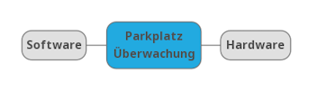
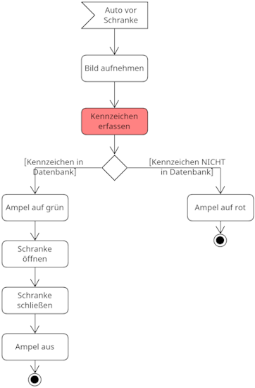
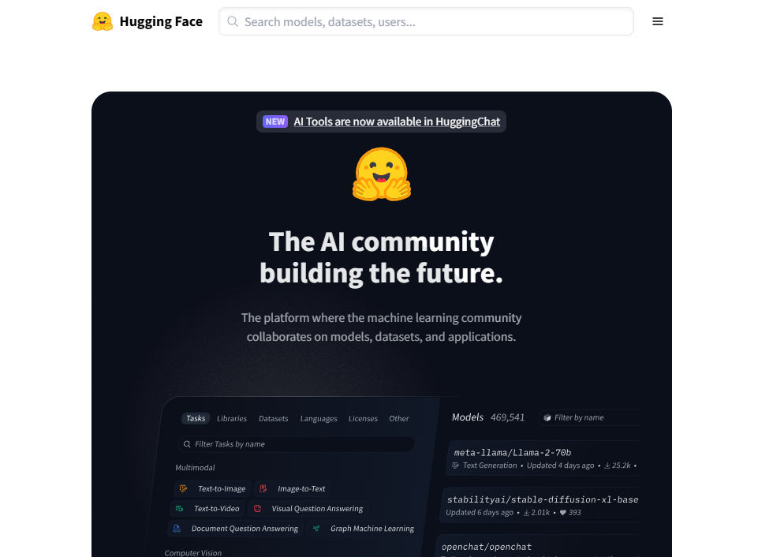
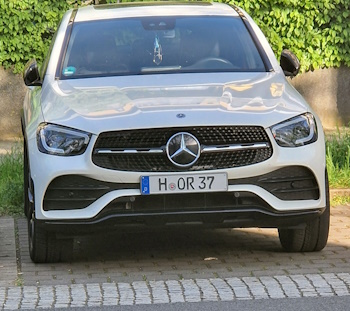
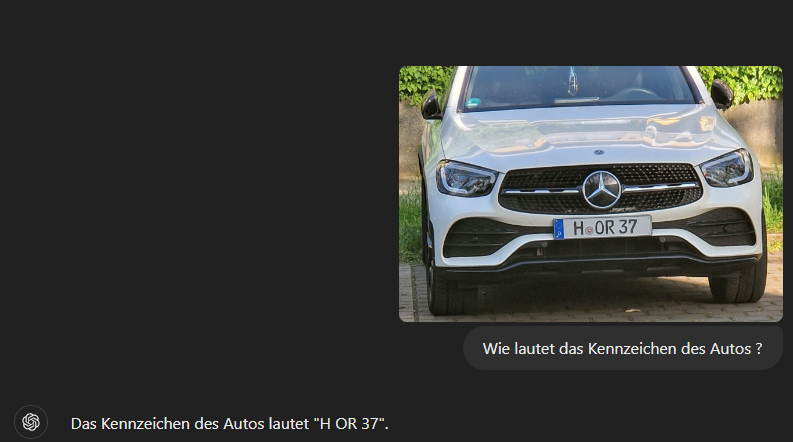

# Zutrittskontrolle für einen Parkplatz

## Berufliche Handlungssituation

Ein lokaler Einzelhändler hat die ChangeIT GmbH (ein innovatives Unternehmen das sich auf IT-Dienstleistungen spezialisiert hat) damit beauftragt ein Berechtigungssystem für den Firmenparkplatz zu entwickeln. Sie als Auszubildender zum Fachinformatiker für Daten- und Prozessanalyse sind maßgeblich an der Implementierung eines ersten **Prototypen** für den Kunden beteiligt.

### Ist-Situation

> Der Einzelhändler verfügt über einen kleinen Parkplatz, auf dem Mitarbeiter parken dürfen. Durch die gute zentrale städtische Lage kommt es jedoch häufig vor, das fremde unberechtigt Personen auf dem Parkplatz parken und so keine Parkmöglichkeiten für Mitarbeiter mehr bestehen.

### Soll-Situation

> Durch ein Schrankensystem soll gewährleistet sein, dass Mitarbeiter deren KFZ Kennzeichen bekannt ist jederzeit parken können. Dazu soll das Kennzeichen automatisch erfasst und in der Datenbank der Mitarbeiter abgeglichen werden.

<div style="page-break-after: always;"></div>

## Informieren  / Planen (ca. 90 Minuten)

**Aufgabe 1.1**: Lesen Sie sich aufmerksam den Arbeitsauftrag durch und diskutieren Sie im Klassenverband, wie ein solches System zu realisieren ist.

- Welche Komponenten Hardware / Software werden benötigt?
- Wie sollen die Kennzeichnen erfasst werden?
- Wie sollen die Kennzeichnen der Mitarbeiter gespeichert werden?

**Aufgabe 1.2**: Bilden Sie Kleingruppen und erstellen zu den Komponenten eine Mindmap.



**Aufgabe 1.3**: Stellen Sie den Informationsfluss des Prozesses in Form eines *UML Aktivitätsdiagramm* dar. 

### Mögliche Lösung



<div style="page-break-after: always;"></div>

## Entscheiden (ca. 45 Minuten)

In modernen Zutrittskontrollsystemen, wie in diesem Projekt für die Kennzeichenerkennung, kommen neuronale Netze zum Einsatz, um komplexe Aufgaben wie die optische Zeichenerkennung (OCR) präzise und effizient zu bewältigen. Ein neuronales Netz ist besonders geeignet, weil es in der Lage ist, aus großen Mengen an Trainingsdaten zu lernen und Muster in Bildern zu erkennen – in diesem Fall die Zeichen auf einem KFZ-Kennzeichen.

#### Warum ist ein neuronales Netz notwendig?

Kennzeichen können in verschiedenen Formen, Schriftarten, Lichtverhältnissen und Winkeln auf Fotos erscheinen. Klassische Algorithmen zur Texterkennung (wie Regel-basierte Ansätze) wären hier nicht flexibel genug, um mit dieser Vielfalt umzugehen. Ein neuronales Netz hingegen ist in der Lage, diese Variationen zu verarbeiten und selbst in schwierigen Fällen (z. B. schlechte Beleuchtung oder teilweise verdeckte Kennzeichen) eine korrekte Erkennung zu ermöglichen. Durch die Fähigkeit zur Generalisierung kann das neuronale Netz lernen, auch bei neuen, zuvor nicht gesehenen Kennzeichen eine genaue Vorhersage zu treffen.

#### Vorteile eines vortrainierten Modells

Die Nutzung eines vortrainierten neuronalen Netzes, wie beispielsweise *naver-clova-ix/donut-base-finetuned-cord-v2*, bietet mehrere Vorteile:

1. **Zeit- und Ressourcenersparnis:** Das Training eines neuronalen Netzes von Grund auf erfordert eine große Menge an Bilddaten und erhebliche Rechenressourcen, die in einem praktischen Projekt nicht immer zur Verfügung stehen. Ein vortrainiertes Modell wurde bereits auf großen Datensätzen trainiert und kann daher sofort eingesetzt werden.

2. **Hohe Genauigkeit:** Vortrainierte Modelle wurden oft auf speziellen, großen und vielfältigen Datensätzen trainiert, was ihre Genauigkeit bei spezifischen Aufgaben wie OCR deutlich erhöht. Diese Modelle haben bereits eine gute Performance erreicht und müssen nur minimal angepasst werden.

3. **Schnelle Integration:** Die Implementierung eines vortrainierten Modells ist meist einfacher, da bereits fertige Lösungen existieren, die nur noch an die spezifischen Anforderungen des Projekts angepasst werden müssen. Dies reduziert die Komplexität und ermöglicht eine schnellere Entwicklung des Prototyps.

4. **Anpassungsmöglichkeiten:** Vortrainierte Modelle können oft für spezifische Anwendungsfälle weiter angepasst werden (Feintuning). Dadurch können sie an die Anforderungen des Unternehmens angepasst werden, ohne von Grund auf neu trainiert zu werden.

Ein eigenes neuronales Netz zu trainieren hat den Vorteil, dass es gezielt auf die spezifischen Bedingungen und Anforderungen des Parkplatzes und der Kennzeichenerkennung zugeschnitten werden kann. Jedoch ist dieser Prozess zeitaufwendig und erfordert spezielle Fachkenntnisse und Rechenressourcen.

Ein vortrainiertes Modell hingegen ist eine schnelle und kostengünstige Lösung, die oft ausreicht, um hohe Erkennungsraten zu erzielen. Es eignet sich besonders dann, wenn der zeitliche Rahmen oder die verfügbaren Ressourcen begrenzt sind und bereits vortrainierte Modelle für ähnliche Aufgaben verfügbar sind.

In diesem Projekt bietet die Nutzung eines vortrainierten Modells eine effiziente Lösung, die sowohl präzise als auch ressourcenschonend ist.



Besuchen Sie die Seite <https://huggingface.co/> und suchen Sie dort nach einem geeigneten Modell zur Texterkennung *OCR* (Optical Character Recognition).

> **Hinweis 1**: Der Senior Developer der ChangeIT GmbH berichtet, dass er bereits bei einem ähnlichen Projekt erfolgreich das folgende Modell eingesetzt hat: <https://huggingface.co/naver-clova-ix/donut-base-finetuned-cord-v2>

> **Hinweis 2**: Ein Freund, der sich recht gut mit Python auskennt, berichtet Ihnen ferner, dass es bereits ein einfaches OCR Modell in Python gibt, welches einfach über den Befehl.

```
pip install easyocr
```

zu installieren ist.
<div style="page-break-after: always;"></div>

## Durchführen (ca. 135 Minuten)

Sie entscheiden sich dafür beide Ansätze zu verfolgen und erstellen zunächst ein Foto eines parkenden Autos zur Realisierung des Prototypen.

 

Zur Realisierung des Prototypen wird die Programmiersprache *Python* und ein *Jupyter Notebook* genutzt werden. Falls noch nicht geschehen, installieren Sie Python und VS Code und aktivieren hier die Python Erweiterung.

> **Erforderliche Software**: Python, VS Code, Jupyter Notebook.
>
> **Erforderliche Bibliotheken**: matplotlib, PIL, OpenCV, easyocr, transformers, torch.

Das Bild können Sie einfach einlesen über folgendes Python Skript:

```py
# load Image and display it
import matplotlib.pyplot as plt
from PIL import Image

plt.rcParams['figure.figsize'] = [20, 10]
im = Image.open("../../azure/OCR/car2.jpg")

# Create figure and axes
fig, ax = plt.subplots()

# Display the image
ax.imshow(im)

plt.show()
```

> **Hinweis**: Ggf. müssen Sie die verwendeten Pakete wie *matplotlib* und *PIL* noch mittels *pip* installieren.

Wenn Sie alles korrekt installiert haben, sollten Sie das Bild im Jupyter Notebook angezeigt bekommen:


### Ansatz mittel easyocr

Ein erster Ansatz zur Verarbeitung des Bildes und lesen des Kennzeichens mittels *easyocr* könnte wie folgt aussehen:

```py
import easyocr
import cv2
from PIL import Image
import numpy as np

# Load the image using PIL
image_path = "../../azure/OCR/car2.jpg"
pil_image = Image.open(image_path)

# Convert PIL image to OpenCV format
open_cv_image = cv2.cvtColor(np.array(pil_image), cv2.COLOR_RGB2BGR)

# Initialize EasyOCR reader
reader = easyocr.Reader(['de'])

# Use EasyOCR to read the text from the license plate area
result = reader.readtext(open_cv_image)

# Extract the text from the result
easyocr_text = " ".join([res[1] for res in result])


print("OCR Result:", easyocr_text)
```

Wenn Sie die Anweisung befolgt haben und alle notwendigen Pakete installiert haben sollten Sie folgende Ausgabe sehen:

```
OCR Result: 0 HeOR 37
```

### Ansatz mittels vortrainiertem Modell

Für die Verwendung des vortrainierten OCR Modells *naver-clova-ix/donut-base-finetuned-cord-v2* kann der folgende Code dienen.

```py
# Load the Model
import re

from transformers import DonutProcessor, VisionEncoderDecoderModel
from datasets import load_dataset
import torch
from PIL import Image


processor = DonutProcessor.from_pretrained(
    "naver-clova-ix/donut-base-finetuned-cord-v2")
model = VisionEncoderDecoderModel.from_pretrained(
    "naver-clova-ix/donut-base-finetuned-cord-v2")

# Load the image
image_path = "../../azure/OCR/car2.jpg"
image = Image.open(image_path).convert("RGB")

# Use the processor on the correctly loaded image
pixel_values = processor(image, return_tensors="pt").pixel_values


device = "cuda" if torch.cuda.is_available() else "cpu"
model.to(device)

# prepare decoder inputs
task_prompt = "<s_cord-v2>"
decoder_input_ids = processor.tokenizer(
    task_prompt, add_special_tokens=False, return_tensors="pt").input_ids


outputs = model.generate(
    pixel_values.to(device),
    decoder_input_ids=decoder_input_ids.to(device),
    max_length=model.decoder.config.max_position_embeddings,
    pad_token_id=processor.tokenizer.pad_token_id,
    eos_token_id=processor.tokenizer.eos_token_id,
    use_cache=True,
    bad_words_ids=[[processor.tokenizer.unk_token_id]],
    return_dict_in_generate=True,
)

sequence = processor.batch_decode(outputs.sequences)[0]
sequence = sequence.replace(processor.tokenizer.eos_token, "").replace(
    processor.tokenizer.pad_token, "")
# remove first task start token
sequence = re.sub(r"<.*?>", "", sequence, count=1).strip()
print(processor.token2json(sequence))
```

Wenn alle Bibliotheken korrekt installiert wurden müsste folgende Ausgabe auf der Konsole zu sehen sein:

```
{'nm': 'H OR 37'}
```

<div style="page-break-after: always;"></div>

## Kontrollieren / Bewerten (45 Minuten)

Überprüfen Sie beide Ansätze mit weiteren Fotos von parkenden Autos und bewerten Sie beide Ansätze:

- Überprüfen Sie die Funktionsweise des Prototyps mit Testdaten und bewerten Sie die Genauigkeit der Kennzeichenerkennung
- Welchen Ansatz würden Sie weiter verfolgen und warum?
- Wie könnte eine weitere Verarbeitung der Daten erfolgen?
- Welche weiteren Arbeitsschritte werden notwendig?

 > Ein Kollege beobachtet ihr Vorgehen und schlägt vor doch das LLM (Large Language Model) ChatGPT für die Erkennung des Kennzeichens zu nutzen. Wie könnte eine weitere Verarbeitung der Daten aussehen? Welche Vor- bzw. Nachteile könnte der Einsatz von ChatGPT zur Kennzeichenerkennung mit sich bringen?

 

<div style="page-break-after: always;"></div>

## Reflektieren (ca. 45 Minuten)

Nach Abschluss und Übergabe des Projektes erhalten Sie eine weitergeleitete Email vom Auftraggeber mit folgendem Inhalt:

>Sehr geehrte Damen und Herren,<br>
>vor kurzem wollte ich auf ihrem Parkplatz parken. Dabei habe ich festgestellen, dass ihre Überwachungskamera Bilder von meinem Auto aufnimmt und das KFZ Kennzeichen erfasst.
>
>Mit Blick auf die DSGVO möchte ich Sie bitten dieses Aufzeichnungen von personengebundenen Daten zu Unterlassen. Sollten Sie ihren Dienst nicht innerhalb der nächsten Woche abstellen, so werde ich mit rechtliche Schritte vorbehalten.
>
>Mit freundlichen Grüßen
>
>Dr. Harald Wöhler

**Beantworten Sie diese Email, nachdem Sie sich zuvor über die rechtlichen Grundlagen informiert haben!**
